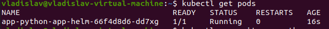
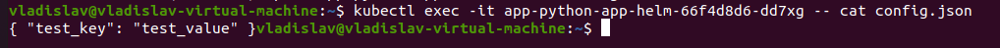

# Lab12

## Using helm to mount `config.json`

* I created the file `./files/config.json` with the following JSON body:
```json
{ "test_key": "test_value" }
```
* Result of execution of the command `kubectl get pods`:

* Result of execution of the command `kubectl exec -it app-python-app-helm-66f4d8d6-dd7xg -- cat config.json`:


## Bonus task

* I added functionality to my Java app to be persistent.

### Explanation of terms

* `StatefulSet` - k8s object that manages pods(for example, scaling) including work with
stateful storages(volumes). We need it to deploy our stateful applications that must store
something in the persistent storage(for example, database). 
* `Headless service` - it is a k8s service that does not have cluster IP and used for grouping
set of pods. In this case, under DNS name of this service we may get list of IPs of all pods that
belonging to this group. We need it to create stateful services or to interact with the individual
pods directly without proxy(for instance, clustering).
* `Persistent Volumes` - storage system resource(for example, physical SSD device) that
can be used pods as filesystem(persistent one). It's lifecycle does not dependent on 
the lifecycle of the pod. We need them to store the data produced by stateful apps or to share some 
static data between pods.