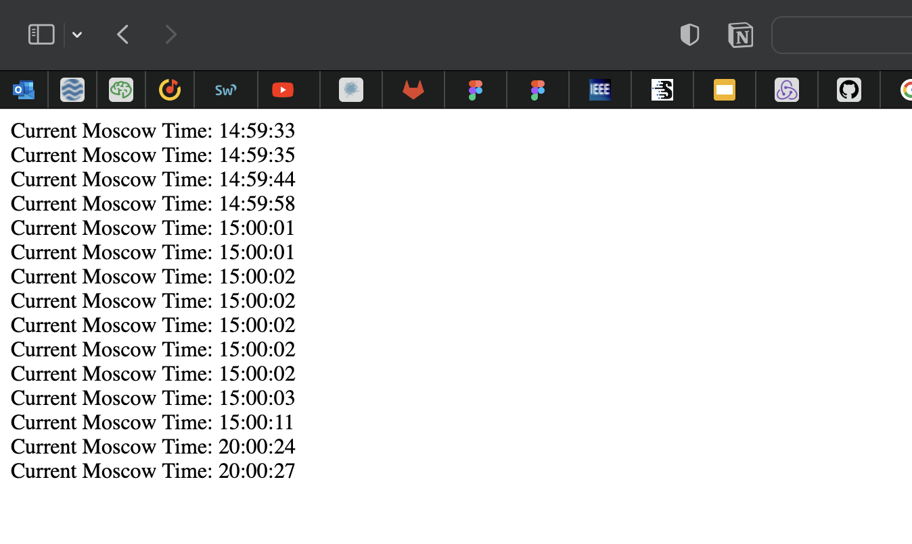

# K8s ConfigMaps

```
 (devops) user@mbp-user k8s % kubectl get pods
 NAME                               READY   STATUS    RESTARTS     AGE
 python-app-helm-7998b44d8d-52pft   1/1     Running   1 (1s ago)   23s


 (devops) user@mbp-user k8s % kubectl exec python-app-helm-7998b44d8d-52pft -- cat /app/config/config.json
 {"key": "value"}%                             

 (devops) user@mbp-user k8s % cat helm-app-python/files/config.json 
 {"key": "value"}%
 ```



# Bonus task

### Stateful set
It is an API for managing stateful applications as pods inside k8s infrastructure. 
Using this workload API it is easy to recover from failed pods due to persisted state of each instance 
via matching concrete volumes

### Headless service
In cases where load-balancing is unnecessary. There will be no single API for the cluster, however 
it will be still possible to interact with various service discovery mechanism avoiding bind 
with k8s implementation

### Persistent volumes
It is the same resource as other nodes in the k8s cluster being a piece of storage provisioned by 
administrator. Also, they have independent lifecycle as other nodes. This API captures main features 
of storage implementation 