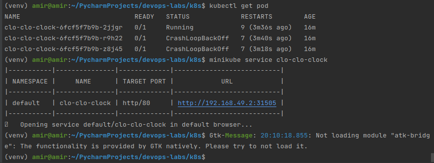
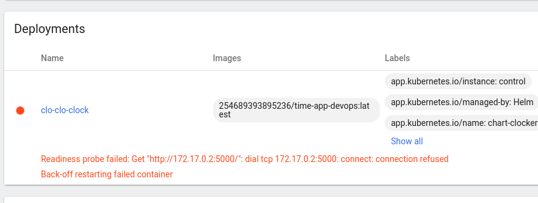
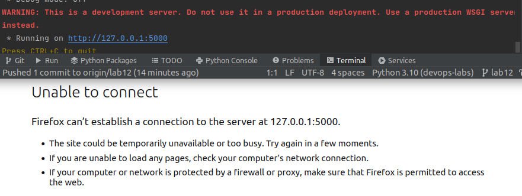
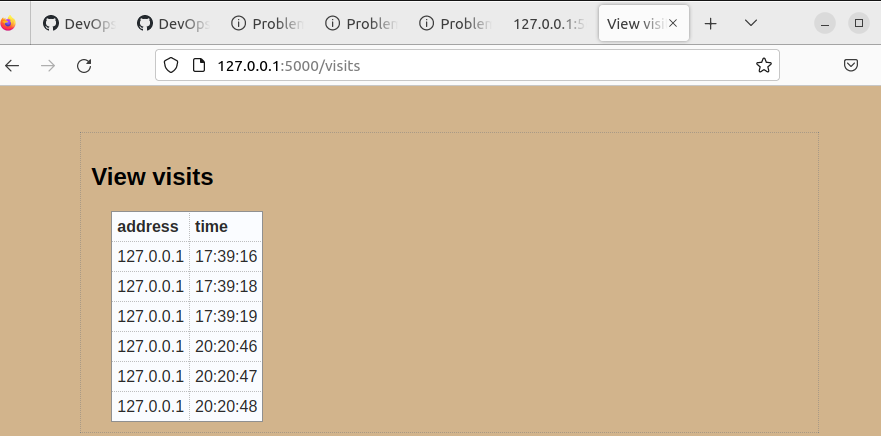

# lab 12

I created a folder `files` with `config.json` inside.
It has next data:
```
{
  "version": "v0.0.1",
  "history_text": "Let it be, let it be, na-na na-na na-na-na-na"
}
```

then, I added `configMap` manifest with next
contains:
```
apiVersion: v1
kind: ConfigMap
metadata:
  name: some_config
data:
  config.json: |-
    {{ .Files.Get :files/config.json" | indent 4 }}
```

next I updated `deployment.yaml` by adding next lines:
```
          volumeMounts:
            - name: configi
              mountPath: /app/config.json
              subPath: config.json
            - name: logsy
              mountPath: /app/visits/
      ...
      
      volumes:
        - name: configi
          configMap:
            name: config-file
        - name: logsy
```

Next I installed my updated helm chart
with `helm upgrade control chart-clocker`

get next:



I do not know why it is happening,
when I build image from dockerfile
I get url for local website, but I cannot
access it


However, app is working locally



okay changed something
```
$ kubectl get po
NAME                             READY   STATUS    RESTARTS   AGE
clo-clo-clock-675fb84d76-dlthf   1/1     Running   0          63s
clo-clo-clock-675fb84d76-h9rfx   1/1     Running   0          87s
clo-clo-clock-675fb84d76-qn5lp   1/1     Running   0          108s

$ kubectl exec clo-clo-clock-675fb84d76-dlthf -- ls -l /app
total 108
-rwxr-xr-x 1 admin root  3023 Sep 11 08:07 README.md
drwxr-xr-x 1 admin root  4096 Sep 11 06:02 app_python
-rw-r--r-- 1 root  root     0 Nov 28 17:27 config.json
-rwxr-xr-x 1 admin root 82551 Sep 11 06:02 demo.gif
-rwxr-xr-x 1 admin root    88 Sep 11 07:54 entrypoint.sh
-rwxr-xr-x 1 admin root    11 Sep 11 06:02 requirements.txt
drwxrwxrwx 2 root  root  4096 Nov 28 17:27 visits

$ kubectl exec clo-clo-clock-675fb84d76-dlthf -- cat config.json
```

