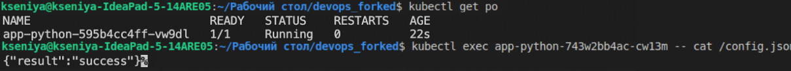

# Lab 12
## K8s ConfigMaps

1. Environment variables are already configured, so it was a time to mount a config file to the container. I created a folder `files` with `config.json` file inside. Its goal is to verify the successful configuration, since `config.json` is holding in json format `result`-key with `success`-value.

1. Then I created a `configMap` manifest. I am getting the data from my `config.json` by using 
    ```bash
    .Files.Get.  config.json: |-
        {{- .Files.Get "files/config.json" | nindent 4 }}
    ```
1.  Subsequently, I updated my `deployment.yaml` by adding  `Volumes` and `VolumeMounts`.

1. After that, I installed the updated helm chart and tested the result.

    1. Get pods: `kubectl get po`
    1. Check my config map inside pod via `kubectl exec app-python-5d77cff49c-6hg97 -- cat /config.json`:

    

1. `/visits` endpoint was created and tested which shows the time when the root path `/` was accessed by the client.:

    

## Bonus

### `StatefulSet, Headless service, Persistent Volumes` in a nutshell:

1. `StatefulSet` is a workload API object that is useful for managing stateful applications because it uses a sticky identifier for each pod.  
The StatefulSets controller provides the ability to number all pods in order, starting from zero. Therefore, when working with stateful applications, it is easy to arrange an architecture in which one pod is the master and the others are its replicas. If one of the pods dies, a new pod of the same name is re-created. This feature is very useful and does not break the cluster chain with state-preserving applications. 

1. `Headless service` - a service without an allocation of Cluster IP (specified as "none" at ".spec.clusterIP"). It also does nor provide load-balancing. Therefore, it can be your choice, when load-balancing or routing is not needed. Furthermore, headless service allows clients to connect directly to the pods instead of connection via the service proxy.

1. `Persistent Volumes`- volume plugins, resources for storage in the clusterthat are not depend on pods, so the data will be more persistent. By using them, one can consume abstract storage resources. 