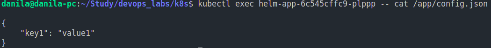

# K8s ConfigMaps

## Results

Pods:

Config inside pod:

## Answers

StatefulSet is API object for managing stateful applications.
It is useful when application require stable identifier, stable storage,
ordered deployment/deletion/scaling.

Headless service is a service that does not use separate IP.
It can be used when application decides by itself to which Pod
it needs to connect.

Persistent Volumes(PVs) are used for storing data in a cluster.
They are not tied to lifecycle of pods. PVs can be useful for stateful
and/or distributed applications.
