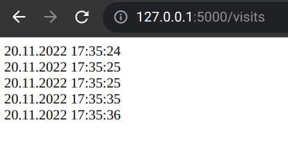
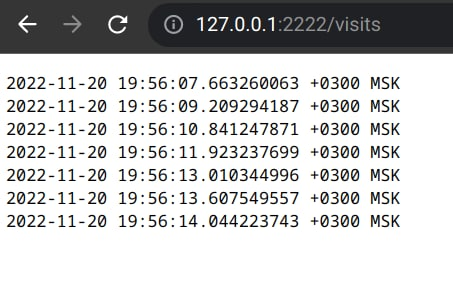

# Lab 12 (K8s ConfigMaps)

# ConfigMap creation 

For config mapping I did next steps:
1. Create a folder `files` with `config.json` file inside with some data
2. Create a ConfigMap manifest file `templates/config.yaml`
3. Add volumes and volumeMounts into`templates/deployment.yaml` file
4. Install an updated helm chart
    ```bash
    $ helm secrets upgrade python-app-helm ./python-app-helm -n default -f ./python-app-helm/secrets.yaml
    Release "python-app-helm" has been upgraded. Happy Helming!
    NAME: python-app-helm
    LAST DEPLOYED: Sun Nov 20 15:07:01 2022
    NAMESPACE: default
    STATUS: deployed
    REVISION: 3
    NOTES:
    1. Get the application URL by running these commands:
         NOTE: It may take a few minutes for the LoadBalancer IP to be available.
               You can watch the status of by running 'kubectl get --namespace default svc -w python-app-helm'
      export SERVICE_IP=$(kubectl get svc --namespace default python-app-helm --template "{{ range (index .status.loadBalancer.ingress 0) }}{{.}}{{ end }}")
      echo http://$SERVICE_IP:80
    removed './python-app-helm/secrets.yaml.dec'
    ```
5. List pods to get exact name of a pod
    ```
    $ kubectl get pods                                     
    NAME                              READY   STATUS    RESTARTS   AGE
    python-app-helm-b758c7f4d-bfc8g   1/1     Running   0          16s
    ```
6. Check config map inside pod   
    ```
    $ kubectl exec python-app-helm-b758c7f4d-bfc8g -- cat /app/config.json
    {"path": "persistent/visits.json" }
    ```

# Update python app

I have updated python app, so it stores the time when user access path "/". 

To see the visits you need to access http://127.0.0.1:5000/visits.



# Update golang app (bonus points)

I have updated golang app, so it stores the time when user access path "/"

To see the visits you need to access http://127.0.0.1:2222/visits.



# Concepts (bonus points)

* **Stateful Set** allows you to manage a stateful application. It creates pods with "sequential" IDs. Also, persistent volume is attached to the pods. When deleting pods, it works with them reversely, not in a random order.
* **Headless service** is a service with IP of a pod, not a proxy. So in this case we will not have a load-balancing and another k8s staff. This allows us to interact directly with the Pods instead of a proxy.
* **Persistent Volumes** are persistent volumes whose life cycle is not depends on pods and containers. It can be used for synchronising data between replicas and for storing other static data.