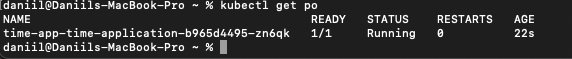
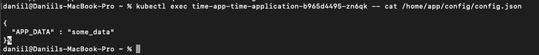
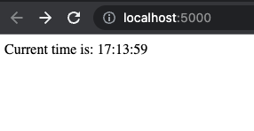
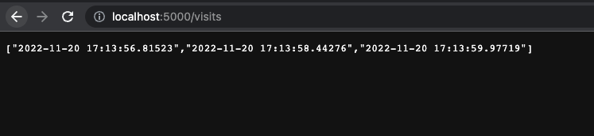

# Lab 12 (Config maps)

1) `kubectl get po`

2) `kubectl exec time-app-time-application-b965d4495-zn6qk -- cat /home/app/config/config.json `

So, our config map is accessible through pod, it means that everything works correctly.

# New endpoint for application:

1) Access several times http://localhost:5000/  

2) Check http://localhost:5000/visits
