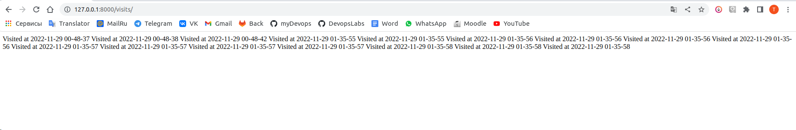
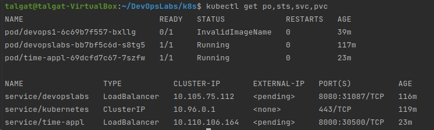
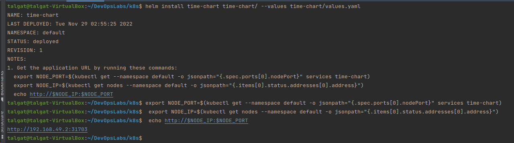
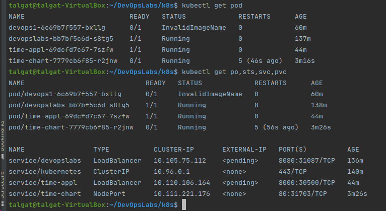

Added visits endpoint to app_python



Pushed new image to docker hub: tbektleuov/devops:latest

```shell
 kubectl get po,sts,svc,pvc
```

Output:



Creating helm chart again:



Now let's run the following commands:



So each pod will have its own volume, and the load balancer will not fairly divide the requests