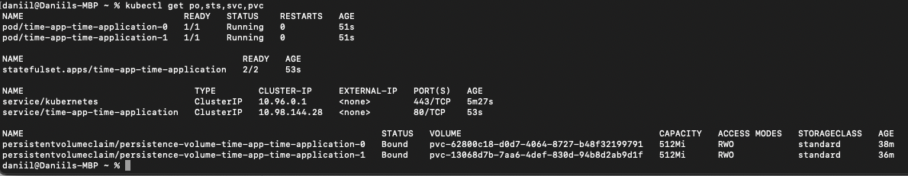
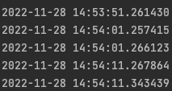
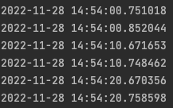
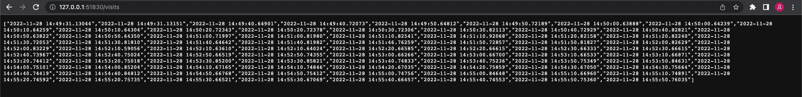
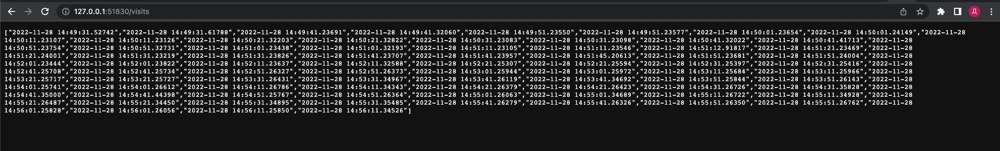

# StatefulSet

1) `kubectl get po,sts,svc,pvc` 

 
2) Let's check content of file: 
`kubectl exec time-app-time-application-0 -- cat saved_visits_time.txt`  
  
`kubectl exec time-app-time-application-1 -- cat saved_visits_time.txt`  

3) Also, we can check content of file by accessing /visits endpoint. I accessed it several times.
  

So, we can see that results are different. It happens since pods have separate volumes. And request are distributed among them. 

3) To launch or terminate all Pods in parallel, we should add property `podManagementPolicy: "Parallel"`
in statefulset.yaml