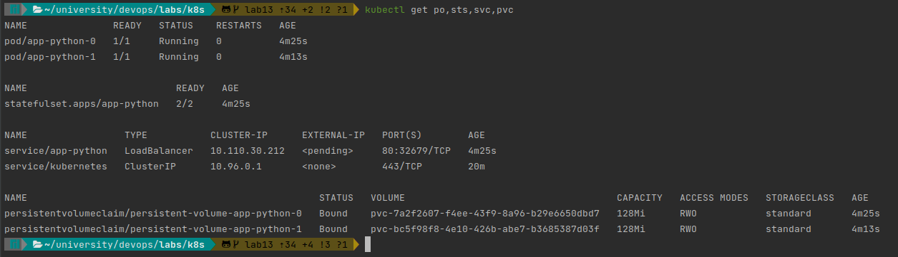
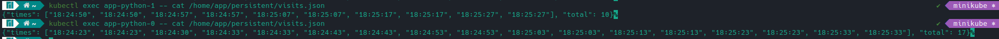

# StatefulSet

#### `kubectl get po,sts,svc,pvc`:

#### Visits of replicas

We have 10 timestamps for one replica and 17 for another.
This happens because each replica has separate volume in StatefulSet and because LoadBalancer does 
not equally distribute requests for replicas.

#### Ordering
Our replicas are independent from each other, so that makes ordering unnecessary.
To make StatefulSet manage replicas in parallel we can add `podManagementPolicy: "Parallel"` to `statefulset.yaml`
