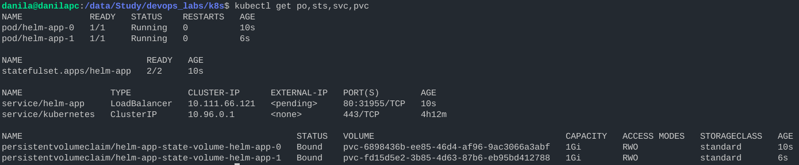
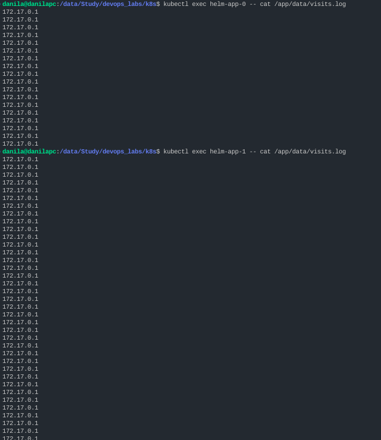
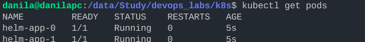
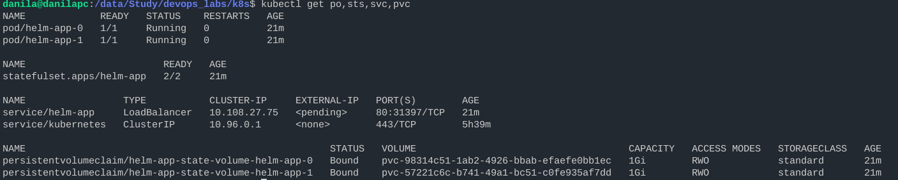
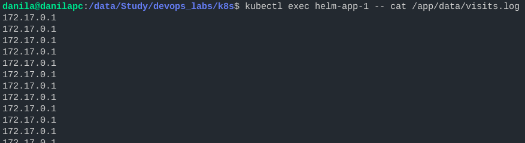
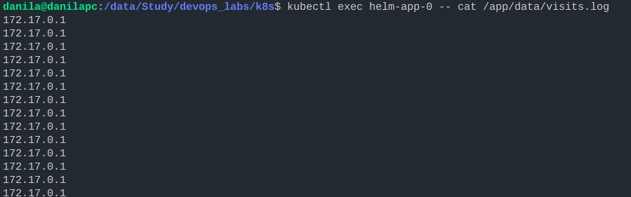
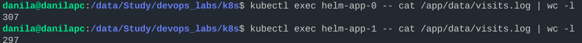

# StatefulSet

## State

Output of ``kubectl get po,sts,svc,pvc``:

## Logs

Logs of replicas:

Totally, there are 18 logs for first replica, 49 logs for second replica.

One of replicas has more log entries because:

1. Each replica in StatefulSet has its own volume
2. Load Balancer distributed requests not equally between these replicas.

## Ordering

For our app the ordering is unnecessary because each replica is independent from others, i.e,
it will work even if other replicas fall or even if they do not exist.

We can start the pods in parallel by adding *podManagementPolicy: "Parallel"* to spec.

Result:

## With GO application

Output of ``kubectl get po,sts,svc,pvc``:

Logs of replicas:

## Update strategies

Based on <https://kubernetes.io/docs/concepts/workloads/controllers/statefulset/#update-strategies>

There are two types of update strategies:

1. OnDelete

2. RollingUpdate

OnDelete strategy requires manual deletion of the pods to trigger the update
while RollingUpdate(set by default) strategy will do it automatically.

RollingUpdate strategy has sub-strategy: partitioned RollingUpdate when not all
podes will be updated(based on ordinal).
