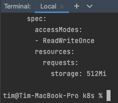
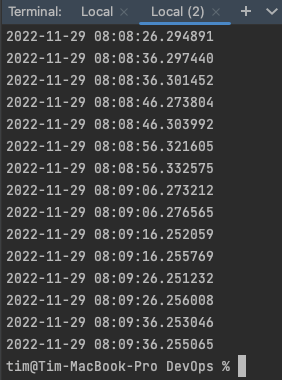
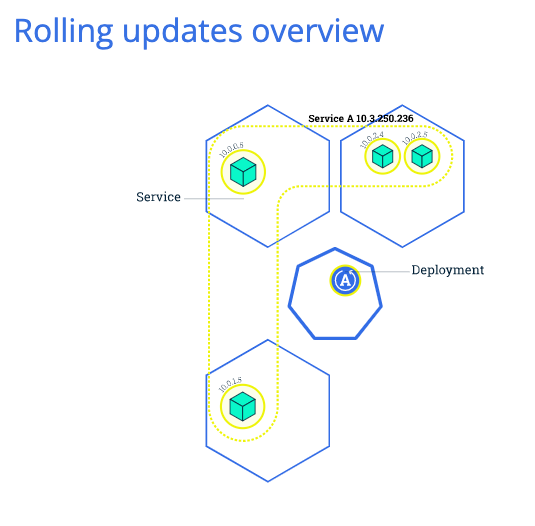
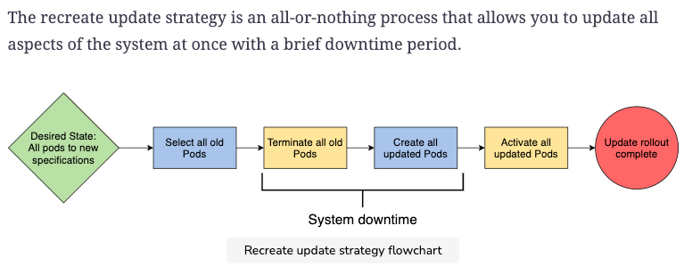

## Lab 13

### Main part

helm install --dry-run --debug time-app time-app

All worked correctly:



```bash
$ helm upgrade time-app --install time-app

$ kubectl get po,sts,svc,pvc
NAME                            READY   STATUS    RESTARTS      AGE
pod/listener-6c97dd6ff8-vkthw   1/1     Running   2 (22m ago)   35h
pod/listener-6c97dd6ff8-wfwnk   1/1     Running   2 (22m ago)   35h
pod/listener-6c97dd6ff8-zssx5   1/1     Running   2 (22m ago)   35h
pod/postgres-7b67788dfc-9zk2v   1/1     Running   2 (22m ago)   36h
pod/producer-5899ff468f-gcbs2   1/1     Running   2 (22m ago)   35h
pod/rabbitmq-7c4f5b79d-9bwgg    1/1     Running   2 (22m ago)   36h
pod/time-app-0                  1/1     Running   0             46s
pod/time-app-1                  1/1     Running   0             45s

NAME                        READY   AGE
statefulset.apps/time-app   2/2     46s

NAME                 TYPE           CLUSTER-IP       EXTERNAL-IP   PORT(S)                          AGE
service/kubernetes   ClusterIP      10.96.0.1        <none>        443/TCP                          37h
service/listener     NodePort       10.109.225.142   <none>        8081:30111/TCP                   35h
service/postgres     ClusterIP      None             <none>        5432/TCP                         36h
service/producer     NodePort       10.102.94.249    <none>        8080:30195/TCP                   35h
service/rabbitmq     LoadBalancer   10.102.137.46    <pending>     5672:32584/TCP,15672:32534/TCP   36h
service/time-app     ClusterIP      10.96.124.164    <none>        80/TCP                           46s

NAME                                                  STATUS   VOLUME                                     CAPACITY   ACCESS MODES   STORAGECLASS   AGE
persistentvolumeclaim/persistence-volume-time-app-0   Bound    pvc-77a0b3ca-37c3-485e-b435-f3ef60671611   512Mi      RWO            standard       46s
persistentvolumeclaim/persistence-volume-time-app-1   Bound    pvc-0d3a79cc-b6f9-4649-b080-36b87f7c6e9b   512Mi      RWO            standard       46s
persistentvolumeclaim/postgres-pv-claim               Bound    pvc-a35e1a0f-d9a9-409f-83e5-2a69fe4e7d19   1Gi        RWO            standard       36h
```

accessing from browser & incognito


using `exec` to access the visits file:

```bash
kubectl exec pod/time-app-0 -- cat saved_visits_time.txt
kubectl exec pod/time-app-1 -- cat saved_visits_time.txt
```

> Note: Time's not MSK (UTC+3) but just UTC that's why I'm running it at 11 am, but it shows 8am

`time-app-0`



`time-app-1`


#### Explanation:

We get duplications and stuff like this because pods have independent volumes
and the load balancer is not distributing fairly between the nodes.

To combat this behavior one could write `podManagementPolicy: "Parallel"`

For our app ordering guarantee is unnecessary as we have time.
And you cannot send them frequently enough to cause any trouble in order.

### Research part

### Update strategies

sources:

- https://kubernetes.io/docs/tutorials/kubernetes-basics/update/update-intro/
- https://www.educative.io/blog/kubernetes-deployments-strategies

we need them to apply changes to already running pods ensuring timely updating.

there's several strategies:

#### Rolling update strategy

It minimizes downtime but update speed suffers a bit.
it is default update strategy.

Upsides:

- update applies Pod-by-Pod so the greater part of the system isn't involved.

Downsides:

- Minor performance reduction.



#### Recreate update

The other way around: more downtime but updates are quick.
The strategy we use for systems that cannot work with partially updated state



Upsides:

- The strategy is better for large updates and overhaul.
  Downsides:
- System is down from the moment old Pod's down till new updated pod is up.

#### Canary update

Quickly updates for a select few users with a full rollout later.


Upsides:

- Rollback process is much quicker than the rolling update strategy
  as you only don't have to roll back all the pods at once.

Downsides:

- This approach can be hard to manage at scale.