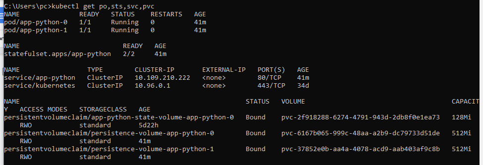
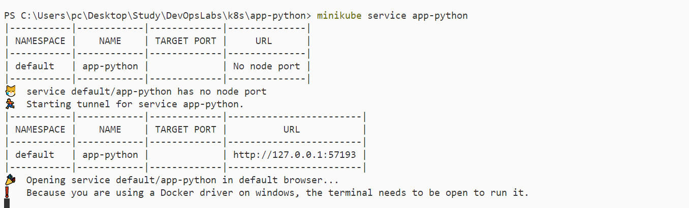
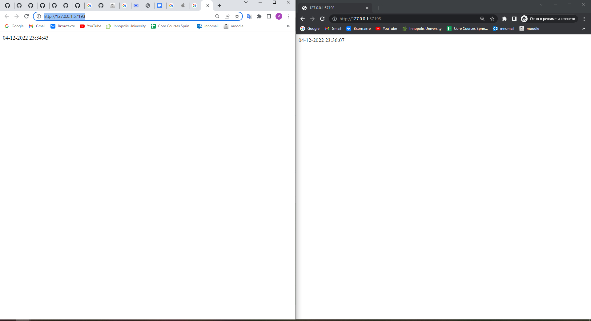
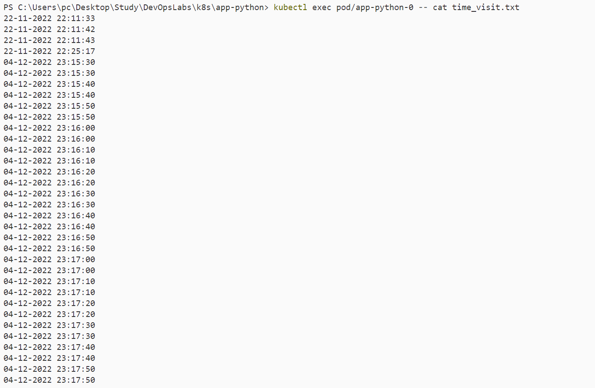
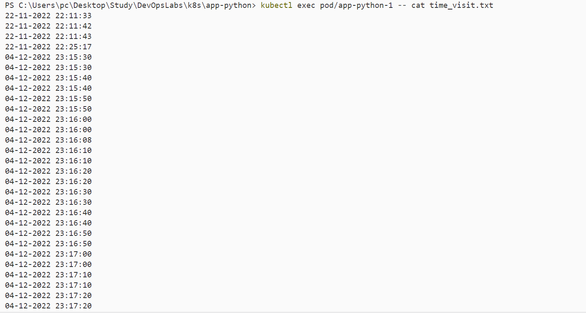

# Main part

## kubectl get po,sts,svc,pvc

## minikube service name_of_your_statefulset

## output of `kubectl exec pod/demo-0 -- cat visits`

### pod 1

### pod 2

## Conclusion on output
Duplications happen because of independent volumes. Thus, load balancer does not do its job equally. To avoid that `podManagementPolicy: "Parallel` might be used.

# Bonus part

## Blue/Green
Simultaneous deployment of the old (green) and new (blue) versions of the application. Once both versions are hosted, the green one is available to the general user, while the blue one is available for the QA team to automate tests via a separate service or direct port forwarding.

pros:
- Safety
- No need to plan maintenance windows and downtime to deploy an update

cons:
- High Infrastructure Costs
- More Database Management

## Canary update
Create two almost identical servers: one serves almost all users, and the other, with new features, serves only a small subgroup of users, after which the results of their work are compared. If everything goes without errors, the new version is gradually rolled out to the entire infrastructure.

Pro:

- version released for a subset of users
- convenient for error rate and performance monitoring
- fast rollback

Cons:

- slow rollout
- fine tuned traffic distribution can be expensive (99% A/ 1%B = 99 pod A, 1 pod B)

## Rolling update strategy
This is the standard deployment strategy for Kubernetes. It gradually, one by one, replaces the pods with the old version of the application with pods with the new version - without downtime of the cluster

pros:

- Frequent health checks during an update
- Reduces the number of services running throughout development

cons:
- Slow
- Backward Compatibility pronlem

## Recreate update
Old pods are killed all at once and replaced with new ones

pros: 
- application state entirely renewed

cons:
- downtime that depends on both shutdown and boot duration of the application