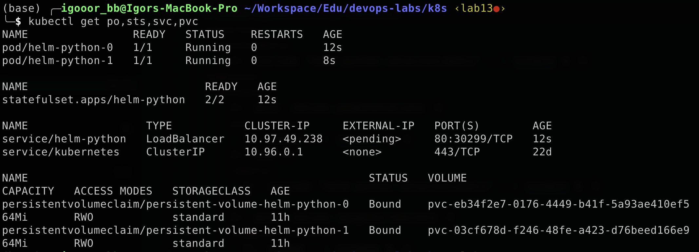
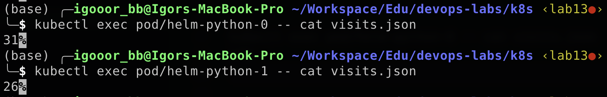
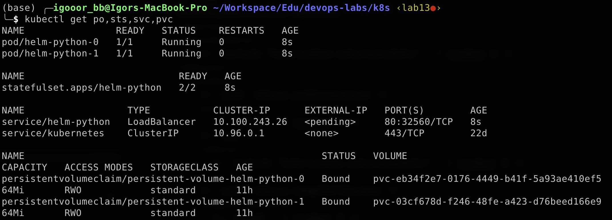

# StatefulSet

## Deployment

This is what the output of the current pods state looks like:



This is how the information about visits within each pod looks like (the file contains the number of visits):



As you can observe, the number of entries varies. This happens because each object in the StatefulSet contains its own volume while load balancer distributes requests between them unevenly.

## Parallel

The order of startup is not important in our case, because each instance is independent of the others and knows nothing about their existence. Therefore, we can run them in parallel by adding the following setting to the configuration file:

```plain
podManagementPolicy: Parallel
```

In this case we can observe from the start time that they are started at the same time:

