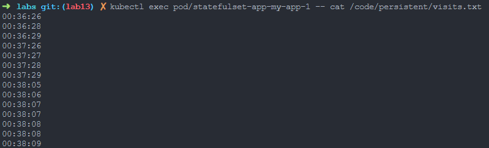
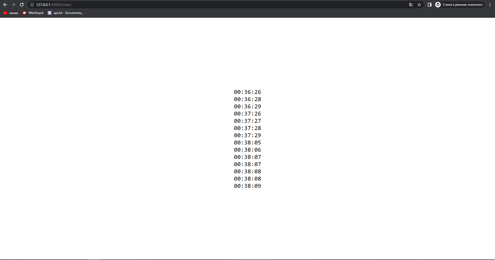
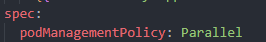

# LAB 13
## OUTPUTS
### kubectl get po,sts,svc,pvc
```
NAME                           READY   STATUS             RESTARTS        AGE
pod/statefulset-app-my-app-0   1/1     Running            0               26s
pod/statefulset-app-my-app-1   1/1     Running            0               24s

NAME                                      READY   AGE
statefulset.apps/statefulset-app-my-app   2/2     26s

NAME                             TYPE        CLUSTER-IP      EXTERNAL-IP   PORT(S)   AGE
service/kubernetes               ClusterIP   10.96.0.1       <none>        443/TCP   28d
service/statefulset-app-my-app   ClusterIP   10.98.225.253   <none>        80/TCP    26s

NAME                                                                    STATUS   VOLUME                                     CAPACITY   ACCESS MODES   STORAGECLASS   AGE
persistentvolumeclaim/my-app-stateful-volume-statefulset-app-my-app-0   Bound    pvc-3e911ef4-3716-4820-9260-5ac0125222a7   1Gi        RWX            standard       2m40s
persistentvolumeclaim/my-app-stateful-volume-statefulset-app-my-app-1   Bound    pvc-65cd7074-0b05-4b12-a190-3d0ac844b209   1Gi        RWX            standard       24s
```





### Since out replicas are independent, we do not care about ordering

### launch or terminate all Pods in parallel is implemented
