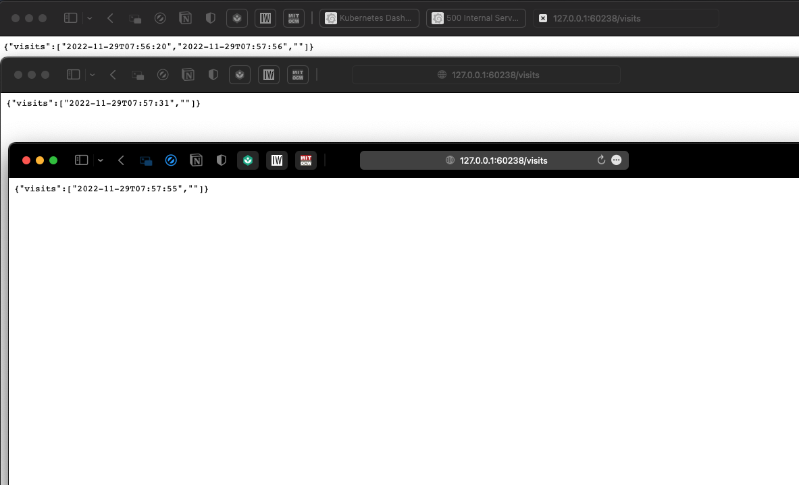

## output of `kubectl get po,sts,svc,pvc`

```sh
NAME               READY   STATUS    RESTARTS   AGE
pod/app-python-0   1/1     Running   0          21s
pod/app-python-1   1/1     Running   0          21s
pod/app-python-2   1/1     Running   0          16s

NAME                          READY   AGE
statefulset.apps/app-python   3/3     21s

NAME                 TYPE        CLUSTER-IP       EXTERNAL-IP   PORT(S)   AGE
service/app-python   ClusterIP   10.107.119.205   <none>        80/TCP    21s
service/kubernetes   ClusterIP   10.96.0.1        <none>        443/TCP   30d

NAME                                        STATUS   VOLUME                                     CAPACITY   ACCESS MODES   STORAGECLASS   AGE
persistentvolumeclaim/visits-app-python-0   Bound    pvc-1018aaad-183e-4bf7-bffb-1e3326d5b106   128M       RWO            standard       3m16s
persistentvolumeclaim/visits-app-python-1   Bound    pvc-3e6926ee-c02f-4def-acf0-d0d6035a2546   128M       RWO            standard       3m16s
persistentvolumeclaim/visits-app-python-2   Bound    pvc-9921e400-71bc-48ea-9b0a-f76d7399a976   128M       RWO            standard       3m16s
```

## outputs of /visits



## Reasoning behind the different output

Since our replicas rely on different persistent volumes, they do their I/O into their respective volumes, without intersecting between each other, writing visits into only their own log file.

## Why app ordering is unnecessary in our case?

Our app is running the same functions accross all replicas, and they are independent of each other. If, for example, we have had a global state that changes depending on function calls accross all replicas, we would need to implement ordering to ensure that we will get a determined and predictable result after each function call from any of the replicas.