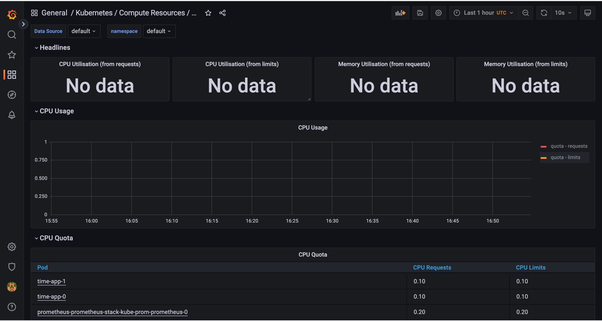

# StatefulSet

1. I've updated `deployemnt.yaml` -> `statefulset.yaml`, move some params to the `values.yaml`, add persistent volume 
with data.

2. Run `helm install --dry-run --debug` and got no errors.

3. Run `kubectl get po,sts,svc,pvc`
```shell
(iu-devops-labs) f3line@kitty-2 k8s % kubectl get po,sts,svc,pvc
NAME               READY   STATUS    RESTARTS   AGE
pod/app-python-0   1/1     Running   0          42s
pod/app-python-1   1/1     Running   0          42s

NAME                          READY   AGE
statefulset.apps/app-python   2/2     42s

NAME                 TYPE        CLUSTER-IP       EXTERNAL-IP   PORT(S)          AGE
service/app-python   NodePort    10.107.104.255   <none>        8000:32496/TCP   42s
service/kubernetes   ClusterIP   10.96.0.1        <none>        443/TCP          28d

NAME                                                 STATUS   VOLUME                                     CAPACITY   ACCESS MODES   STORAGECLASS   AGE
persistentvolumeclaim/app-python-data-app-python-0   Bound    pvc-b1c91e2b-3688-49e1-a33f-0214cb16cc9d   128Mi      RWO            standard       26m
persistentvolumeclaim/app-python-data-app-python-1   Bound    pvc-32e45a46-f929-45db-9763-feb12f0536a9   128Mi      RWO            standard       26m
```

4. I've send several requests, to add entities into `visists.log`.
```shell
curl -X 'POST' \
  'http://127.0.0.1:61896/v1/visits' \
  -H 'accept: application/json' \
  -d ''
```

5. I can see, that api stores it properly.


6. Check this file in each pod. These files are different, each pod keeps its own version of the file. Since api keeps 
connection, requests from first page goes to the same pod. I open two web pages, to write to different pods.
```shell
(iu-devops-labs) f3line@kitty-2 k8s % kubectl exec pod/app-python-0 -- cat storage/visits.log
2022-11-29 08:55:16.177791
2022-11-29 08:55:20.642215
2022-11-29 08:55:20.650121
2022-11-29 08:55:21.607256
```
```shell
(iu-devops-labs) f3line@kitty-2 k8s % kubectl exec pod/app-python-1 -- cat storage/visits.log
2022-11-29 08:47:23.523317
2022-11-29 08:48:16.883445
2022-11-29 08:48:28.568083
2022-11-29 08:48:29.220870
2022-11-29 08:48:29.830244
2022-11-29 08:48:30.361699
```

7. The api is independent of replicas, so ordering is not needed. Also, we can start/stop replicas at the same time. To
do that we need to set `podManagementPolicy` in `spec` in `statefulset.yaml` to `Parallel`.

# Bonus
The is two possible variants of updating:
https://kubernetes.io/docs/concepts/workloads/controllers/statefulset/#update-strategies

1. We can set `.spec.updateStrategy.type` to `OnDelete`, the StatefulSet will not automatically update the Pods. You can
manually delete Pods, and controller will create a new one (updated).

2. Also, we can set type to the `RollingUpdate`, this tell the StatefulSet to update Pods automated, sequentially.
