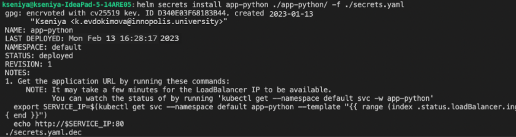
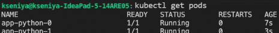
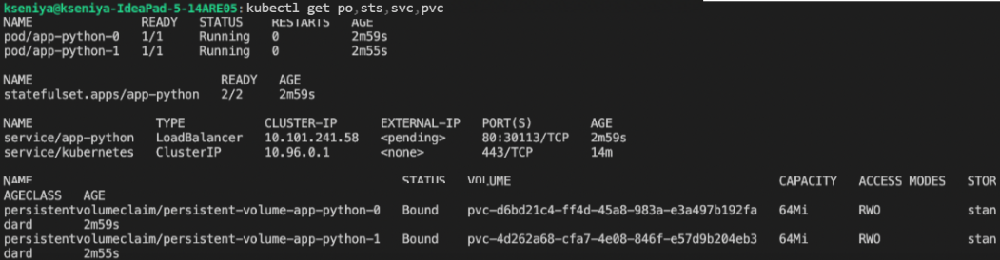
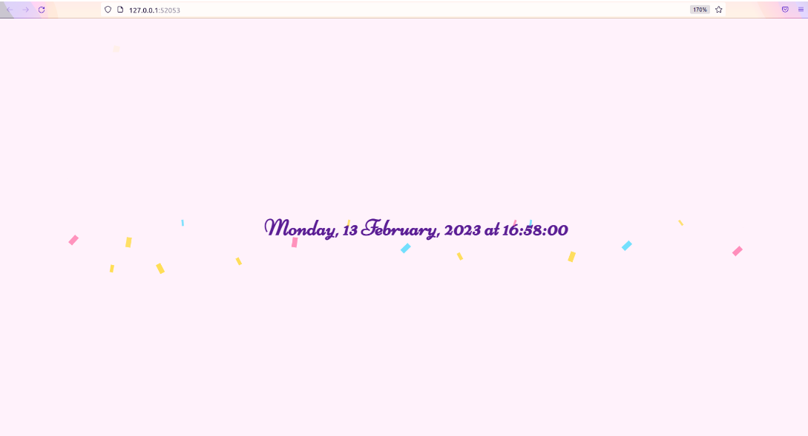
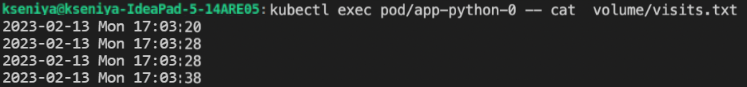
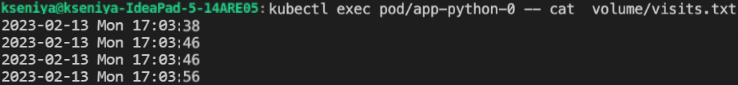

# Lab 13 - K8s StatefulSet

## StatefulSet

1. I read about `StatefulSet` objects:
    * [Concept](https://kubernetes.io/docs/concepts/workloads/controllers/statefulset/)
    * [Tutorial](https://kubernetes.io/docs/tutorials/stateful-application/basic-stateful-set/)
1. I prepared a manifest for StatefulSet and updated the helm chart:
    * Renamed my file deployment.yml to statefulset.yml.
    * Follow the * [tutorial](https://kubernetes.io/docs/tutorials/stateful-application/basic-stateful-set/) and updated my manifest.
    * Tested it with command:  
    `helm secrets install --dry-run --debug app-python ./app-python/ -f ./secrets.yaml`.
    * And then deployed it:  
    `helm secrets install app-python ./app-python/ -f ./secrets.yaml`  
    .
    * The best practices were followed, some values were meaningfully moved to variables in `values.yml`.

1. Output of `kubectl get pods`:  
    
1. Output of `kubectl get po,sts,svc,pvc`:  
    
1. I used `minikube service app-python` command to access the app:  
    
1. I used several tabs in my browser, incognito mode, etc to access the root path of your app.
1. I checked the content of my file, in each pod (provide the output of the command for all replicas):  
    `kubectl exec pod/app-python-0 -- cat  volume/visits.txt`  
    
    `kubectl exec pod/app-python-0 -- cat  volume/visits.txt`  
    

1. **The differences between the output of the command for replicas.**  
The output of the command for replicas can vary due to the fact
that each replica in a StatefulSet has its own volume, which is independent from the other replicas.
Furthermore, the Load Balancer distributes the load between the replicas in an uneven manner, which can lead to discrepancies in the output of the command.  
1. For my app ordering guarantee is unnecessary, since the replicas are independent from each other.  
To ensure ordering guarantee for my app,
the StatefulSet controller can be configured to launch or terminate all Pods in parallel.
This will allow the controller to manage the Pods simultaneously,
without waiting for each Pod to become Running and Ready or
completely terminated before launching or terminating the next Pod.
1. I implemented it by adding this:  
`podManagementPolicy: "Parallel"`
1. Read about update strategies. Describe how did you understand them, kinds and difference.

## Bonus
**Read about update strategies. Describe how did you understand them, kinds and difference.**  

In StatefulSet, there are two update strategies: RollingUpdate (the default) and OnDelete. RollingUpdate updates the Pods one at a time, terminating one Pod and waiting until it becomes Running and Ready before proceeding with the next Pod. This ensures that the application remains healthy and the update is consistent in the presence of failures. OnDelete, on the other hand, does not automatically update Pods after any changes are made to the StatefulSet's .spec.template field. This strategy requires manual deletion of Pods.
