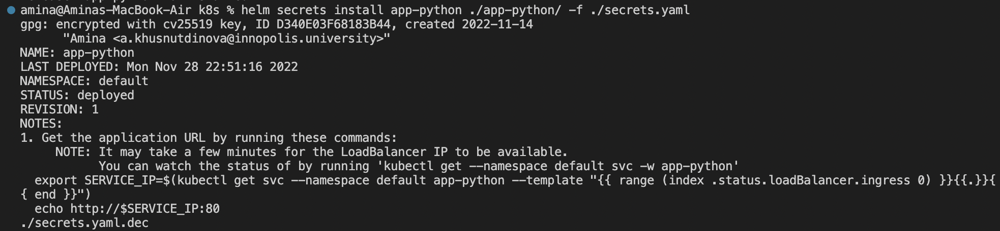
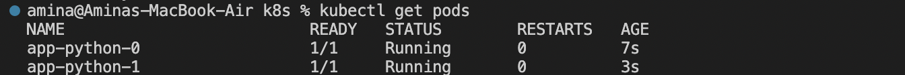
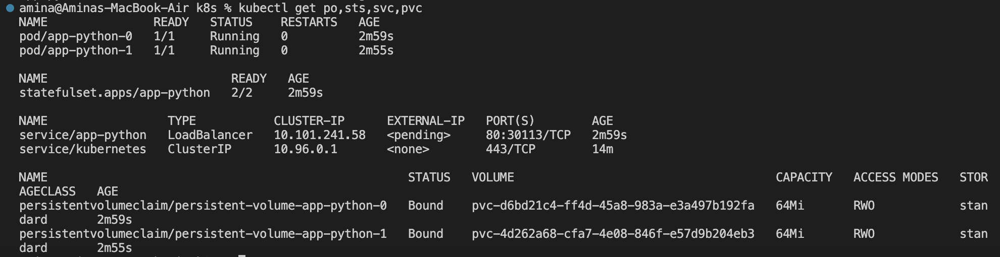
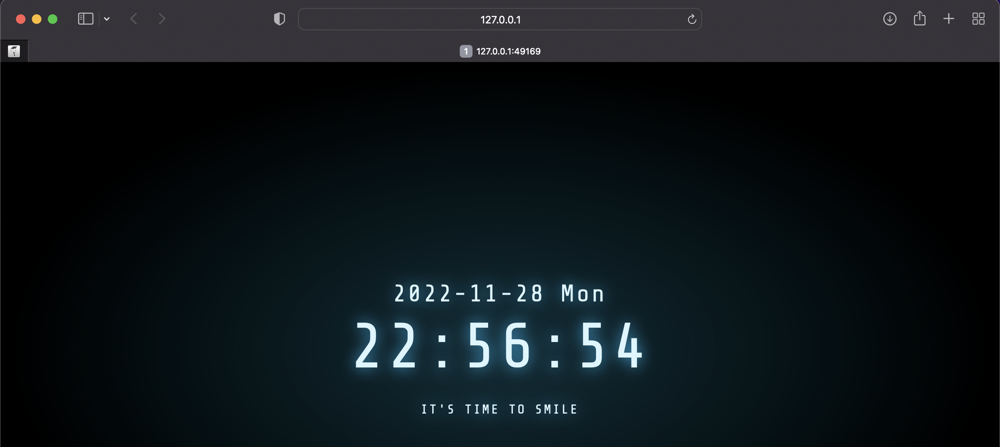
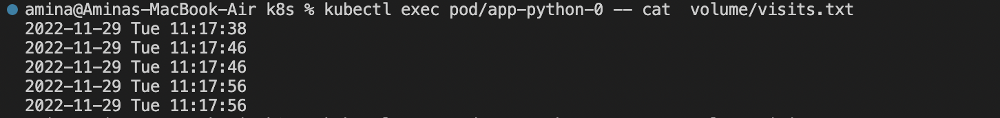
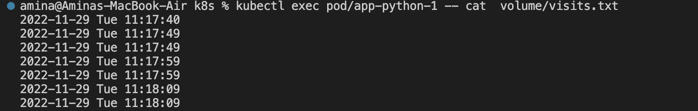

# K8s StatefulSet

## StatefulSet

1. Prepare a manifest for StatefulSet following the [tutorial](https://kubernetes.io/docs/tutorials/stateful-application/basic-stateful-set/).
1. Test with command:
    `helm secrets install --dry-run --debug app-python ./app-python/ -f ./secrets.yaml`
1. Deploy:
    `helm secrets install app-python ./app-python/ -f ./secrets.yaml`
    
1. Move some values to variables in `values.yml`
1. Output of `kubectl get pods`:
    
1. Output of `kubectl get po,sts,svc,pvc`:
    
1. Use `minikube service app-python` command to access the app:
    
1. Use several tabs in your browser, incognito mode, etc to access the root path of your app.

## Visits

1. Check the content of your file:
   `kubectl exec pod/app-python-0 -- cat  volume/visits.txt`
   

   `kubectl exec pod/app-python-1 -- cat  volume/visits.txt`
    

## Q&As

1. The differences between the output of the command for replicas occurs due to the fact that each replica in StatefulSet has its own volume independent from others, and the Load Balancer distributes the load between the replicas unequally.
1. For our app ordering guarantee are unnecessary because the replicas are independent from each other.
1. How to tell to the StatefulSet controller to launch or terminate all Pods in parallel?
`Parallel` pod management tells the StatefulSet controller to launch or terminate all Pods in parallel, and not to wait for Pods to become Running and Ready or completely terminated prior to launching or terminating another Pod.
1. To implement it added this `podManagementPolicy: "Parallel"`
1. Read about update strategies. Describe how did you understand them, kinds and difference.

## Bonus

In StatefulSet, there are two update strategies. They can be used to upgrade the containers, resource requests, limits, labels, and annotations of the Pods in a StatefulSet.

The first, `RollingUpdate` (whch is default one) updates the Pods one at a time: first, it terminates one Pod and waits until it becomes `Running` and `Ready` to proceed with the next Pod. This allows to keep the application healthy and the update consistent in the presence of failures.

With the second update startegy, `OnDelete`, Pods won't be automatically updated after any modification in the StatefulSet's .`spec.template field`. This strategy requires manual Pods deletion.
