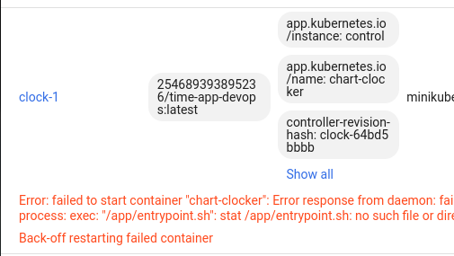

# lab 13

I renamed `deployment.yaml` to `statefulset.yaml`

Next I typed this command: `helm install --dry-run --debug control chart-clocker`

I get next output:
```
$ helm install --dry-run --debug control chart-clocker
install.go:192: [debug] Original chart version: ""
install.go:209: [debug] CHART PATH: /home/amir/PycharmProjects/devops-labs/k8s/chart-clocker

NAME: control
LAST DEPLOYED: Tue Nov 29 20:05:04 2022
NAMESPACE: default
STATUS: pending-install
REVISION: 1
USER-SUPPLIED VALUES:
{}

COMPUTED VALUES:
affinity: {}
autoscaling:
  enabled: false
  maxReplicas: 100
  minReplicas: 1
  targetCPUUtilizationPercentage: 80
fullnameOverride: clock
healthcheck:
  enabled: false
image:
  pullPolicy: Always
  repository: 254689393895236/time-app-devops
  tag: latest
imagePullSecrets: []
ingress:
  annotations: {}
  className: ""
  enabled: false
  hosts:
  - host: chart-example.local
    paths:
    - path: /
      pathType: ImplementationSpecific
  tls: []
mountVisits:
  enabled: false
nameOverride: ""
nodeSelector: {}
podAnnotations: {}
podSecurityContext: {}
replicaCount: 3
resources: {}
securityContext: {}
service:
  port: 80
  type: LoadBalancer
serviceAccount:
  annotations: {}
  create: true
  name: clock
tolerations: []

HOOKS:
---
# Source: chart-clocker/templates/tests/test-connection.yaml
apiVersion: v1
kind: Pod
metadata:
  name: "clock-test-connection"
  labels:
    helm.sh/chart: chart-clocker-0.1.0
    app.kubernetes.io/name: chart-clocker
    app.kubernetes.io/instance: control
    app.kubernetes.io/version: "1.16.0"
    app.kubernetes.io/managed-by: Helm
  annotations:
    "helm.sh/hook": test
spec:
  containers:
    - name: wget
      image: busybox
      command: ['wget']
      args: ['clock:80']
  restartPolicy: Never
MANIFEST:
---
# Source: chart-clocker/templates/serviceaccount.yaml
apiVersion: v1
kind: ServiceAccount
metadata:
  name: clock
  labels:
    helm.sh/chart: chart-clocker-0.1.0
    app.kubernetes.io/name: chart-clocker
    app.kubernetes.io/instance: control
    app.kubernetes.io/version: "1.16.0"
    app.kubernetes.io/managed-by: Helm
---
# Source: chart-clocker/templates/secrets.yaml
apiVersion: v1
kind: Secret
metadata:
  name: beautiful
  namespace: default
data:
  token: SnVsaTNEb2UzTm90
type: Opaque
---
# Source: chart-clocker/templates/configmap.yaml
apiVersion: v1
kind: ConfigMap
metadata:
  name: some-config
data:
  config.json: |-
---
# Source: chart-clocker/templates/service.yaml
apiVersion: v1
kind: Service
metadata:
  name: clock
  labels:
    helm.sh/chart: chart-clocker-0.1.0
    app.kubernetes.io/name: chart-clocker
    app.kubernetes.io/instance: control
    app.kubernetes.io/version: "1.16.0"
    app.kubernetes.io/managed-by: Helm
spec:
  type: LoadBalancer
  ports:
    - port: 80
      targetPort: http
      protocol: TCP
      name: http
  selector:
    app.kubernetes.io/name: chart-clocker
    app.kubernetes.io/instance: control
---
# Source: chart-clocker/templates/statefulset.yaml
apiVersion: apps/v1
kind: StatefulSet
metadata:
  name: clock
  labels:
    helm.sh/chart: chart-clocker-0.1.0
    app.kubernetes.io/name: chart-clocker
    app.kubernetes.io/instance: control
    app.kubernetes.io/version: "1.16.0"
    app.kubernetes.io/managed-by: Helm
spec:
  podManagementPolicy: "Parallel"
  replicas: 3
  selector:
    matchLabels:
      app.kubernetes.io/name: chart-clocker
      app.kubernetes.io/instance: control
  template:
    metadata:
      labels:
        app.kubernetes.io/name: chart-clocker
        app.kubernetes.io/instance: control
    spec:
      serviceAccountName: clock
      securityContext:
        {}
      containers:
        - name: chart-clocker
          securityContext:
            {}
          image: "254689393895236/time-app-devops:latest"
          imagePullPolicy: Always
          volumeMounts:
            - name: configi
              mountPath: /app/config.json
              subPath: config.json
          env:
            - name: TOKEN
              valueFrom:
                secretKeyRef:
                  name: beautiful
                  key: token
          resources:
            requests:
              memory: "64M"
              cpu: "100m"
            limits:
              memory: "256M"
              cpu: "200m"
          ports:
            - name: http
              containerPort: 5000
              protocol: TCP

      volumes:
        - name: configi
          configMap:
            name: some-config

NOTES:
1. Get the application URL by running these commands:
     NOTE: It may take a few minutes for the LoadBalancer IP to be available.
           You can watch the status of by running 'kubectl get --namespace default svc -w clock'
  export SERVICE_IP=$(kubectl get svc --namespace default clock --template "{{ range (index .status.loadBalancer.ingress 0) }}{{.}}{{ end }}")
  echo http://$SERVICE_IP:80
```

I moved these variables to values to configure environment:
```
mountVisits:
  enabled: false

healthcheck:
  enabled: false
```

`mountVisits` is used to mount volume (look at `statefulset.yaml`)

```
$ kubectl get po,sts,svc,pvc
NAME          READY   STATUS              RESTARTS      AGE
pod/clock-0   0/1     CrashLoopBackOff    4 (40s ago)   2m46s
pod/clock-1   0/1     RunContainerError   4 (9s ago)    2m46s
pod/clock-2   0/1     CrashLoopBackOff    4 (20s ago)   2m46s

NAME                     READY   AGE
statefulset.apps/clock   0/3     2m46s

NAME                 TYPE           CLUSTER-IP       EXTERNAL-IP   PORT(S)          AGE
service/clock        LoadBalancer   10.99.196.251    <pending>     80:32468/TCP     2m47s
service/clocker      LoadBalancer   10.109.126.103   <pending>     5000:32188/TCP   10d
service/exposer      LoadBalancer   10.110.54.193    <pending>     80:30827/TCP     10d
service/kubernetes   ClusterIP      10.96.0.1        <none>        443/TCP          10d
```

problem with docker image



Check and provide proof of your success:

    Create a 13.md report.
    Put an output of kubectl get po,sts,svc,pvc command to the 13.md report.
    Use minikube service name_of_your_statefulset command to access you app.
    Use several tabs in your browser, incognito mode, etc to access the root path of your app.
    Check the content of your file, in each pod, example - kubectl exec pod/demo-0 -- cat visits provide the output of the command for all replicas.
    Describe and explain in the report the differences between the output of the command for replicas.

For our app ordering guarantee are unnecessary. Describe in the report why. Then find a way to tell to the StatefulSet controller to launch or terminate all Pods in parallel. Implement it.
