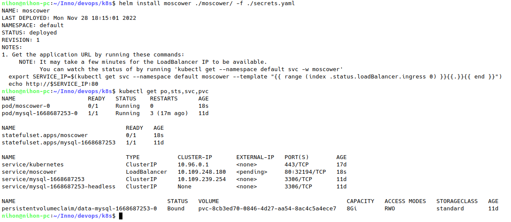
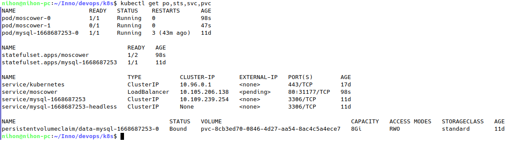
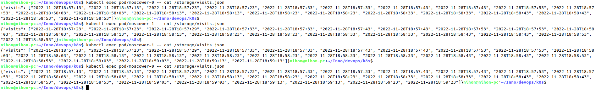

# StatefulSet

## Change deployment to a stateful set

Installation

After adding more replicas for task 3

Check `visits.json` for both replicas

As can be seen, due to healthchecks continiously accessing the root, visits count inreases without my interference. Both replicas have different states, independent from each other.

## Update strategies

Rolling updates are updates that performed one-by-one: since we do not want to have downtimes in our app, we first recreate one pod with the new version of the app, then another one and so on.

`.spec.updateStrategy` field allows us to configure rolling updates or even disable them: setting its `.type` field to 'OnDelete' will forbid rolling updates from happenning automatically, and users will be forced to delete pods manually
