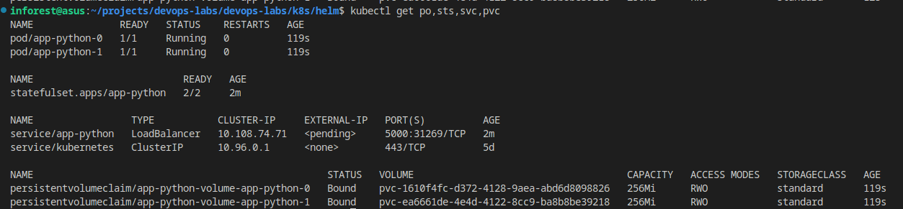
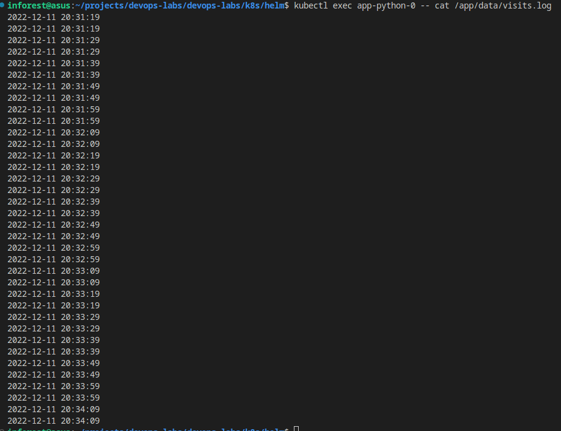

# Lab 13

## Result 



## Logs
Logs for first is



Logs for second is 
```
inforest@asus:~/projects/devops-labs/devops-labs/k8s/helm$ kubectl exec app-python-1 -- cat /app/data/visits.log
2022-12-11 20:31:20
2022-12-11 20:31:20
2022-12-11 20:31:30
2022-12-11 20:31:30
2022-12-11 20:31:40
2022-12-11 20:31:40
2022-12-11 20:31:50
2022-12-11 20:31:50
2022-12-11 20:32:00
2022-12-11 20:32:00
2022-12-11 20:32:10
2022-12-11 20:32:10
2022-12-11 20:32:20
2022-12-11 20:32:20
2022-12-11 20:32:30
2022-12-11 20:32:30
2022-12-11 20:32:40
2022-12-11 20:32:40
2022-12-11 20:32:50
2022-12-11 20:32:50
2022-12-11 20:33:00
2022-12-11 20:33:00
2022-12-11 20:33:10
2022-12-11 20:33:10
2022-12-11 20:33:20
2022-12-11 20:33:20
2022-12-11 20:33:30
2022-12-11 20:33:30
2022-12-11 20:33:40
2022-12-11 20:33:40
2022-12-11 20:33:50
2022-12-11 20:33:50
2022-12-11 20:34:00
2022-12-11 20:34:00
2022-12-11 20:34:10
2022-12-11 20:34:10
2022-12-11 20:34:20
2022-12-11 20:34:20
2022-12-11 20:34:30
2022-12-11 20:34:30
2022-12-11 20:34:40
2022-12-11 20:34:40
2022-12-11 20:34:50
2022-12-11 20:34:50
```

37 and 44 requests in the both logs.

One of replicas has more log entries because Load Balancer distributed requests not equally between these replicas.

## Parallel

We can start the pods running in parallel by adding podManagementPolicy: "Parallel" to spec.
