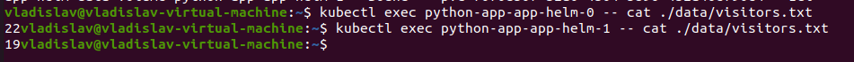

# Lab 13

[//]: <> (Command for deployment: .)
[//]: <> (helm secrets install python-app -f ./secrets.yaml -f ./app-python-values.yaml .)

## Deploying `python-app` as StatefulSet

* Result of execution of the command `kubectl get pods`:


* Result of execution of the command `kubectl get sts`:


* Result of execution of the command `kubectl get svc`:


* Result of execution of the command `kubectl get pvc`:


* Accessing number of visits of the pods running the commands: 
`kubectl exec python-app-app-helm-0 -- cat ./data/visitors.txt` and 
`kubectl exec python-app-app-helm-1 -- cat ./data/visitors.txt`

After opening minikube service(`minikube service python-app-app-helm`) with my `python-app` I made many requests 
to one target(designated) port. As a result, the requests were routed to different pods via k8s LoadBalancer. From 
the picture below, we can see different amount of visits to the root page.



### The differences between the output of the command for replicas

There is a difference in logs and number of visits for each pod because:
1. There is LoadBalancer that distributes the load among the pods, however, with the current configuration
it does it not in the honest way(since it uses caching for target DNS). As a result, many requests may be routed
to one pod until the cache will be updated.
2. Each pods has its own VolumeClaimTemplate(as I configured `acessMode=ReadWriteOnce`), thus each pods has its own
version of `visits.txt` file managing it.

### Explanation of app ordering guarantee

In our case there is no need for ordering guarantee(rollout) since:
1. Each instance of running application(pod) has its own life cycle. It doesn't communicate with any other applications.
The application only manages its state. Thus, we may run many instances of the application, and each instance
will have its own state without even knowing about other instances.
2. Instances of the application doesn't communicate with each other. They do not depend on each other, so we may 
run them in different orders - it will not affect anything.

### Implementation of parallel launch and terminate

To implement this feature, I added the following configuration to `spec` of `./templates/statefulset.yaml`:
```yaml
podManagementPolicy: "Parallel"
```

## Bonus task

## Deploying `java-app` as StatefulSet

* Result of execution of the command `kubectl get pods`:


* Result of execution of the command `kubectl get sts`:


* Result of execution of the command `kubectl get svc`:


* Result of execution of the command `kubectl get pvc`:


* Accessing number of visits of the pods running the commands: 
`kubectl exec java-app-app-helm-0 -- cat ./data/visitors.txt` and 
`kubectl exec java-app-app-helm-0 -- cat ./data/visitors.txt`

After opening minikube service(`minikube service python-app-app-helm`) with my `java-app` I made many requests 
to one target(designated) port. As a result, the requests were routed to different pods via k8s LoadBalancer. From 
the picture below, we can see different amount of visits to the root page.


### Update strategies

The update strategy accepts one of the following value:

* OnDelete - it is like manual update. The user must delete some running pods to indicate controller that new pods 
can be run  with new version of the app. It helps to accurately check that newly created pod acts normally and works
as expected.
* RollingUpdate - it is automated update. In this case controller automatically deletes pod and creates a new one(with 
new image). Controller does this update sequentially(one by one) and verifies that newly created pods marked as
"Ready" and "Running". If there is a failure, the pod will be rolled back to the previous image.