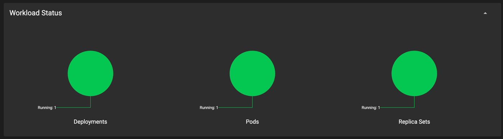

1) getting pods
```bash
k8s % kubectl get po,sts,svc,pvc
NAME             READY   STATUS    RESTARTS   AGE
pod/time-app-0   1/1     Running   0          91s
pod/time-app-1   1/1     Running   0          59s

NAME                        READY   AGE
statefulset.apps/time-app   2/2     91s

NAME                 TYPE           CLUSTER-IP     EXTERNAL-IP   PORT(S)          AGE
service/kubernetes   ClusterIP      10.96.0.1      <none>        443/TCP          29d
service/time-app     LoadBalancer   10.111.12.99   <pending>     5000:30041/TCP   91s

NAME                                                  STATUS   VOLUME                                     CAPACITY   ACCESS MODES   STORAGECLASS   AGE
persistentvolumeclaim/persistence-volume-time-app-0   Bound    pvc-8ed2c053-4c5b-4444-b7d2-0f728cd75a44   512Mi      RWO            standard       91s
persistentvolumeclaim/persistence-volume-time-app-1   Bound    pvc-2265f460-c853-47ab-9938-0f94a1885491   512Mi      RWO            standard       59s
```

2) visiting result \


   
We have this results due to the fact that pods have separate volumes
As we see load balances does not distribute request equally

3) In order to distribute requests equally between pods we need to add the following 
line to the statefulset.yaml:
   podManagementPolicy: "Parallel"