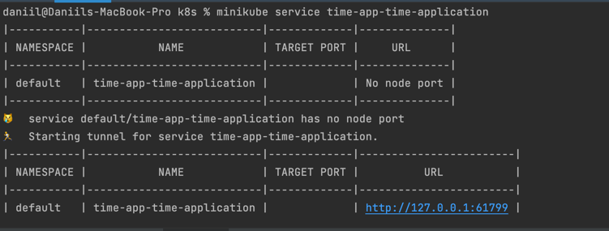
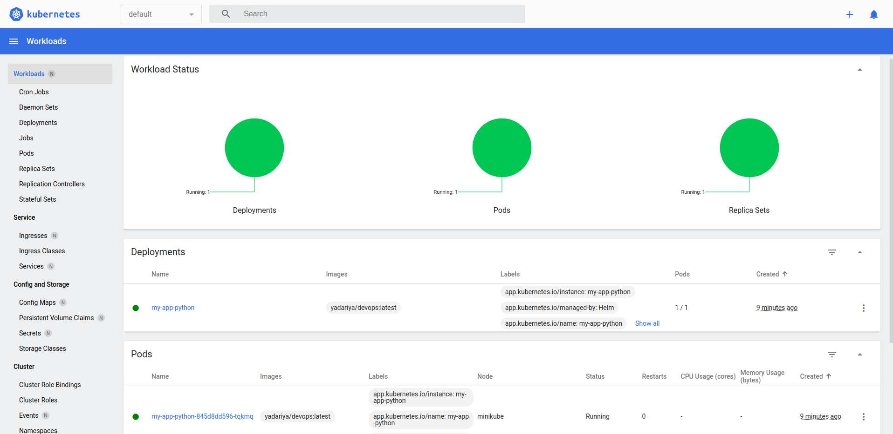

## Explanations of termins

### The Prometheus Operator

The Kubernetes native deployment and administration of Prometheus and associated monitoring components are provided by the Prometheus Operator. 

Highly available Prometheus—the monitoring system that is Prometheus.

Highly accessible - a utility for managing alerts sent by apps is called Alertmanager. Alerts can be sent over various channels, such email, after being preprocessed.

### Node exporter

Go-based Prometheus exporter with pluggable metric collectors for hardware and OS metrics exposed by *NIX kernels.

### Prometheus Adapter for Kubernetes Metrics APIs

The adaptor uses the Kubernetes generic API server parameters as its input (including those for authentication and authorization). By default, it will try to join to the cluster using the Kubernetes in-cluster configuration.

### kube-state-metrics

KSM is a simple service that listens to the Kubernetes API server and generates metrics about the state of the objects. (See examples in the Metrics section below.) It is not focused on the health of the individual Kubernetes components, but rather on the health of the various objects inside, such as deployments, nodes and pods.

### Grafana 

It is a tool for displaying statistics

## kubectl get po,sts,svc,pvc,cm

```shell
NAME                                                    READY   STATUS      RESTARTS      AGE
pod/app-python-97f45848-2hk8j                           0/1     Completed   0             43m
pod/app-python2-7d6f6c4774-kxhw4                        0/1     Completed   0             41m
pod/juice-app-6b49cdb5bf-q2xvc                          1/1     Running     2 (22m ago)   4d7h
pod/prometheus-alertmanager-0                           0/1     Running     2 (22m ago)   51m
pod/prometheus-kube-state-metrics-5fdc4f6d6c-rz774      0/1     Running     1 (22m ago)   51m
pod/prometheus-prometheus-node-exporter-bb9xq           0/1     Running     1 (22m ago)   51m
pod/prometheus-prometheus-pushgateway-5c567c4cb-r2lzl   0/1     Completed   0             51m
pod/prometheus-server-6c8b46f77b-6lqsv                  0/2     Completed   0             51m

NAME                                       READY   AGE
statefulset.apps/prometheus-alertmanager   0/1     51m

NAME                                          TYPE           CLUSTER-IP       EXTERNAL-IP   PORT(S)          AGE
service/app-python                            LoadBalancer   10.103.174.55    <pending>     8080:32459/TCP   43m
service/app-python2                           LoadBalancer   10.106.225.158   <pending>     8000:30652/TCP   41m
service/juice-app                             LoadBalancer   10.99.138.207    <pending>     3000:30564/TCP   4d7h
service/kubernetes                            ClusterIP      10.96.0.1        <none>        443/TCP          7d1h
service/prometheus-alertmanager               ClusterIP      10.109.144.97    <none>        9093/TCP         51m
service/prometheus-alertmanager-headless      ClusterIP      None             <none>        9093/TCP         51m
service/prometheus-kube-state-metrics         ClusterIP      10.102.239.51    <none>        8080/TCP         51m
service/prometheus-prometheus-node-exporter   ClusterIP      10.96.212.252    <none>        9100/TCP         51m
service/prometheus-prometheus-pushgateway     ClusterIP      10.107.239.217   <none>        9091/TCP         51m
service/prometheus-server                     ClusterIP      10.111.197.250   <none>        80/TCP           51m
service/prometheus-server-np                  NodePort       10.98.223.223    <none>        80:30953/TCP     51m

NAME                                                      STATUS   VOLUME                                     CAPACITY   ACCESS MODES   STORAGECLASS   AGE
persistentvolumeclaim/prometheus-server                   Bound    pvc-3075bea9-2b8b-4f89-9334-af9c398bc368   8Gi        RWO            standard       51m
persistentvolumeclaim/storage-prometheus-alertmanager-0   Bound    pvc-e7ef8ddf-f767-41df-ae94-4bad4d3cbaf4   2Gi        RWO            standard       51m

NAME                                DATA   AGE
configmap/kube-root-ca.crt          1      7d1h
configmap/prometheus-alertmanager   1      51m
configmap/prometheus-server         6      51m

```
## Statistics

I have followed many steps and googled a lot but nothing worked for me - the data doesn't show up for me.



### Check how much CPU and Memory your StatefulSet is consuming.

There will be anyway not data as the version is outdated

### Check which Pod is using CPU more than others and which is less in the default namespace.

There will be anyway not data as the version is outdated

### Memory Usage 

I could create my own panel to show such statistics:




### Check how many pods and containers actually ran by the Kubelet service.

### Check which Pod is using network more than others and which is less in the default namespace.

### Check how many alerts you have. Also, you can see them in the Web UI by the `minikube service monitoring-kube-prometheus-alertmanager` command.

## Init containers

Run this command to get the html content:

```shell
wget -O /work-dir/index.html http://info.cern.ch

```

Then run this command: 

```shell
talgat@talgat-VirtualBox:~/DevOpsLabs/k8s$ kubectl exec time-chart -- cat /html_files/index.html
```

Output:

```shell
<html><head></head><body><header>
<title>http://info.cern.ch</title>
</header>

<h1>http://info.cern.ch - home of the first website</h1>
<p>From here you can:</p>
<ul>
<li><a href="http://info.cern.ch/hypertext/WWW/TheProject.html">Browse the first website</a></li>
<li><a href="http://line-mode.cern.ch/www/hypertext/WWW/TheProject.html">Browse the first website using the line-mode browser simulator</a></li>
<li><a href="http://home.web.cern.ch/topics/birth-web">Learn about the birth of the web</a></li>
<li><a href="http://home.web.cern.ch/about">Learn about CERN, the physics laboratory where the web was born</a></li>
</ul>
</body></html>
```


