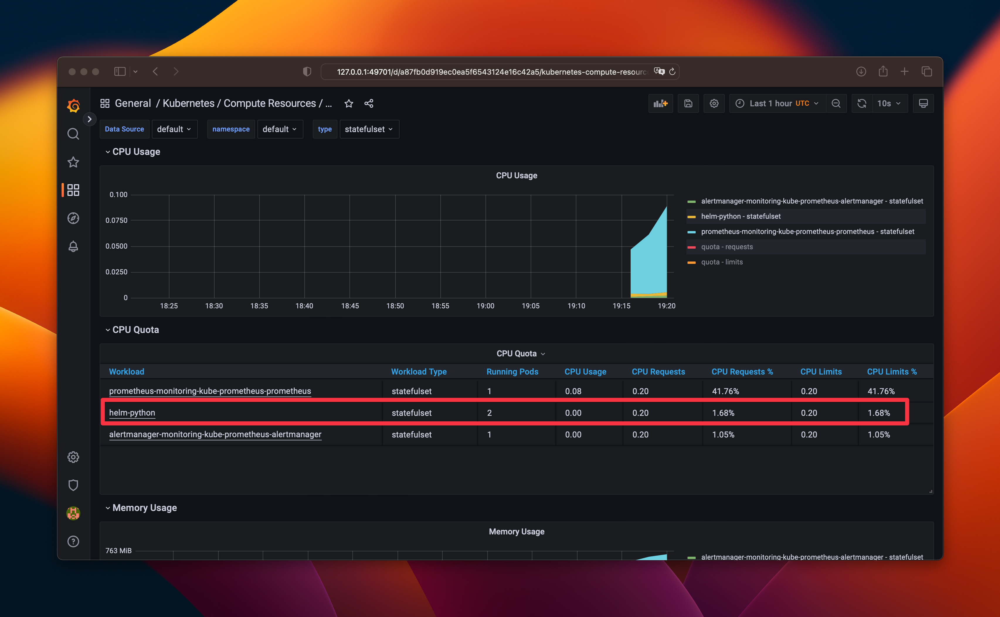
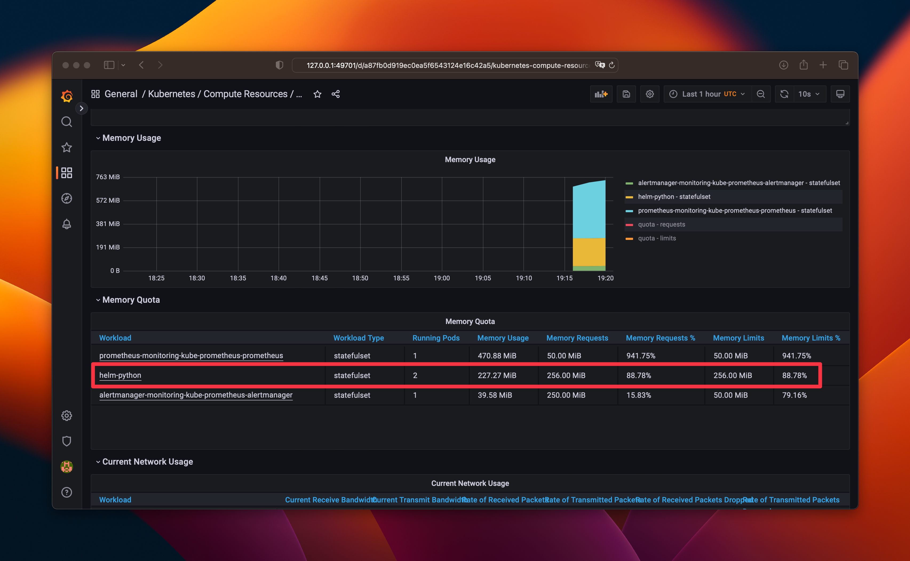
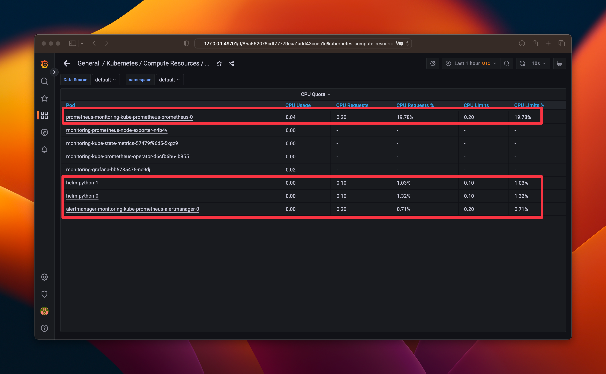
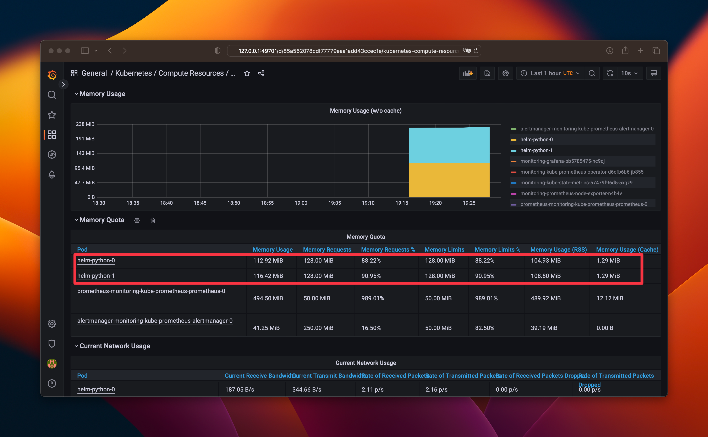
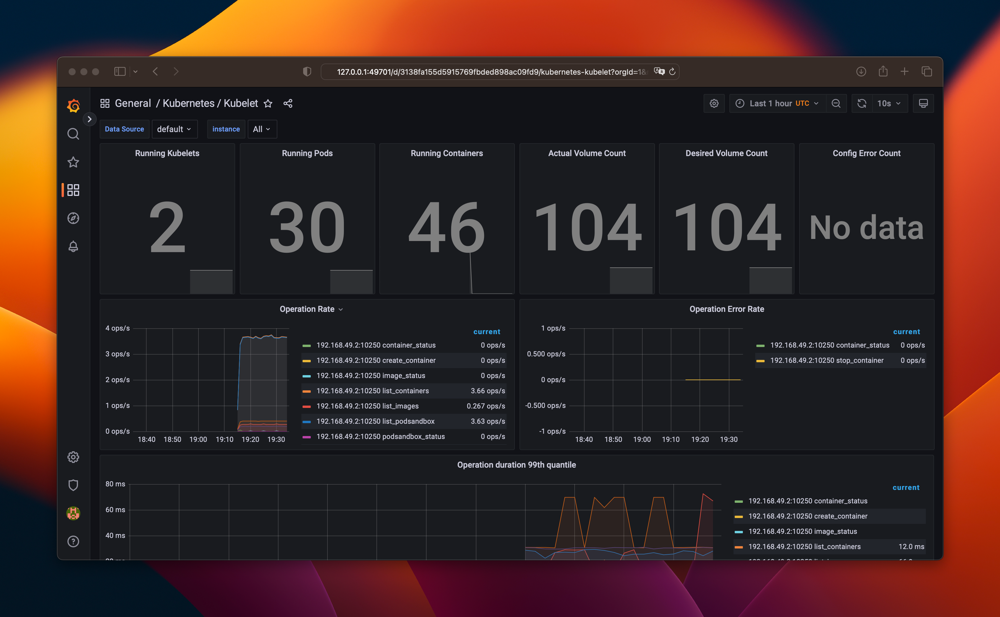
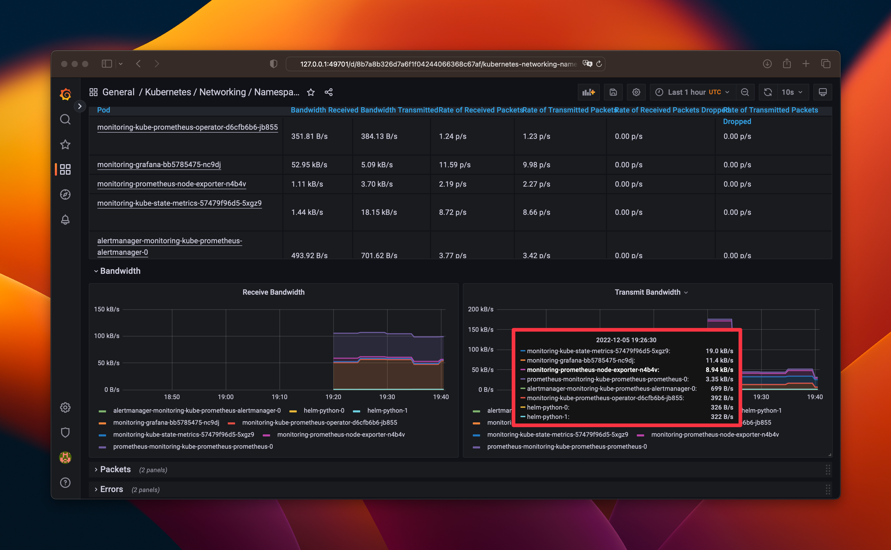
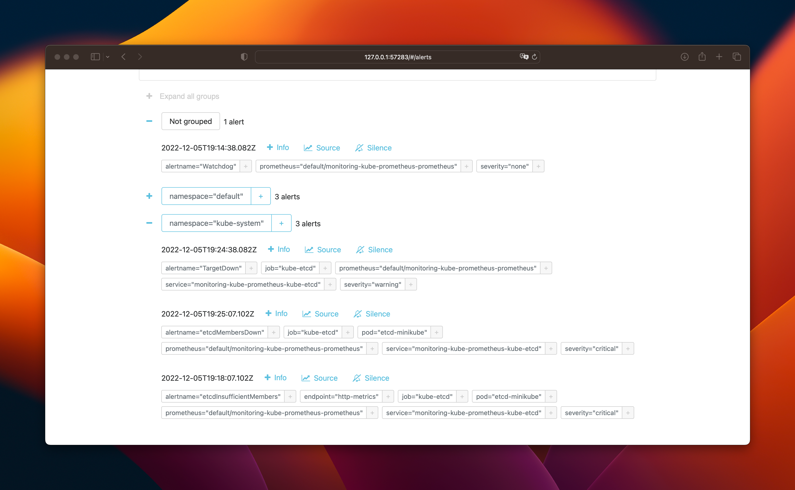

# Prometheus Stack

## Components of Prometheus Stack

- The Prometheus Operator (service that manages cluster).
- Highly available Prometheus (robust version of Prometheus for system monitoring).
- Highly available Alertmanager (robust version of Alertmanager which is used for handling alerts sent by client applications).
- Prometheus node-exporter (exporter for hardware and OS metrics)
- Prometheus Adapter for Kubernetes Metrics APIs (exposes metrics stored in Prometheus in the form of Kubernetes Metrics API).
- kube-state-metrics (service that listens to the Kubernetes API server and generates metrics about the state of the objects such as deployments, nodes, and pods).
- Grafana (visualization dashboard for data).

### Stack installation

> As you know, newest version of minikube has some problems with Prometheus, and we were allowed to skip some questions from next section. However, my classmate **Vladimir Markov** suggested a solution for running an older version that works with Prometheus. I left this note to avoid possible plagiarism problems with this command, you may consider it a quotation.

So, the command to run old version of minikube is as follows:

```bash
minikube start --kubernetes-version=v1.23.0 --memory=6g --bootstrapper=kubeadm --extra-config=kubelet.authentication-token-webhook=true --extra-config=kubelet.authorization-mode=Webhook --extra-config=scheduler.bind-address=0.0.0.0 --extra-config=controller-manager.bind-address=0.0.0.0
```

The `kubectl get po,sts,svc,pvc,cm` obtains information about pods, stateful sets, services, persistent volumes, and config maps correspondingly. The output of this command is as follows:

```plain
NAME                                                         READY   STATUS    RESTARTS      AGE
pod/alertmanager-monitoring-kube-prometheus-alertmanager-0   2/2     Running   1 (38s ago)   40s
pod/helm-python-0                                            1/1     Running   0             12m
pod/helm-python-1                                            1/1     Running   0             12m
pod/monitoring-grafana-bb5785475-nc9dj                       3/3     Running   0             41s
pod/monitoring-kube-prometheus-operator-d6cfb6b6-jb855       1/1     Running   0             41s
pod/monitoring-kube-state-metrics-57479f96d5-5xgz9           1/1     Running   0             41s
pod/monitoring-prometheus-node-exporter-n4b4v                1/1     Running   0             42s
pod/prometheus-monitoring-kube-prometheus-prometheus-0       2/2     Running   0             39s

NAME                                                                    READY   AGE
statefulset.apps/alertmanager-monitoring-kube-prometheus-alertmanager   1/1     40s
statefulset.apps/helm-python                                            2/2     12m
statefulset.apps/prometheus-monitoring-kube-prometheus-prometheus       1/1     39s

NAME                                              TYPE           CLUSTER-IP       EXTERNAL-IP   PORT(S)                      AGE
service/alertmanager-operated                     ClusterIP      None             <none>        9093/TCP,9094/TCP,9094/UDP   40s
service/helm-python                               LoadBalancer   10.100.25.210    <pending>     80:30319/TCP                 12m
service/kubernetes                                ClusterIP      10.96.0.1        <none>        443/TCP                      21m
service/monitoring-grafana                        ClusterIP      10.111.211.57    <none>        80/TCP                       42s
service/monitoring-kube-prometheus-alertmanager   ClusterIP      10.102.229.155   <none>        9093/TCP                     42s
service/monitoring-kube-prometheus-operator       ClusterIP      10.111.208.228   <none>        443/TCP                      42s
service/monitoring-kube-prometheus-prometheus     ClusterIP      10.100.83.137    <none>        9090/TCP                     42s
service/monitoring-kube-state-metrics             ClusterIP      10.97.95.128     <none>        8080/TCP                     42s
service/monitoring-prometheus-node-exporter       ClusterIP      10.107.39.170    <none>        9100/TCP                     42s
service/prometheus-operated                       ClusterIP      None             <none>        9090/TCP                     39s

NAME                                                    STATUS   VOLUME                                     CAPACITY   ACCESS MODES   STORAGECLASS   AGE
persistentvolumeclaim/persistent-volume-helm-python-0   Bound    pvc-3b8f1b1d-047d-4703-a67c-8d573f8d7b46   64Mi       RWO            standard       12m
persistentvolumeclaim/persistent-volume-helm-python-1   Bound    pvc-fa92e3c2-9ba6-448b-8bdf-ffde998f8f79   64Mi       RWO            standard       12m

NAME                                                                     DATA   AGE
configmap/helm-python-config                                             1      12m
configmap/kube-root-ca.crt                                               1      20m
configmap/monitoring-grafana                                             1      42s
configmap/monitoring-grafana-config-dashboards                           1      42s
configmap/monitoring-kube-prometheus-alertmanager-overview               1      42s
configmap/monitoring-kube-prometheus-apiserver                           1      42s
configmap/monitoring-kube-prometheus-cluster-total                       1      42s
configmap/monitoring-kube-prometheus-controller-manager                  1      42s
configmap/monitoring-kube-prometheus-etcd                                1      42s
configmap/monitoring-kube-prometheus-grafana-datasource                  1      42s
configmap/monitoring-kube-prometheus-grafana-overview                    1      42s
configmap/monitoring-kube-prometheus-k8s-coredns                         1      42s
configmap/monitoring-kube-prometheus-k8s-resources-cluster               1      42s
configmap/monitoring-kube-prometheus-k8s-resources-namespace             1      42s
configmap/monitoring-kube-prometheus-k8s-resources-node                  1      42s
configmap/monitoring-kube-prometheus-k8s-resources-pod                   1      42s
configmap/monitoring-kube-prometheus-k8s-resources-workload              1      42s
configmap/monitoring-kube-prometheus-k8s-resources-workloads-namespace   1      42s
configmap/monitoring-kube-prometheus-kubelet                             1      42s
configmap/monitoring-kube-prometheus-namespace-by-pod                    1      42s
configmap/monitoring-kube-prometheus-namespace-by-workload               1      42s
configmap/monitoring-kube-prometheus-node-cluster-rsrc-use               1      42s
configmap/monitoring-kube-prometheus-node-rsrc-use                       1      42s
configmap/monitoring-kube-prometheus-nodes                               1      42s
configmap/monitoring-kube-prometheus-nodes-darwin                        1      42s
configmap/monitoring-kube-prometheus-persistentvolumesusage              1      42s
configmap/monitoring-kube-prometheus-pod-total                           1      42s
configmap/monitoring-kube-prometheus-prometheus                          1      42s
configmap/monitoring-kube-prometheus-proxy                               1      42s
configmap/monitoring-kube-prometheus-scheduler                           1      42s
configmap/monitoring-kube-prometheus-workload-total                      1      42s
configmap/prometheus-monitoring-kube-prometheus-prometheus-rulefiles-0   29     40s
```

## Grafana Dashboard

Here is the data on CPU and memory consumption by our StatefulSet:





Prometheus uses the most CPU resources, while my application and alert manager use the least:



The first replica of my application uses 113 of 128 MB (88%), the second replica of my application uses 116 of 128 MB (91%):



The number of pods and containers actually ran by the Kubelet service:



If we measure network consumption by data transmitted, prometheus-node-exporter consumes the most:



There are 7 alerts in the alert manager:



