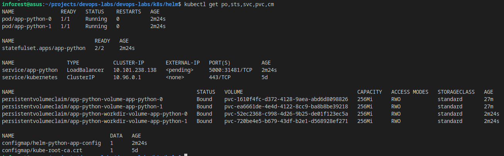
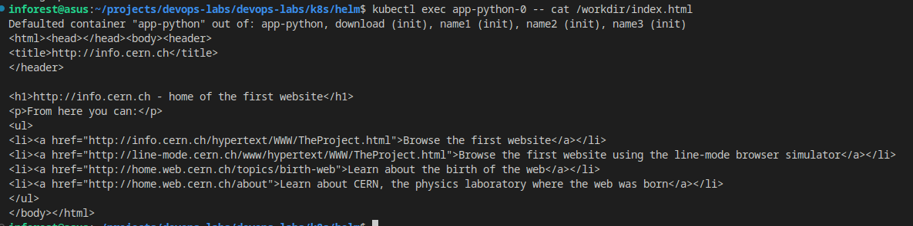
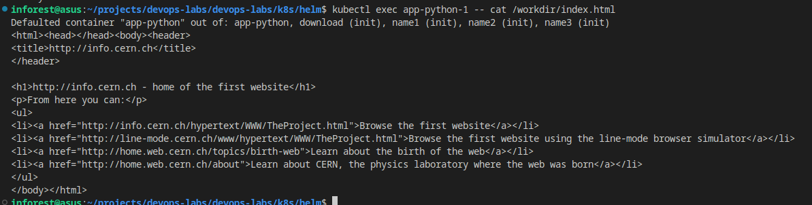

# Lab 14

## Main task

### Running services

`kube-prometheus-stack` have several components:

1. Prometheus Operator - Prometheus deployment on k8s.

2. Highly available Prometheus - time series database for metrics.

3. Highly available Alertmanager - for alerts sent from different sources.

4. Prometheus node-exporter - Export hardware and OS metrics.

5. Prometheus Adapter for Kubernetes Metrics API - generates metrics from the k8s API.

6. kube-state-metrics - Generates metrics from the k8s API about the state of objects.

7. Grafana - interface for data from different sources.

Command below consist from several entities:

- po - Pod

- sts - StatefulSet

- svc - Service

- pvc - PersistentVolumeClaim

- cm - ConfigMap

### Init containers

I used for that info.cern.ch first website

