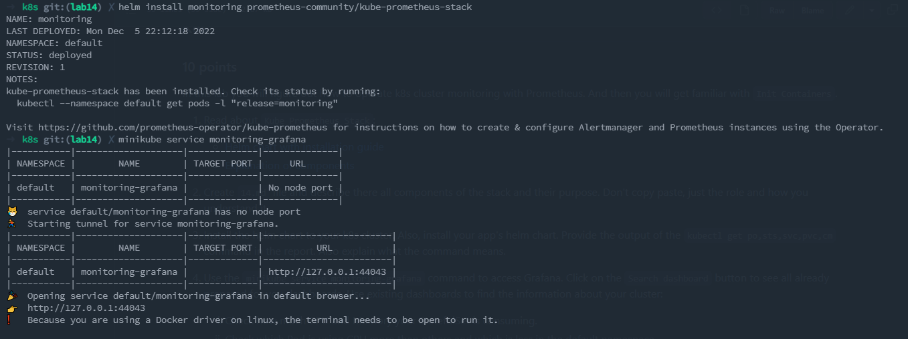
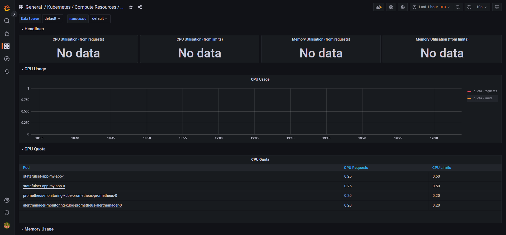
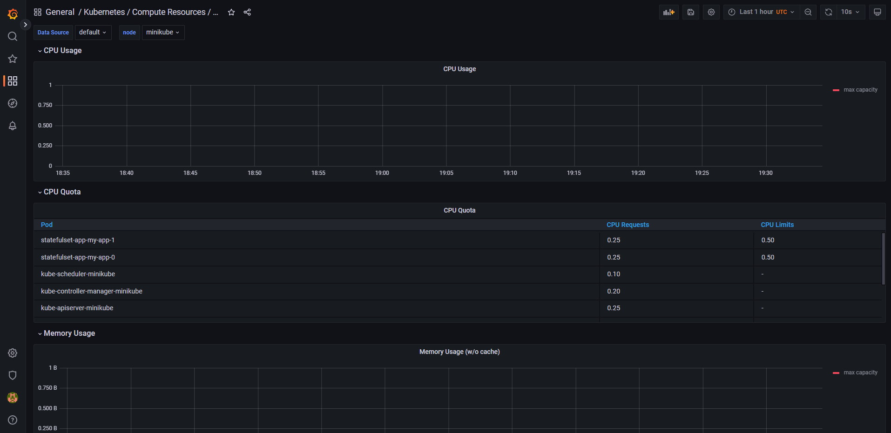
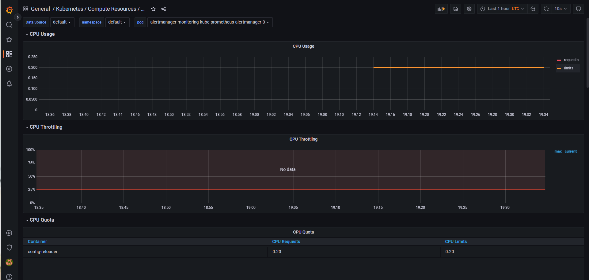
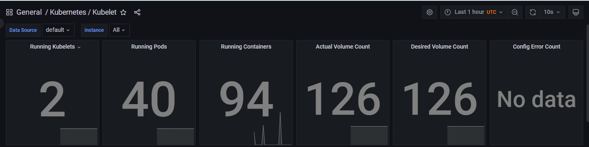
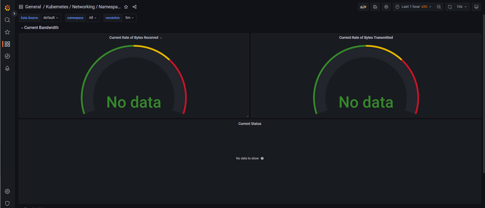
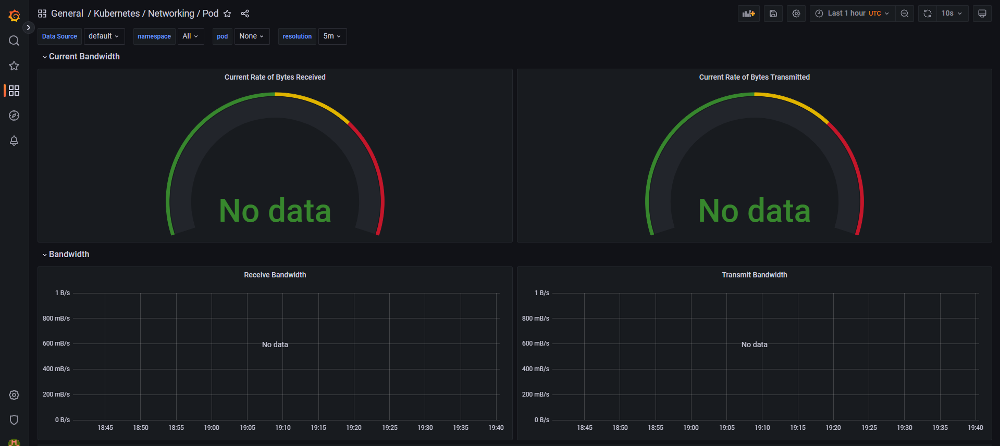
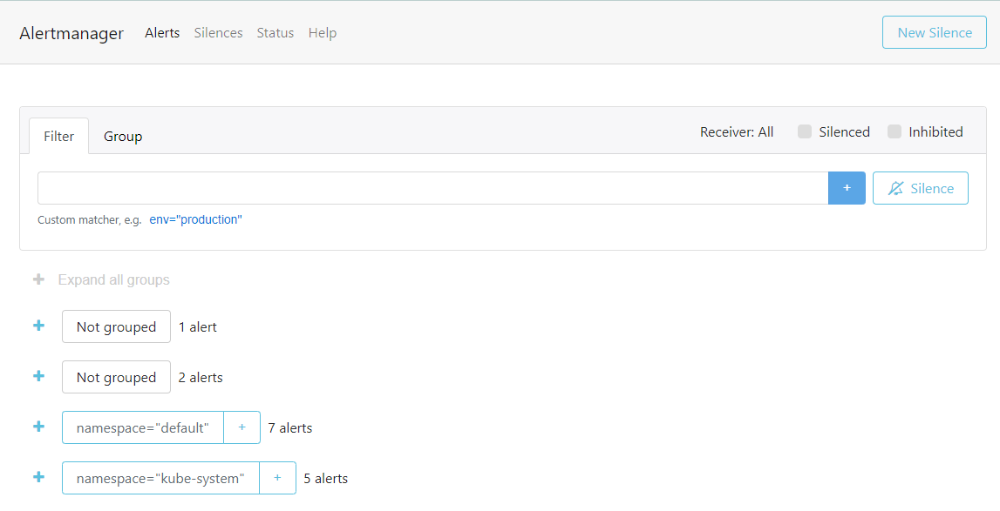
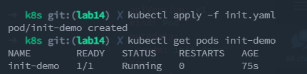
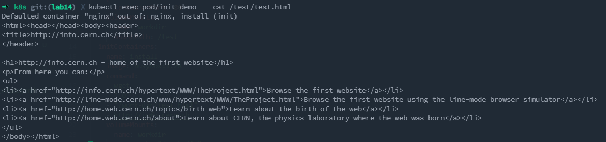

# Lab 14
## Components
* Prometheus Operator
    * Makes easier Prometheus monitoring stack using kubernetes.
* Prometheus
    * Is an application that collects metrics using http pull technology.
* Alertmanager
    * a manager that send alerts depending on triggers such as PromQL query, and also it can send emails or use OpsGenie and etc.
* Prometheus Node Exporter
    * software that exports information/metrics about operating system or hardware.
* Prometheus Adapter for Kubernetes Metrics APIs
    * Is an implementation of some Kubernetes APIs that responsible for metrics.
* kube-state-metrics
    * converts state of objects from kubernetes API
* Grafana
    * this is tool for visualize data on dashboards.
## OUTPUTS
```
> kubectl get po,sts,svc,pvc,cm
NAME                                                         READY   STATUS             RESTARTS       AGE 
pod/alertmanager-monitoring-kube-prometheus-alertmanager-0   2/2     Running            1 (108s ago)   113s
pod/monitoring-grafana-59c58b6f5b-d5jpb                      3/3     Running            0              117s
pod/monitoring-kube-prometheus-operator-54795dd8c9-rxw9w     1/1     Running            0              117s
pod/monitoring-kube-state-metrics-5d8cb49c5d-mgq2p           1/1     Running            0              117s
pod/monitoring-prometheus-node-exporter-tbkwz                1/1     Running            0              117s
pod/prometheus-monitoring-kube-prometheus-prometheus-0       2/2     Running            0              112s
pod/rabbitlab                                                3/6     CrashLoopBackOff   454 (5s ago)   8d
pod/statefulset-app-my-app-0                                 1/1     Running            1 (46m ago)    6d21h
pod/statefulset-app-my-app-1                                 1/1     Running            1 (46m ago)    6d21h
pod/web-0                                                    1/1     Running            2 (46m ago)    6d23h
pod/web-1                                                    1/1     Running            2 (46m ago)    6d23h

NAME                                                                    READY   AGE
statefulset.apps/alertmanager-monitoring-kube-prometheus-alertmanager   1/1     113s
statefulset.apps/prometheus-monitoring-kube-prometheus-prometheus       1/1     112s
statefulset.apps/statefulset-app-my-app                                 2/2     6d21h
statefulset.apps/web                                                    2/2     6d23h

NAME                                              TYPE        CLUSTER-IP       EXTERNAL-IP   PORT(S)                      AGE
service/alertmanager-operated                     ClusterIP   None             <none>        9093/TCP,9094/TCP,9094/UDP   113s
service/kubernetes                                ClusterIP   10.96.0.1        <none>        443/TCP                      35d
service/lab13                                     ClusterIP   None             <none>        80/TCP                       6d23h
service/monitoring-grafana                        ClusterIP   10.100.218.198   <none>        80/TCP                       118s
service/monitoring-kube-prometheus-alertmanager   ClusterIP   10.106.217.180   <none>        9093/TCP                     118s
service/monitoring-kube-prometheus-operator       ClusterIP   10.97.105.107    <none>        443/TCP                      118s
service/monitoring-kube-prometheus-prometheus     ClusterIP   10.105.72.196    <none>        9090/TCP                     118s
service/monitoring-kube-state-metrics             ClusterIP   10.100.7.136     <none>        8080/TCP                     118s
service/monitoring-prometheus-node-exporter       ClusterIP   10.102.10.189    <none>        9100/TCP                     118s
service/prometheus-operated                       ClusterIP   None             <none>        9090/TCP                     112s
service/statefulset-app-my-app                    ClusterIP   10.103.240.30    <none>        80/TCP                       6d21h

NAME                                                                    STATUS   VOLUME                                     CAPACITY   ACCESS MODES   STORAGECLASS   AGE
persistentvolumeclaim/my-app-stateful-volume-statefulset-app-my-app-0   Bound    pvc-3e911ef4-3716-4820-9260-5ac0125222a7   1Gi        RWX            standard       6d21h
persistentvolumeclaim/my-app-stateful-volume-statefulset-app-my-app-1   Bound    pvc-65cd7074-0b05-4b12-a190-3d0ac844b209   1Gi        RWX            standard       6d21h
persistentvolumeclaim/stateful-volume-statefulset-app-my-app-0          Bound    pvc-bbaadbaa-eb30-4956-9f39-81913c0528be   1Gi        RWX            standard       6d22h
persistentvolumeclaim/stateful-volume-statefulset-app-my-app-1          Bound    pvc-491cd251-560b-468d-b2de-cf1b10de803f   1Gi        RWX            standard       6d22h
persistentvolumeclaim/visits-web-0                                      Bound    pvc-419f96d1-01bd-4e82-9115-b8d05cf66cd8   1Gi        RWX            standard       6d23h
persistentvolumeclaim/visits-web-1                                      Bound    pvc-4e9d451a-a644-483e-97e4-179500494666   1Gi        RWX            standard       6d23h

NAME                                                                     DATA   AGE
configmap/kube-root-ca.crt                                               1      35d
configmap/monitoring-grafana                                             1      118s
configmap/monitoring-grafana-config-dashboards                           1      118s
configmap/monitoring-kube-prometheus-alertmanager-overview               1      118s
configmap/monitoring-kube-prometheus-apiserver                           1      118s
configmap/monitoring-kube-prometheus-cluster-total                       1      118s
configmap/monitoring-kube-prometheus-controller-manager                  1      118s
configmap/monitoring-kube-prometheus-etcd                                1      118s
configmap/monitoring-kube-prometheus-grafana-datasource                  1      118s
configmap/monitoring-kube-prometheus-grafana-overview                    1      118s
configmap/monitoring-kube-prometheus-k8s-coredns                         1      118s
configmap/monitoring-kube-prometheus-k8s-resources-cluster               1      118s
configmap/monitoring-kube-prometheus-k8s-resources-namespace             1      118s
configmap/monitoring-kube-prometheus-k8s-resources-node                  1      118s
configmap/monitoring-kube-prometheus-k8s-resources-pod                   1      118s
configmap/monitoring-kube-prometheus-k8s-resources-workload              1      118s
configmap/monitoring-kube-prometheus-k8s-resources-workloads-namespace   1      118s
configmap/monitoring-kube-prometheus-kubelet                             1      118s
configmap/monitoring-kube-prometheus-namespace-by-pod                    1      118s
configmap/monitoring-kube-prometheus-namespace-by-workload               1      118s
configmap/monitoring-kube-prometheus-node-cluster-rsrc-use               1      118s
configmap/monitoring-kube-prometheus-node-rsrc-use                       1      118s
configmap/monitoring-kube-prometheus-nodes                               1      118s
configmap/monitoring-kube-prometheus-nodes-darwin                        1      118s
configmap/monitoring-kube-prometheus-persistentvolumesusage              1      118s
configmap/monitoring-kube-prometheus-pod-total                           1      118s
configmap/monitoring-kube-prometheus-prometheus                          1      118s
configmap/monitoring-kube-prometheus-proxy                               1      118s
configmap/monitoring-kube-prometheus-scheduler                           1      118s
configmap/monitoring-kube-prometheus-workload-total                      1      118s
configmap/my-app-config                                                  1      6d21h
configmap/prometheus-monitoring-kube-prometheus-prometheus-rulefiles-0   29     113s
```
### Description of those commands `kubectl get po,sts,svc,pvc,cm`
* `kubectl get` - list information about:
    * `po`
        * shows information about your pods
    * `sts`
        * shows information about your statefulsets
    * `svc`
        * shows information about your services
    * `pvc`
        * shows information about your persistent volumes
    * `cm`
        * shows information about your ConfigMaps
## GRAFANA DASHBOARDS
Installation:

There is no data in:
* Kubernetes / Compute Resources / Node (Pods)
* Kubernetes / Compute Resources / Namespace (Pods)
* Kubernetes / Compute Resources / Pod
Screenshots:




* Here you can see that there are 40 pods and 94 containers:


* There is no data about network either:



* There are 15 alerts in total:


## Init Containers
I created custom yaml to use init containers `./k8s/init.yaml`


Now lets see if it works:


