# Lab 14

1. Components of the stack and their purpose:
   * **Prometheus Operator** - A set of components to work with prometheus monitoring tool in K8S
   * **Prometheus** - Monitoring tool that collect and store different metrics
   * **Alertmanager** - Tool to handle alerts (for example from the Prometheus server) and send them via, for example, email.
   * **Prometheus node-exporter** - monitor and send hardware and OS metrics to Prometheus
   * **Prometheus Adapter for Kubernetes Metrics APIs** - monitor and send K8S metrics to Prometheus (resource metrics, custom metrics, and external metrics APIs)
   * **kube-state-metrics** - monitor and send state of the objects (such as deployments, nodes and pods) to the Prometheus.
   * **Grafana** - tool for metrics visualization

2. Install `Kube Prometheus Stack`:

   Due to problems with newest version of minikube and prometheus we need to use special version of the minikube with special flugs (taken from [here](https://github.com/prometheus-operator/kube-prometheus#minikube)):

   ```bash
   minikube start --kubernetes-version=v1.23.0 --memory=6g --bootstrapper=kubeadm --extra-config=kubelet.authentication-token-webhook=true --extra-config=kubelet.authorization-mode=Webhook --extra-config=scheduler.bind-address=0.0.0.0 --extra-config=controller-manager.bind-address=0.0.0.0
   ```

   Install monitoring tools:

   ```bash
   helm repo add prometheus-community https://prometheus-community.github.io/helm-charts
   helm repo update
   helm install -f helm-monitoring/values.yaml monitoring prometheus-community/kube-prometheus-stack
   ```

   Output of the `kubectl get po,sts,svc,pvc,cm` command (this command gets all pods, statefulsets, services, persistentvolumeclaims and configmaps):

   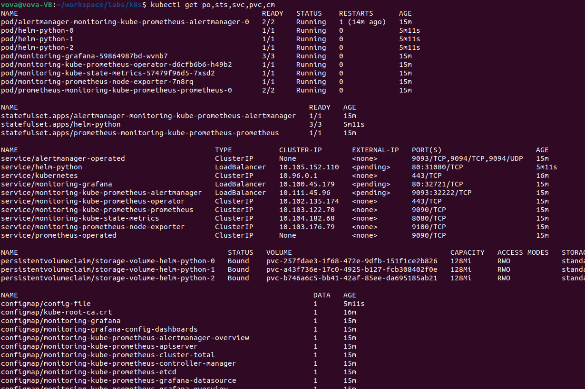

3. Access Grafana:

   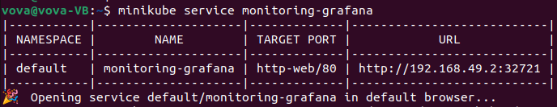

   1. Check how much CPU and Memory your StatefulSet is consuming (use `Kubernetes / Compute Resources / Namespace (Workload)`):

      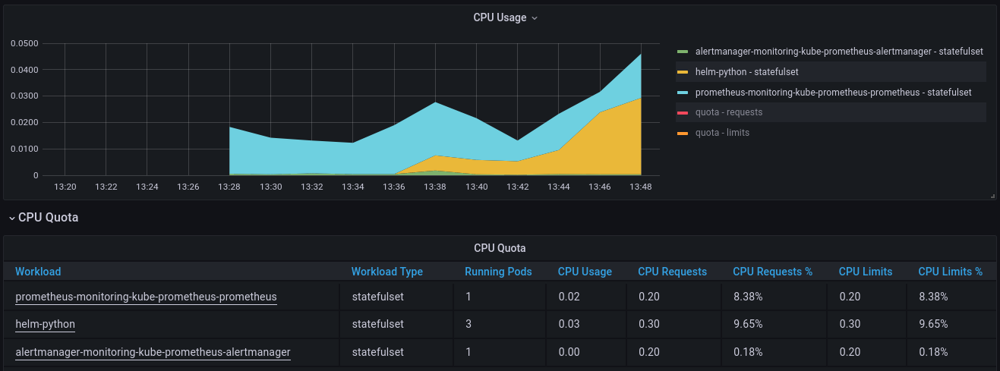

      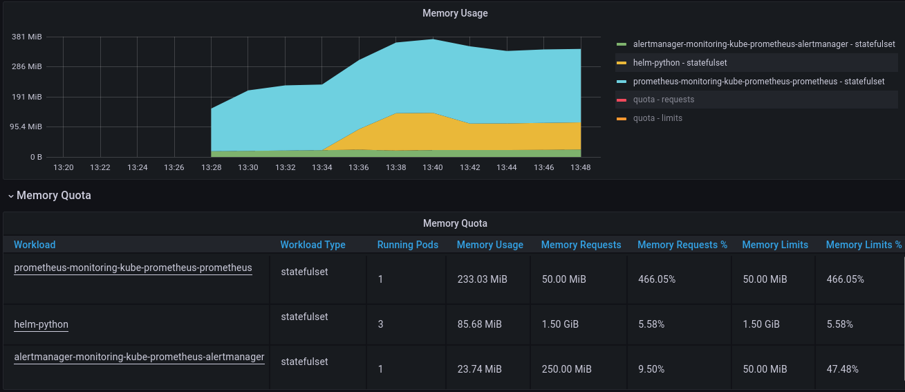

   2. Check which Pod is using CPU more than others and which is less in the default namespace (use `Kubernetes / Compute Resources / Namespace (Pods)`):

      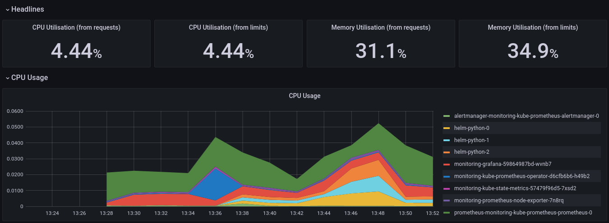

      Prometheus and Grafana uses more and my app uses less CPU.

   3. Check how much memory is used on your node, in % and mb (use `Kubernetes / Compute Resources / Namespace (Pods)`):

      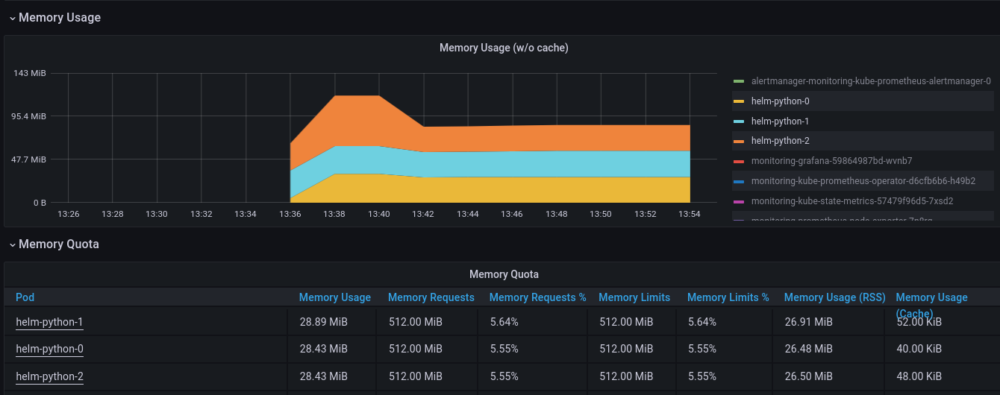

      Each of my nodes use 29 MiB our of 512 MiB (5.5%).

   4. Check how many pods and containers actually ran by the Kubelet service (use `Kubernetes / Kublet`):

      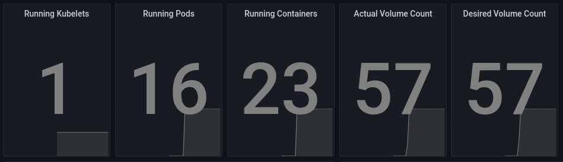

      There are 16 pods and 23 containers.

   5. Check which Pod is using network more than others and which is less in the default namespace (use `Kubernetes / Networking / Namespace (Pods)`):

      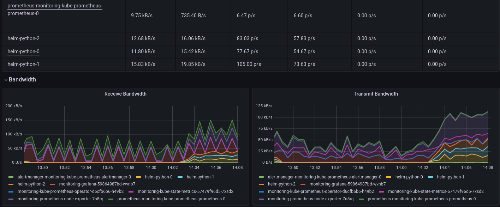

      Node exporter is using network the most.

   6. Check how many alerts you have:

      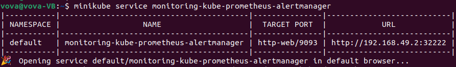

      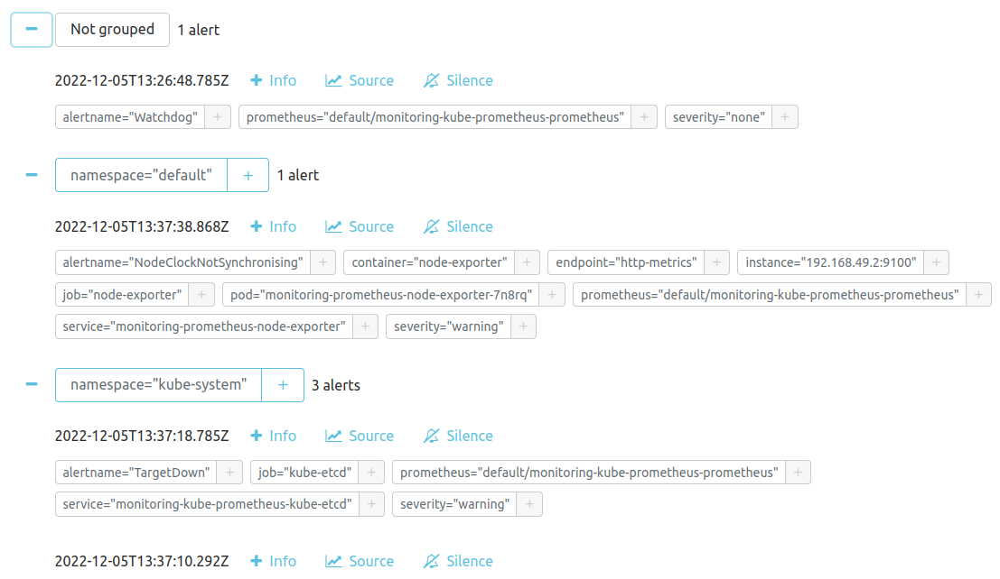

      I have 5 alerts.

4. Let's use an Init container to download any file:

   ```bash
   kubectl apply -f init_container/deployment.yaml
   ```

   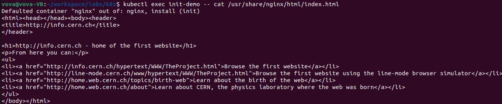

## Bonus

1. Deploy our application using [this](https://github.com/prometheus-operator/prometheus-operator/blob/main/Documentation/user-guides/getting-started.md#deploying-a-sample-application) instruction, [this](https://github.com/prometheus-operator/prometheus-operator/blob/main/Documentation/troubleshooting.md#troubleshooting-servicemonitor-changes) and [this](https://managedkube.com/prometheus/operator/servicemonitor/troubleshooting/2019/11/07/prometheus-operator-servicemonitor-troubleshooting.html) for troubleshooting:

   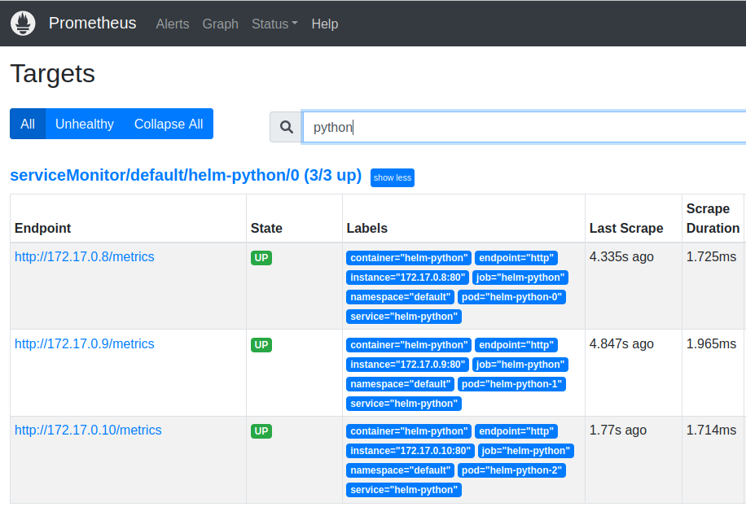

   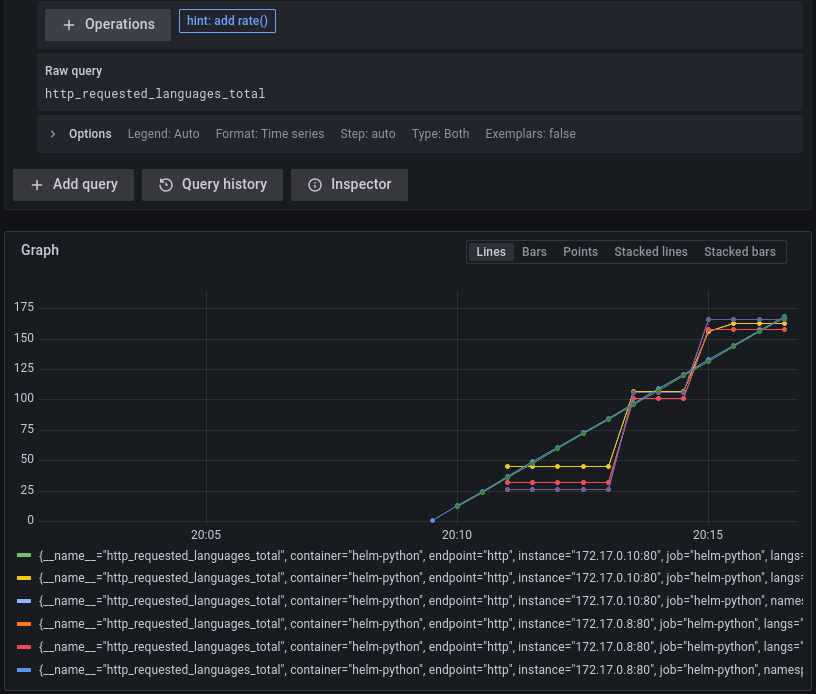

2. Create a queue of three Init containers, with any logic like adding new lines to the same file:

   ```bash
   kubectl apply -f init_container/deployment_bonus.yaml
   ```

   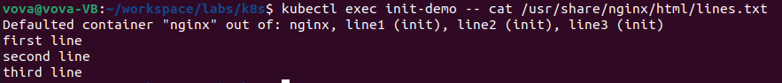