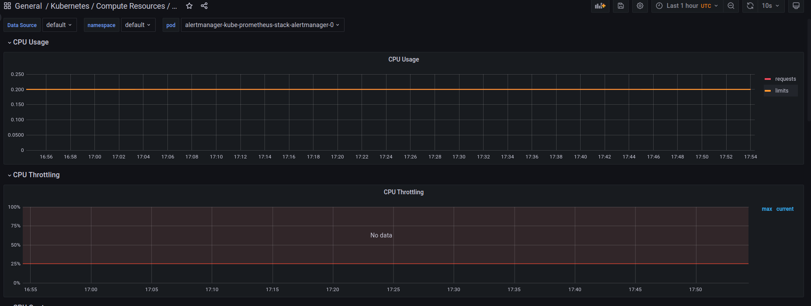

# Lab 14

### Components

- The Prometheus Operator - Manages Prometheus cluster inside k8s. Provides CRDs, Prometheus deployment, Prometheus config auto-generation.
- Prometheus - The monitoring system itself that collects metrics from targets.
- Alertmanager - Handles alerts sent based on metric values in Prometheus.
- Prometheus node-exporter - Collects hardware-specific metrics from a device (like cpu usage, memory util, etc).
- Prometheus Adapter for Kubernetes Metrics APIs - Sens k8s-specific metrics in Prometheus format to Prometheus.
- kube-state-metrics - Exporter for k8s object state. Sends the metrics to Prometheus.
- Grafana - A tool for data visualization

### Deployment 

```bash
$ kubectl get po,sts,svc,pvc,cm # list pods, statefulsets, servises, persistentvolumeclaims and configmaps
NAME                                                           READY   STATUS    RESTARTS      AGE
pod/alertmanager-kube-prometheus-stack-alertmanager-0          2/2     Running   1 (33s ago)   35s
pod/kube-prometheus-stack-grafana-66f69dffdb-29q4p             3/3     Running   0             37s
pod/kube-prometheus-stack-kube-state-metrics-b64cf5876-7gnzv   1/1     Running   0             37s
pod/kube-prometheus-stack-operator-766596c5df-dh4bt            1/1     Running   0             37s
pod/kube-prometheus-stack-prometheus-node-exporter-qqkmx       1/1     Running   0             37s
pod/prometheus-kube-prometheus-stack-prometheus-0              2/2     Running   0             35s
pod/py-app-0                                                   1/1     Running   0             3m6s
pod/py-app-1                                                   1/1     Running   0             3m2s
pod/py-app-2                                                   1/1     Running   0             2m58s

NAME                                                               READY   AGE
statefulset.apps/alertmanager-kube-prometheus-stack-alertmanager   1/1     35s
statefulset.apps/prometheus-kube-prometheus-stack-prometheus       1/1     35s
statefulset.apps/py-app                                            3/3     3m6s

NAME                                                     TYPE           CLUSTER-IP       EXTERNAL-IP   PORT(S)                      AGE
service/alertmanager-operated                            ClusterIP      None             <none>        9093/TCP,9094/TCP,9094/UDP   35s
service/kube-prometheus-stack-alertmanager               ClusterIP      10.103.61.129    <none>        9093/TCP                     37s
service/kube-prometheus-stack-grafana                    LoadBalancer   10.96.16.225     <pending>     80:32445/TCP                 37s
service/kube-prometheus-stack-kube-state-metrics         ClusterIP      10.99.236.85     <none>        8080/TCP                     37s
service/kube-prometheus-stack-operator                   ClusterIP      10.108.237.195   <none>        443/TCP                      37s
service/kube-prometheus-stack-prometheus                 ClusterIP      10.111.154.142   <none>        9090/TCP                     37s
service/kube-prometheus-stack-prometheus-node-exporter   ClusterIP      10.104.22.154    <none>        9100/TCP                     37s
service/kubernetes                                       ClusterIP      10.96.0.1        <none>        443/TCP                      30d
service/prometheus-operated                              ClusterIP      None             <none>        9090/TCP                     35s
service/py-app                                           LoadBalancer   10.106.143.124   <pending>     80:30555/TCP                 3m6s

NAME                                           STATUS   VOLUME                                     CAPACITY   ACCESS MODES   STORAGECLASS   AGE
persistentvolumeclaim/py-app-volume-py-app-0   Bound    pvc-7720eeda-b453-45b4-a17e-3a14d02a14a1   64Mi       RWO            standard       7d23h
persistentvolumeclaim/py-app-volume-py-app-1   Bound    pvc-77375eaf-5f32-4930-b3b2-7e2757dc61b7   64Mi       RWO            standard       7d23h
persistentvolumeclaim/py-app-volume-py-app-2   Bound    pvc-6466f14e-a6da-4ad3-a35c-6d07fca6f4e3   64Mi       RWO            standard       7d23h

NAME                                                                DATA   AGE
configmap/kube-prometheus-stack-alertmanager-overview               1      37s
configmap/kube-prometheus-stack-apiserver                           1      37s
configmap/kube-prometheus-stack-cluster-total                       1      37s
configmap/kube-prometheus-stack-controller-manager                  1      37s
configmap/kube-prometheus-stack-etcd                                1      37s
configmap/kube-prometheus-stack-grafana                             1      37s
configmap/kube-prometheus-stack-grafana-config-dashboards           1      37s
configmap/kube-prometheus-stack-grafana-datasource                  1      37s
configmap/kube-prometheus-stack-grafana-overview                    1      37s
configmap/kube-prometheus-stack-k8s-coredns                         1      37s
configmap/kube-prometheus-stack-k8s-resources-cluster               1      37s
configmap/kube-prometheus-stack-k8s-resources-namespace             1      37s
configmap/kube-prometheus-stack-k8s-resources-node                  1      37s
configmap/kube-prometheus-stack-k8s-resources-pod                   1      37s
configmap/kube-prometheus-stack-k8s-resources-workload              1      37s
configmap/kube-prometheus-stack-k8s-resources-workloads-namespace   1      37s
configmap/kube-prometheus-stack-kubelet                             1      37s
configmap/kube-prometheus-stack-namespace-by-pod                    1      37s
configmap/kube-prometheus-stack-namespace-by-workload               1      37s
configmap/kube-prometheus-stack-node-cluster-rsrc-use               1      37s
configmap/kube-prometheus-stack-node-rsrc-use                       1      37s
configmap/kube-prometheus-stack-nodes                               1      37s
configmap/kube-prometheus-stack-nodes-darwin                        1      37s
configmap/kube-prometheus-stack-persistentvolumesusage              1      37s
configmap/kube-prometheus-stack-pod-total                           1      37s
configmap/kube-prometheus-stack-prometheus                          1      37s
configmap/kube-prometheus-stack-proxy                               1      37s
configmap/kube-prometheus-stack-scheduler                           1      37s
configmap/kube-prometheus-stack-workload-total                      1      37s
configmap/kube-root-ca.crt                                          1      30d
configmap/prometheus-kube-prometheus-stack-prometheus-rulefiles-0   29     35s
configmap/py-app-config                                             1      3m6s
```

### Screenshots

I could not do screenshots as I had no data



### Init container

```bash
$ kubectl exec pod/py-app-0 -- cat ./a/LAB14.md                                                                                        
Defaulted container "py" out of: py, volume-mount (init), download-file (init)

<!DOCTYPE html>
<html lang="en" data-color-mode="auto" data-light-theme="light" data-dark-theme="dark" data-a11y-animated-images="system">
  <head>
    <meta charset="utf-8">
  <link rel="dns-prefetch" href="https://github.githubassets.com">
  <link rel="dns-prefetch" href="https://avatars.githubusercontent.com">
  <link rel="dns-prefetch" href="https://github-cloud.s3.amazonaws.com">
  <link rel="dns-prefetch" href="https://user-images.githubusercontent.com/">
  <link rel="preconnect" href="https://github.githubassets.com" crossorigin>
  <link rel="preconnect" href="https://avatars.githubusercontent.com">

... # rest was removed in order to srink the report
```