## Lab 14: Init Containers

#### All components of the stack & their purpose:

- Prometheus Operator: manages all the components from prometheus to work together.
- HA prometheus: tool for gathering metrics and alerting.
- HA alert-manager: tool handling alerts from monitoring systems.
- prometheus node exporter: tool that gathers hardware and operating system metrics.
- Prometheus adapter for k8s Metrics: tool that help to get Kubernetes metrics.
- kube-state-metrics: tool that generates metrics from k8s msgs.
- Grafana: tool for data monitoring, visualization.

### Monitoring

To avoid the

```shell
minikube delete
minikube start --kubernetes-version=v1.23.0 --memory=2g --bootstrapper=kubeadm --extra-config=kubelet.authentication-token-webhook=true --extra-config=kubelet.authorization-mode=Webhook --extra-config=scheduler.bind-address=0.0.0.0 --extra-config=controller-manager.bind-address=0.0.0.0
```

```
$ helm repo add prometheus-community https://prometheus-community.github.io/helm-charts
$ helm repo update
$ helm install -f ./values.yaml monitoring prometheus-community/kube-prometheus-stack

NAME: monitoring
LAST DEPLOYED: Mon Dec  5 22:35:53 2022
NAMESPACE: default
STATUS: deployed
REVISION: 1
NOTES:
kube-prometheus-stack has been installed. Check its status by running:
  kubectl --namespace default get pods -l "release=monitoring"

$ kubectl --namespace default get pods -l "release=monitoring"

NAME                                                 READY   STATUS    RESTARTS   AGE
monitoring-kube-prometheus-operator-d6cfb6b6-qszcz   1/1     Running   0          26s
monitoring-kube-state-metrics-57479f96d5-9nqv5       1/1     Running   0          26s
monitoring-prometheus-node-exporter-bczwk            1/1     Running   0          26s

```

```shell
kubectl get po,sts,svc,pvc,cm
```
(output from the end of the lab, after some troubleshooting)
```shell
tim@Tim-MacBook-Pro k8s % kubectl get po,sts,svc,pvc,cm
NAME                                                         READY   STATUS    RESTARTS      AGE
pod/alertmanager-monitoring-kube-prometheus-alertmanager-0   2/2     Running   1 (89m ago)   89m
pod/init-time-app                                            1/1     Running   0             3m41s
pod/monitoring-grafana-bb5785475-s4mrz                       3/3     Running   0             89m
pod/monitoring-kube-prometheus-operator-d6cfb6b6-qszcz       1/1     Running   0             89m
pod/monitoring-kube-state-metrics-57479f96d5-9nqv5           1/1     Running   0             89m
pod/monitoring-prometheus-node-exporter-bczwk                1/1     Running   0             89m
pod/prometheus-monitoring-kube-prometheus-prometheus-0       2/2     Running   0             89m
pod/time-app-0                                               1/1     Running   0             29m
pod/time-app-1                                               1/1     Running   0             29m

NAME                                                                    READY   AGE
statefulset.apps/alertmanager-monitoring-kube-prometheus-alertmanager   1/1     89m
statefulset.apps/prometheus-monitoring-kube-prometheus-prometheus       1/1     89m
statefulset.apps/time-app                                               2/2     29m

NAME                                              TYPE        CLUSTER-IP       EXTERNAL-IP   PORT(S)                      AGE
service/alertmanager-operated                     ClusterIP   None             <none>        9093/TCP,9094/TCP,9094/UDP   89m
service/kubernetes                                ClusterIP   10.96.0.1        <none>        443/TCP                      93m
service/monitoring-grafana                        ClusterIP   10.100.78.112    <none>        80/TCP                       89m
service/monitoring-kube-prometheus-alertmanager   ClusterIP   10.103.175.46    <none>        9093/TCP                     89m
service/monitoring-kube-prometheus-operator       ClusterIP   10.98.241.22     <none>        443/TCP                      89m
service/monitoring-kube-prometheus-prometheus     ClusterIP   10.101.119.173   <none>        9090/TCP                     89m
service/monitoring-kube-state-metrics             ClusterIP   10.102.11.70     <none>        8080/TCP                     89m
service/monitoring-prometheus-node-exporter       ClusterIP   10.97.171.200    <none>        9100/TCP                     89m
service/prometheus-operated                       ClusterIP   None             <none>        9090/TCP                     89m
service/time-app                                  ClusterIP   10.107.24.114    <none>        80/TCP                       29m

NAME                                                  STATUS   VOLUME                                     CAPACITY   ACCESS MODES   STORAGECLASS   AGE
persistentvolumeclaim/persistence-volume-time-app-0   Bound    pvc-4c80e82b-0ad8-4d00-80a3-b237b4a82d94   512Mi      RWO            standard       29m
persistentvolumeclaim/persistence-volume-time-app-1   Bound    pvc-4591b3a3-75c1-41ce-85d2-1bf2c6bb547c   512Mi      RWO            standard       29m

NAME                                                                     DATA   AGE
configmap/kube-root-ca.crt                                               1      93m
configmap/monitoring-grafana                                             1      89m
configmap/monitoring-grafana-config-dashboards                           1      89m
configmap/monitoring-kube-prometheus-alertmanager-overview               1      89m
configmap/monitoring-kube-prometheus-apiserver                           1      89m
configmap/monitoring-kube-prometheus-cluster-total                       1      89m
configmap/monitoring-kube-prometheus-controller-manager                  1      89m
configmap/monitoring-kube-prometheus-etcd                                1      89m
configmap/monitoring-kube-prometheus-grafana-datasource                  1      89m
configmap/monitoring-kube-prometheus-grafana-overview                    1      89m
configmap/monitoring-kube-prometheus-k8s-coredns                         1      89m
configmap/monitoring-kube-prometheus-k8s-resources-cluster               1      89m
configmap/monitoring-kube-prometheus-k8s-resources-namespace             1      89m
configmap/monitoring-kube-prometheus-k8s-resources-node                  1      89m
configmap/monitoring-kube-prometheus-k8s-resources-pod                   1      89m
configmap/monitoring-kube-prometheus-k8s-resources-workload              1      89m
configmap/monitoring-kube-prometheus-k8s-resources-workloads-namespace   1      89m
configmap/monitoring-kube-prometheus-kubelet                             1      89m
configmap/monitoring-kube-prometheus-namespace-by-pod                    1      89m
configmap/monitoring-kube-prometheus-namespace-by-workload               1      89m
configmap/monitoring-kube-prometheus-node-cluster-rsrc-use               1      89m
configmap/monitoring-kube-prometheus-node-rsrc-use                       1      89m
configmap/monitoring-kube-prometheus-nodes                               1      89m
configmap/monitoring-kube-prometheus-nodes-darwin                        1      89m
configmap/monitoring-kube-prometheus-persistentvolumesusage              1      89m
configmap/monitoring-kube-prometheus-pod-total                           1      89m
configmap/monitoring-kube-prometheus-prometheus                          1      89m
configmap/monitoring-kube-prometheus-proxy                               1      89m
configmap/monitoring-kube-prometheus-scheduler                           1      89m
configmap/monitoring-kube-prometheus-workload-total                      1      89m
configmap/prometheus-monitoring-kube-prometheus-prometheus-rulefiles-0   29     89m
configmap/time-app-configmap                                             1      29m

```


`minikube service prometheus-grafana`

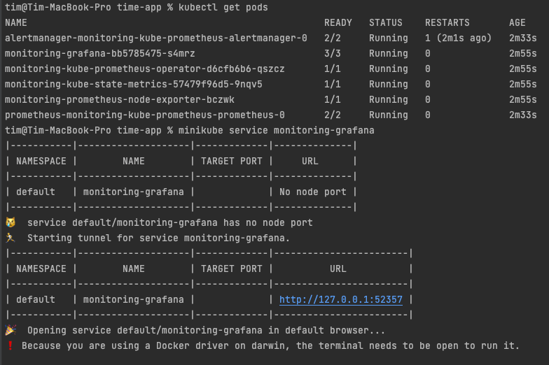

creds:

- admin
- prom-operator

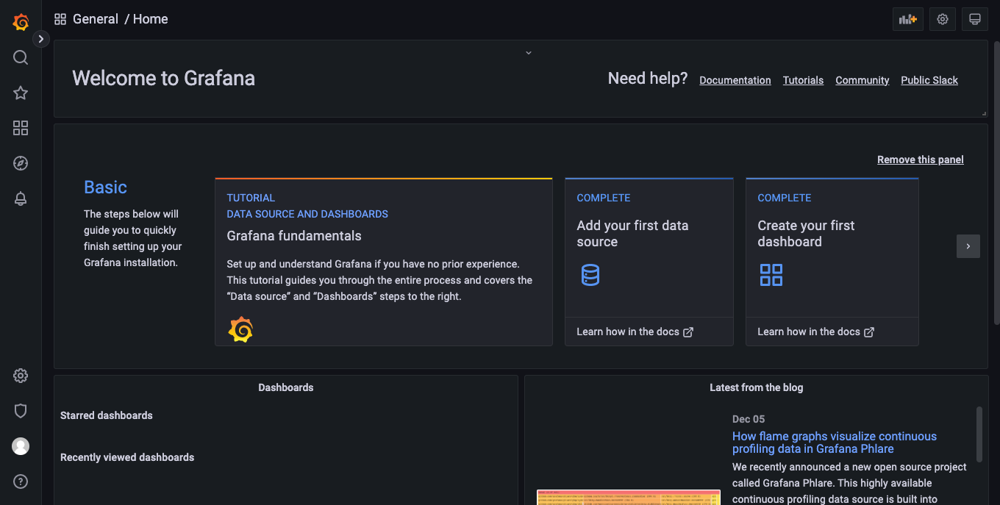

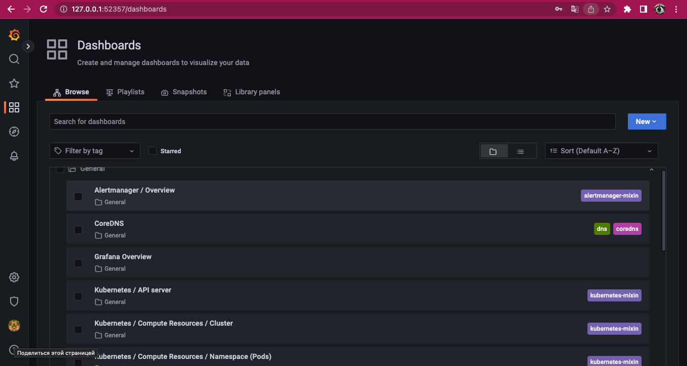

- Check how much CPU and Memory your StatefulSet is consuming.

kubernetes-compute-resources-namespace-workloads:

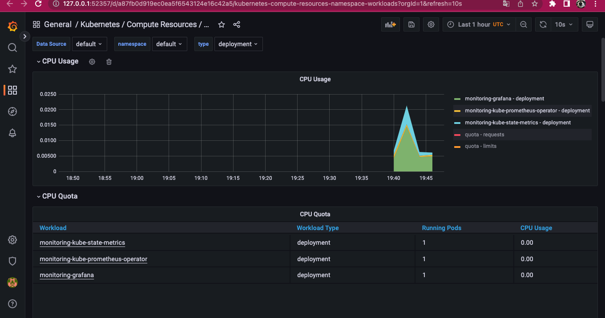

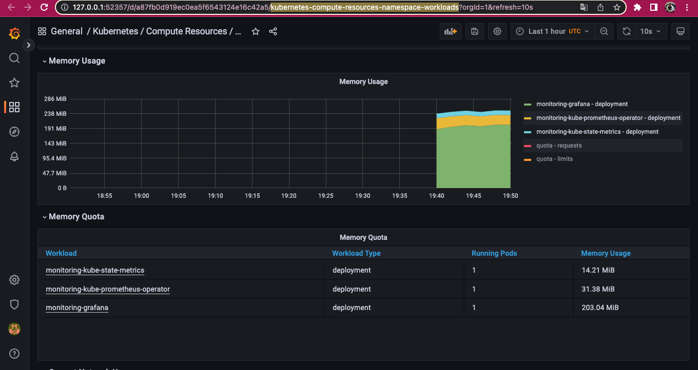

- Check which Pod is using CPU more than others and which is less in the default namespace.

Let's spin up our time-app, too!

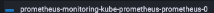

kubernetes-compute-resources-namespace-pods:

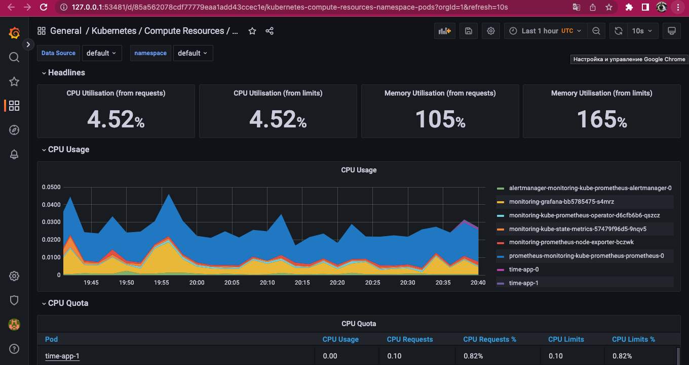

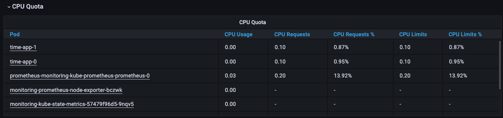

Prometheus and Grafana uses more cpu. My time-app nodes use less.

- Check how much memory is used on your node, in % and mb.

In the same tab we look at memory usage:

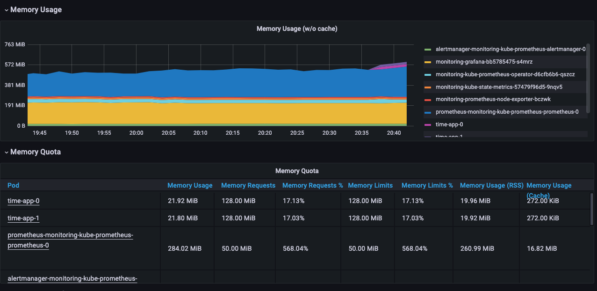

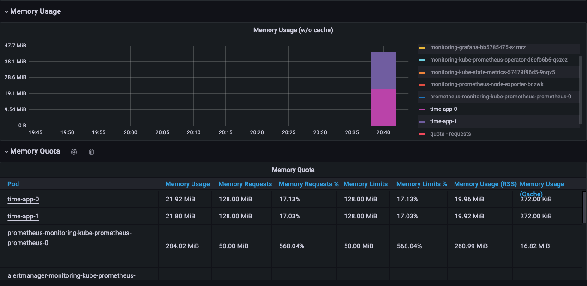

Both my nodes use about 22MiB per 128MiB that's about 17.1%

- Check how many pods and containers actually ran by the Kubelet service.

kubernetes-kubelet:

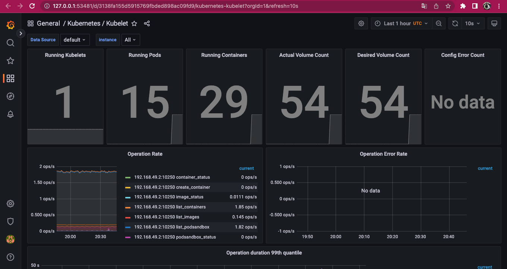

that's 15 pods and 29 running containers.

- Check which Pod is using network more than others and which is less in the default namespace.

kubernetes-networking-namespace-pods:

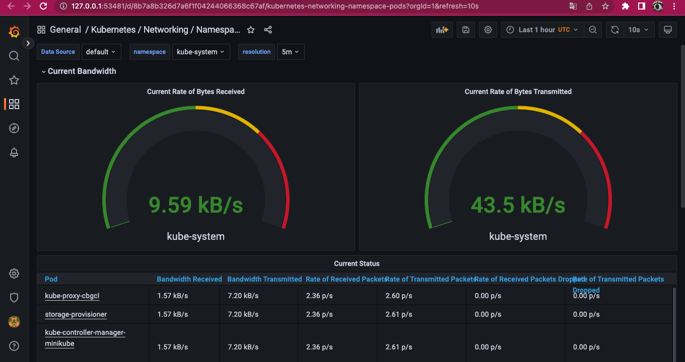

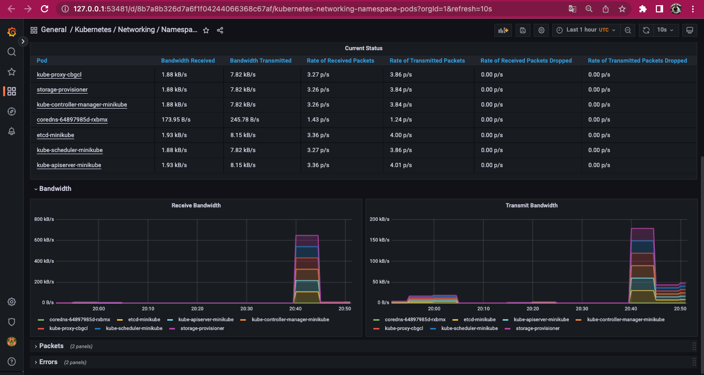

They're all using similar network but node exporter is using more than the others.

- Check how many alerts you have. Also you can see them in the Web UI by
  the `minikube service monitoring-kube-prometheus-alertmanager` command.

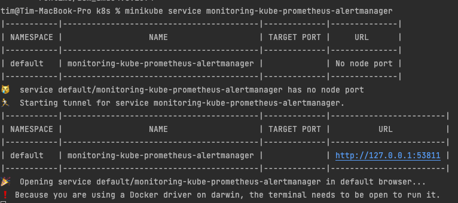

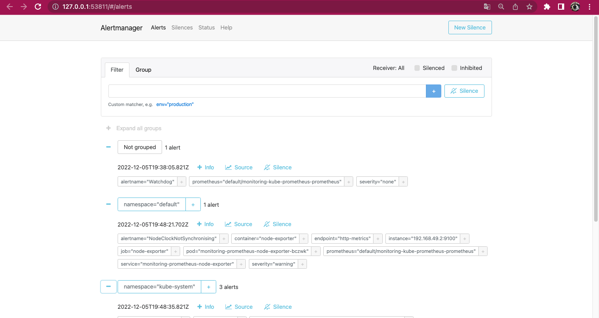

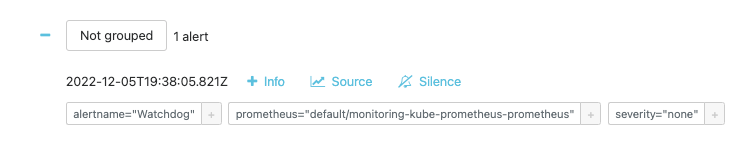

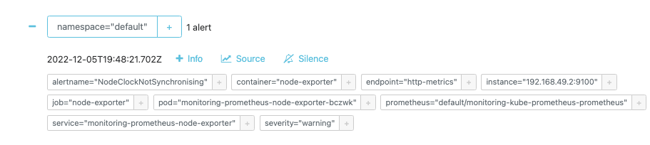

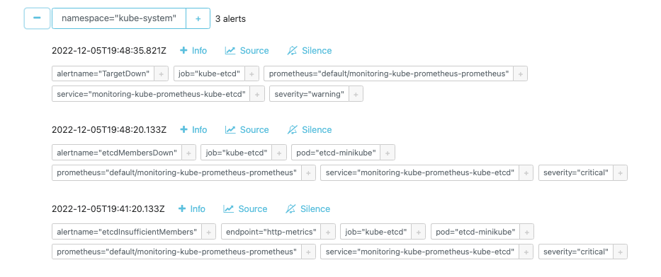

I found 5 alerts.

### Init containers

kubectl apply -f time-app/templates/init-containers.yaml

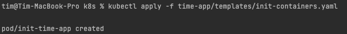

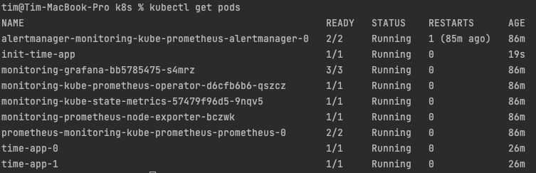

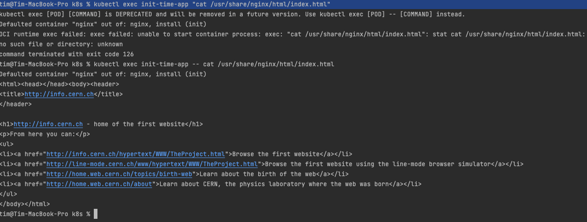

We can see the CERN page, so it downloaded successfully!