# lab 14

kube-prometheus-stack contains next components:

- Prometheus Operator - an operator which provides prometheus monitoring with needed components for deploying and working
in k8s

- Prometheus - an application which collect logs and store metrics

- Alertmanager - some service which send notification via different methods about service alerts (Prometheus alerts) 

- Prometheus node-exporter - some exporter which monitor and send hardware and OS logs to Prometheus

- Prometheus Adapter for Kubernetes Metrics APIs - some adapter which monitor and send metrics to Prometheus

- kube-state-metrics - a service which monitor k8s objects' state

- Grafana - an application which provides log and metrics visualization


I took next step to install Kube Prometheus Stack:

- I followed instructions provided [here](https://github.com/prometheus-operator/kube-prometheus) and use next commands to change minikube version:
`$ minikube delete && minikube start --kubernetes-version=v1.23.0 --memory=6g --bootstrapper=kubeadm --extra-config=kubelet.authentication-token-webhook=true --extra-config=kubelet.authorization-mode=Webhook --extra-config=scheduler.bind-address=0.0.0.0 --extra-config=controller-manager.bind-address=0.0.0.0`
then following this [guideline](https://github.com/prometheus-community/helm-charts/tree/main/charts/kube-prometheus-stack)
I entered next commands: 
```
helm repo add prometheus-community https://prometheus-community.github.io/helm-charts
helm repo update
helm install monitor prometheus-community/kube-prometheus-stack
```
output:
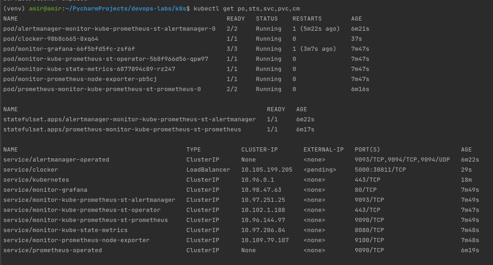

Next I accessed Grafana with `minikube service monitoring-grafana`. However,
I received error and went to check available services:
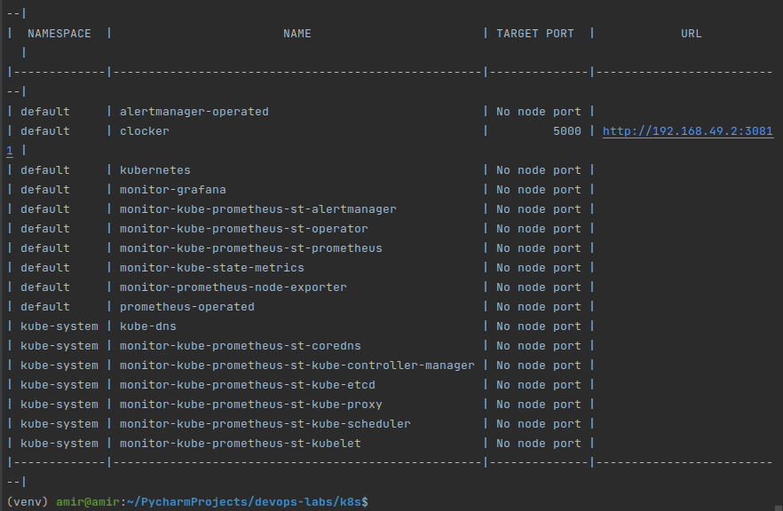
The reason was in values, therefore I created a file for values
with next contains:
```
alertmanager:
  service:
    type: LoadBalancer

grafana:
  service:
    type: LoadBalancer
  adminPassword: 'admin'
```
Next I used command: 
`helm upgrade -f monitor-values.yaml monitor prometheus-community/kube-prometheus-stack`
output:
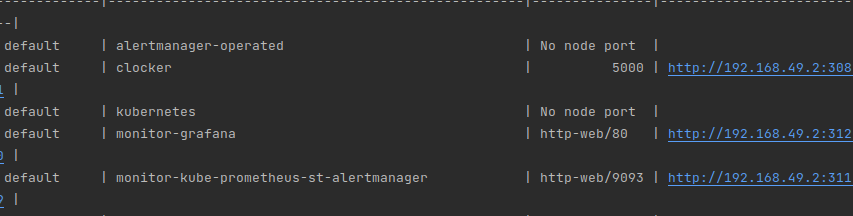
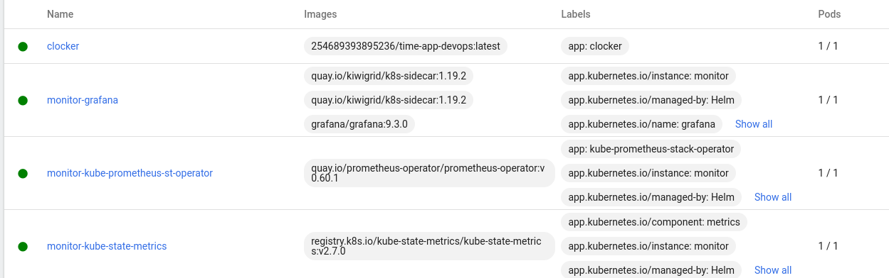

I edited `monitoring-grafana` service by:
```
$ KUBE_EDITOR="nano"
$ kubectl edit svc monitor-grafana
```
And changed `ClusterIP` to type `NodePort` as were suggested by instructor

Next I accessed the monitor-grafana
`minikube service monitor-grafana`
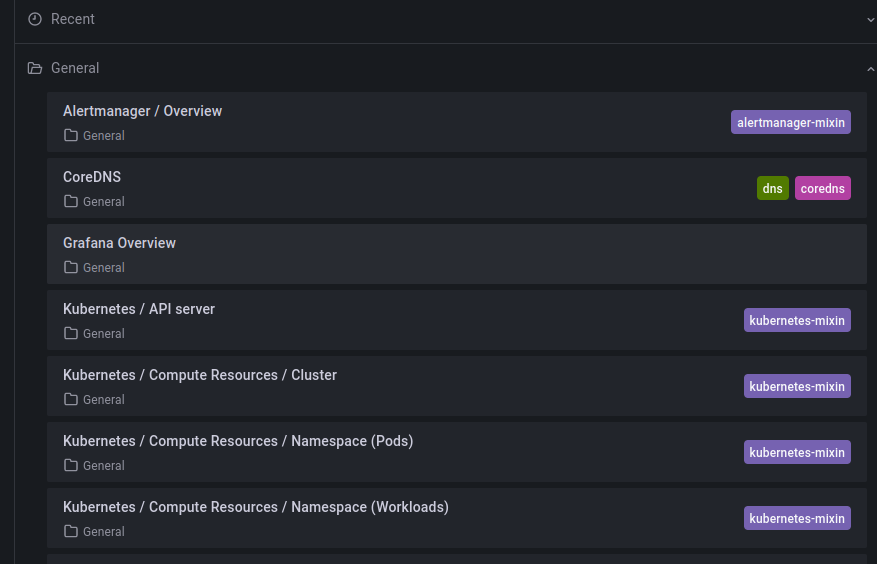

And explored the dashboards for the next metrics:

1. Check how much CPU and Memory your StatefulSet is consuming.

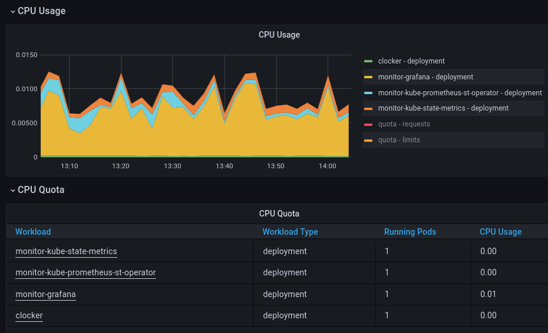
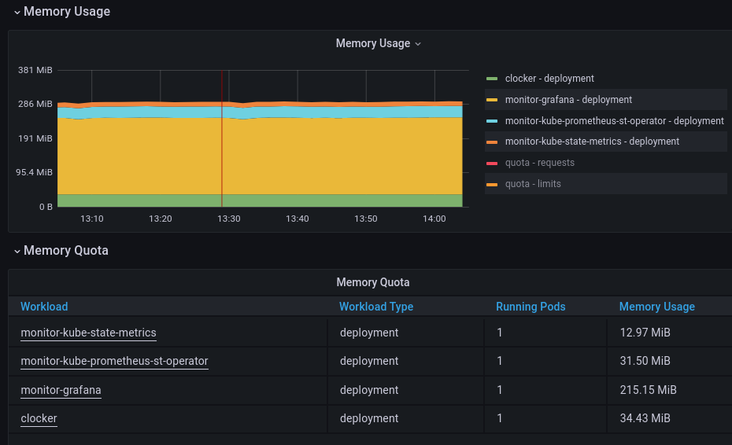

3. Check which Pod is using CPU more than others and which is less in the default namespace.

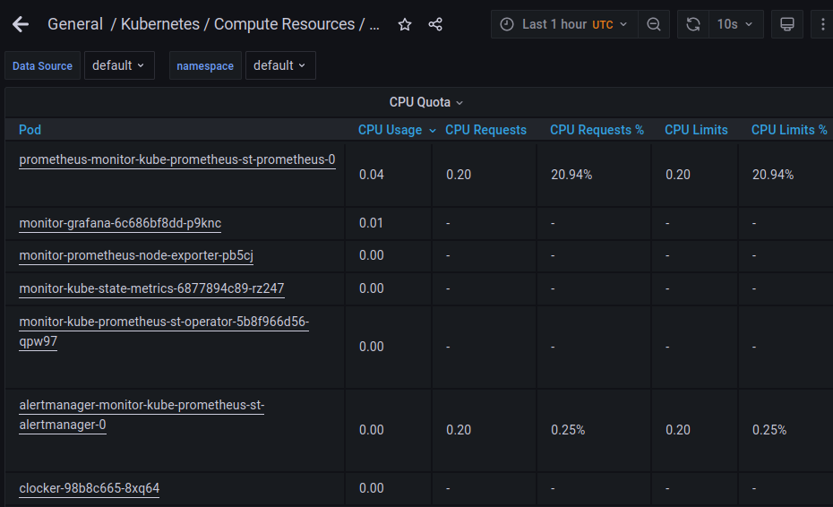
`prometheus-monitor-kube-prometheus-st-prometheus-0` uses CPU the most, while
`clocker-98b9c66508xq64` uses CPU less than others. `clocker` is a small container, also nobody has interacted
with `clocker` service during evaluation.

4. Check how much memory is used on your node, in % and mb.

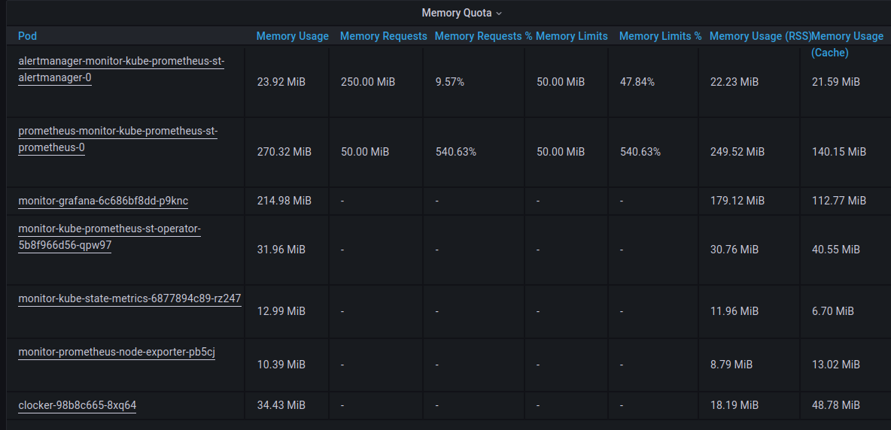
Again box for `memory request` is empty since `clocker` were not used actively.

5. Check how many pods and containers actually ran by the Kubelet service.

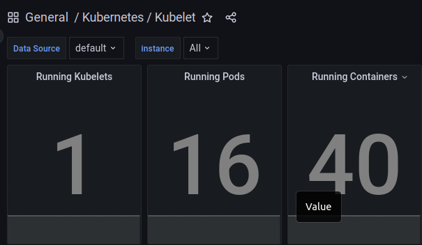
16 pods, 40 containers

6. Check which Pod is using network more than others and which is less in the default namespace.

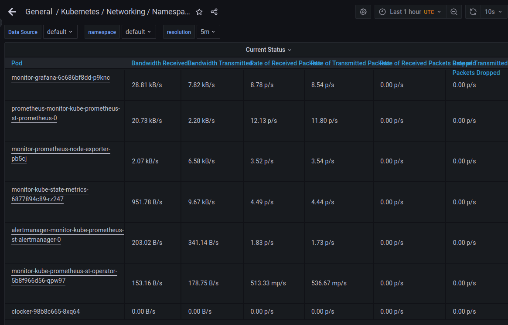
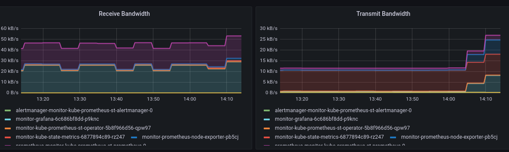
`prometheus-monitor-kube-prometheus-st-prometheus-0` and `monitor-grafana` uses network the most,
and `clocker` the least

7. Check how many alerts you have. Also you can see them in the Web UI by the `minikube service monitor-kube-prometheus-st-alertmanager` command.

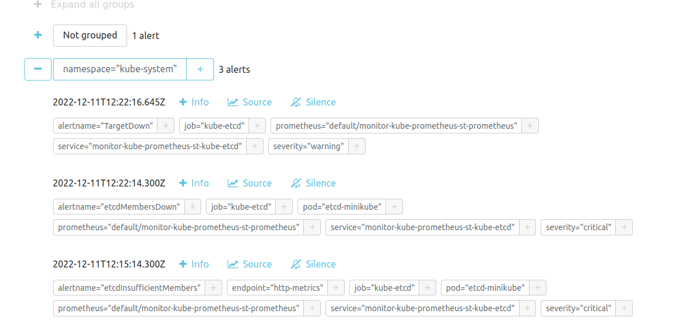

### For init container
I used tutorial example

I created Init container
```commandline
$ kubectl apply -f init-containers/deployment.yaml
pod/init-demo created
$ kubectl exec init-demo -- cat /usr/share/nginx/html/index.html
Defaulted container "nginx" out of: nginx, install (init)
<html><head></head><body><header>
<title>http://info.cern.ch</title>
</header>

<h1>http://info.cern.ch - home of the first website</h1>
<p>From here you can:</p>
<ul>
<li><a href="http://info.cern.ch/hypertext/WWW/TheProject.html">Browse the first website</a></li>
<li><a href="http://line-mode.cern.ch/www/hypertext/WWW/TheProject.html">Browse the first website using the line-mode browser simulator</a></li>
<li><a href="http://home.web.cern.ch/topics/birth-web">Learn about the birth of the web</a></li>
<li><a href="http://home.web.cern.ch/about">Learn about CERN, the physics laboratory where the web was born</a></li>
</ul>
</body></html>
```