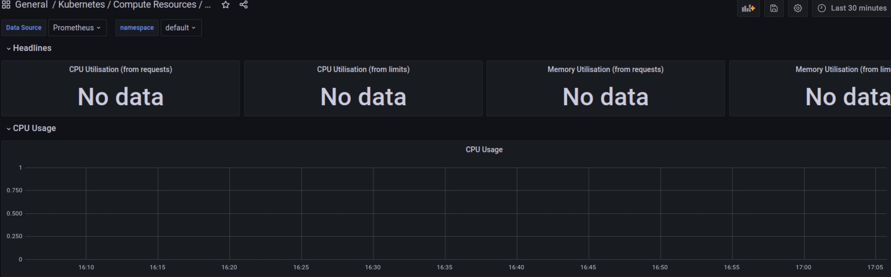
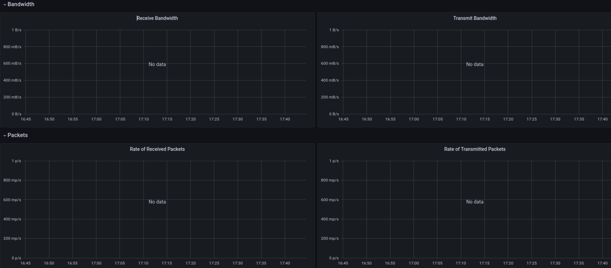
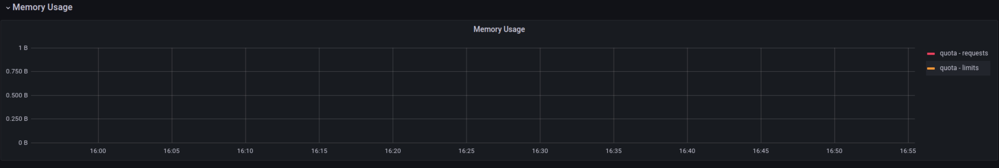
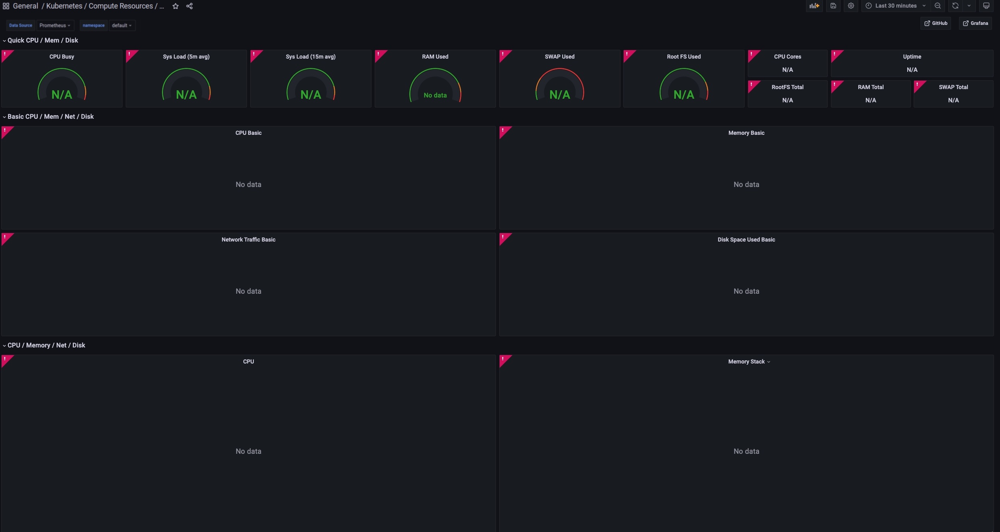
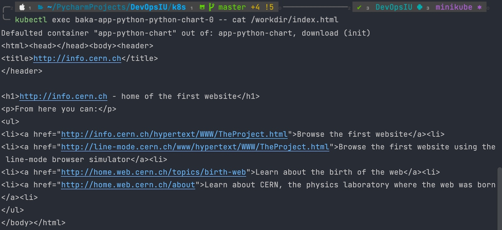

## Lab 14

Hello, just want to warn you that minikube has no errors. And seems like everything is working fine, but Grafana is not showing the graphs.

I don't know what is error, I've tried fix it for few hours, but it is week of finals and full time job...
I noticed only today rule about 6 points on each lab, and I hope just for getting in one last lab grade 5/10 or lower will not ruin all my hard work here. Because as I understood getting lower than 6 means I will need to go to retake, so, please, consider this facts. 👉👈 

Also I did revs!!! 😅

### Theoretical part

Prometheus Operator - Set of tools to work with prometheus monitoring tool in K8S

Prometheus - Free and open-source systems monitoring and alerting toolkit. It stores metrics in time series database.

Alertmanager - System to handle alerts sent by client applications such as the Prometheus server.

Prometheus node-exporter - Exporter for machine metrics.

Prometheus Adapter for Kubernetes Metrics APIs - Prometheus Adapter for Kubernetes Metrics APIs

kube-state-metrics - Expose cluster-level metrics for Kubernetes objects.

Grafana - Open source analytics and monitoring solution. For visualizing metrics.

### Practical part

```bash
$ kubectl get po,sts,svc,pvc,cm
NAME                                                         READY   STATUS    RESTARTS       AGE
pod/alertmanager-monitoring-kube-prometheus-alertmanager-0   2/2     Running   2 (7m9s ago)   34m
pod/baka-app-python-0                                        1/1     Running   2 (7m9s ago)   34m
pod/baka-app-python-0                                        1/1     Running   2 (7m9s ago)   34m
pod/monitoring-grafana-hosnisndf-l91ksla                     3/3     Running   1 (7m9s ago)   34m
pod/monitoring-kube-prometheus-operator-a8wna9enfl-1udbe     1/1     Running   1 (7m9s ago)   34m
pod/monitoring-kube-state-metrics-86sfveklxu-7hndf           1/1     Running   1 (7m9s ago)   34m
pod/monitoring-prometheus-node-exporter-15fxh                1/1     Running   1 (7m9s ago)   34m
pod/prometheus-monitoring-kube-prometheus-prometheus-0       2/2     Running   3 (7m9s ago)   34m
NAME                                                                    READY   AGE
statefulset.apps/alertmanager-monitoring-kube-prometheus-alertmanager   1/1     34m
statefulset.apps/app-python-app-python                                  2/2     34m
statefulset.apps/prometheus-monitoring-kube-prometheus-prometheus       1/1     34m
NAME                                              TYPE           CLUSTER-IP       EXTERNAL-IP   PORT(S)                      AGE
service/alertmanager-operated                     ClusterIP      None             <none>        9093/TCP,9094/TCP,9094/UDP   34m
service/app-python-app-python                     LoadBalancer   10.96.167.83     <pending>     80:31337/TCP                 34m
service/kubernetes                                ClusterIP      10.96.0.1        <none>        443/TCP                      35m
service/monitoring-grafana                        ClusterIP      10.104.97.93     <none>        80/TCP                       34m
service/monitoring-kube-prometheus-alertmanager   ClusterIP      10.96.88.12      <none>        9093/TCP                     34m
service/monitoring-kube-prometheus-operator       ClusterIP      10.104.239.120   <none>        443/TCP                      34m
service/monitoring-kube-prometheus-prometheus     ClusterIP      10.99.182.20     <none>        9090/TCP                     34m
service/monitoring-kube-state-metrics             ClusterIP      10.98.103.28     <none>        8080/TCP                     34m
service/monitoring-prometheus-node-exporter       ClusterIP      10.102.27.6      <none>        9100/TCP                     34m
service/prometheus-operated                       ClusterIP      None             <none>        9090/TCP                     34m
NAME                                                                     DATA   AGE
configmap/kube-root-ca.crt                                               1      35m
configmap/monitoring-grafana                                             1      34m
configmap/monitoring-grafana-config-dashboards                           1      34m
configmap/monitoring-kube-prometheus-alertmanager-overview               1      34m
configmap/monitoring-kube-prometheus-apiserver                           1      34m
configmap/monitoring-kube-prometheus-cluster-total                       1      34m
configmap/monitoring-kube-prometheus-controller-manager                  1      34m
configmap/monitoring-kube-prometheus-etcd                                1      34m
configmap/monitoring-kube-prometheus-grafana-datasource                  1      34m
configmap/monitoring-kube-prometheus-grafana-overview                    1      34m
configmap/monitoring-kube-prometheus-k8s-coredns                         1      34m
configmap/monitoring-kube-prometheus-k8s-resources-cluster               1      34m
configmap/monitoring-kube-prometheus-k8s-resources-namespace             1      34m
configmap/monitoring-kube-prometheus-k8s-resources-node                  1      34m
configmap/monitoring-kube-prometheus-k8s-resources-pod                   1      34m
configmap/monitoring-kube-prometheus-k8s-resources-workload              1      34m
configmap/monitoring-kube-prometheus-k8s-resources-workloads-namespace   1      34m
configmap/monitoring-kube-prometheus-kubelet                             1      34m
configmap/monitoring-kube-prometheus-namespace-by-pod                    1      34m
configmap/monitoring-kube-prometheus-namespace-by-workload               1      34m
configmap/monitoring-kube-prometheus-node-cluster-rsrc-use               1      34m
configmap/monitoring-kube-prometheus-node-rsrc-use                       1      34m
configmap/monitoring-kube-prometheus-nodes                               1      34m
configmap/monitoring-kube-prometheus-nodes-darwin                        1      34m
configmap/monitoring-kube-prometheus-persistentvolumesusage              1      34m
configmap/monitoring-kube-prometheus-pod-total                           1      34m
configmap/monitoring-kube-prometheus-prometheus                          1      34m
configmap/monitoring-kube-prometheus-proxy                               1      34m
configmap/monitoring-kube-prometheus-scheduler                           1      34m
configmap/monitoring-kube-prometheus-workload-total                      1      34m
configmap/prometheus-monitoring-kube-prometheus-prometheus-rulefiles-0   29     34m
```

### So here is not working dashboards:

Also, I've tried another grafana dashboard for node-exporter, but it did'nt not work too.







Thanks for the course.