# k8s Prometheus

## Components

1. The Prometheus Operator is an extension for Kubernetes
that provides easy deployment and management of Prometheus, Alertmanager,
ThanosRuler, and other monitoring components.

2. Highly available Prometheus - Prometheus itself, monitoring system.

3. Highly available Alertmanager is a tool for manage alerts sent from
applications. It can preprocess alerts and send them to some channels, e.g., email.

4. Prometheus node-exporter provides hardware and kernel metrics of
*nix systems.

5. Prometheus Adapter for Kubernetes Metrics APIs used for autoscaling. It is
a bridge between Kubernetes and Prometheus.

6. kube-state-metrics provides
metrics of Kubernetes components, e.g., Pods.

7. Grafana is a tool for visualizing metrics.

## Resources after installing helm chart

The output of the command ``kubectl get po,sts,svc,pvc,cm``:

```plain
    NAME                                                         READY   STATUS    RESTARTS        AGE
    pod/alertmanager-main-kube-prometheus-stack-alertmanager-0   2/2     Running   1 (8m39s ago)   9m28s
    pod/helm-app-0                                               1/1     Running   0               32s
    pod/helm-app-1                                               1/1     Running   0               32s
    pod/main-grafana-86467858b9-kznkf                            3/3     Running   0               10m
    pod/main-kube-prometheus-stack-operator-7f58594b85-6r947     1/1     Running   0               10m
    pod/main-kube-state-metrics-56bcc7468d-24hns                 1/1     Running   0               10m
    pod/main-prometheus-node-exporter-vgx7q                      1/1     Running   0               10m
    pod/prometheus-main-kube-prometheus-stack-prometheus-0       2/2     Running   0               9m25s

    NAME                                                                    READY   AGE
    statefulset.apps/alertmanager-main-kube-prometheus-stack-alertmanager   1/1     9m28s
    statefulset.apps/helm-app                                               2/2     32s
    statefulset.apps/prometheus-main-kube-prometheus-stack-prometheus       1/1     9m25s

    NAME                                              TYPE           CLUSTER-IP       EXTERNAL-IP   PORT(S)                      AGE
    service/alertmanager-operated                     ClusterIP      None             <none>        9093/TCP,9094/TCP,9094/UDP   9m28s
    service/helm-app                                  LoadBalancer   10.100.29.89     <pending>     80:32577/TCP                 32s
    service/kubernetes                                ClusterIP      10.96.0.1        <none>        443/TCP                      28m
    service/main-grafana                              ClusterIP      10.107.40.46     <none>        80/TCP                       10m
    service/main-kube-prometheus-stack-alertmanager   ClusterIP      10.100.163.123   <none>        9093/TCP                     10m
    service/main-kube-prometheus-stack-operator       ClusterIP      10.111.26.178    <none>        443/TCP                      10m
    service/main-kube-prometheus-stack-prometheus     ClusterIP      10.110.35.12     <none>        9090/TCP                     10m
    service/main-kube-state-metrics                   ClusterIP      10.103.217.46    <none>        8080/TCP                     10m
    service/main-prometheus-node-exporter             ClusterIP      10.103.1.129     <none>        9100/TCP                     10m
    service/prometheus-operated                       ClusterIP      None             <none>        9090/TCP                     9m26s

    NAME                                                     STATUS   VOLUME                                     CAPACITY   ACCESS MODES   STORAGECLASS   AGE
    persistentvolumeclaim/helm-app-state-volume-helm-app-0   Bound    pvc-e4101007-c609-4db1-b22c-205ebd68262c   1Gi        RWO            standard       28m
    persistentvolumeclaim/helm-app-state-volume-helm-app-1   Bound    pvc-4427c71b-0b0d-434f-bda6-7de0d8f6eeb0   1Gi        RWO            standard       24m

    NAME                                                                     DATA   AGE
    configmap/helm-app-config                                                1      32s
    configmap/kube-root-ca.crt                                               1      28m
    configmap/main-grafana                                                   1      10m
    configmap/main-grafana-config-dashboards                                 1      10m
    configmap/main-kube-prometheus-stack-alertmanager-overview               1      10m
    configmap/main-kube-prometheus-stack-apiserver                           1      10m
    configmap/main-kube-prometheus-stack-cluster-total                       1      10m
    configmap/main-kube-prometheus-stack-controller-manager                  1      10m
    configmap/main-kube-prometheus-stack-etcd                                1      10m
    configmap/main-kube-prometheus-stack-grafana-datasource                  1      10m
    configmap/main-kube-prometheus-stack-grafana-overview                    1      10m
    configmap/main-kube-prometheus-stack-k8s-coredns                         1      10m
    configmap/main-kube-prometheus-stack-k8s-resources-cluster               1      10m
    configmap/main-kube-prometheus-stack-k8s-resources-namespace             1      10m
    configmap/main-kube-prometheus-stack-k8s-resources-node                  1      10m
    configmap/main-kube-prometheus-stack-k8s-resources-pod                   1      10m
    configmap/main-kube-prometheus-stack-k8s-resources-workload              1      10m
    configmap/main-kube-prometheus-stack-k8s-resources-workloads-namespace   1      10m
    configmap/main-kube-prometheus-stack-kubelet                             1      10m
    configmap/main-kube-prometheus-stack-namespace-by-pod                    1      10m
    configmap/main-kube-prometheus-stack-namespace-by-workload               1      10m
    configmap/main-kube-prometheus-stack-node-cluster-rsrc-use               1      10m
    configmap/main-kube-prometheus-stack-node-rsrc-use                       1      10m
    configmap/main-kube-prometheus-stack-nodes                               1      10m
    configmap/main-kube-prometheus-stack-nodes-darwin                        1      10m
    configmap/main-kube-prometheus-stack-persistentvolumesusage              1      10m
    configmap/main-kube-prometheus-stack-pod-total                           1      10m
    configmap/main-kube-prometheus-stack-prometheus                          1      10m
    configmap/main-kube-prometheus-stack-proxy                               1      10m
    configmap/main-kube-prometheus-stack-scheduler                           1      10m
    configmap/main-kube-prometheus-stack-workload-total                      1      10m
    configmap/prometheus-main-kube-prometheus-stack-prometheus-rulefiles-0   29     9m26s
```

Meaning of the command:

*kubectl get* dislays Kubernetes resources, e.g.,:

   1. po = pods
   2. sts = statefulset
   3. svc = service
   4. pvc = persistentvolumeclaim
   5. cm = configmap

## Grafana

I have used port forwarding to access Grafana.

Metrics:

1. How much CPU and Memory your StatefulSet is consuming.

    No data. Only quotas are present.

    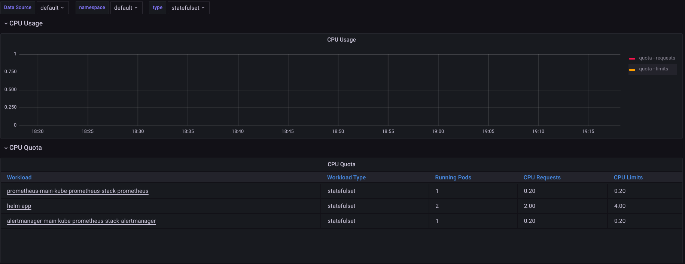

    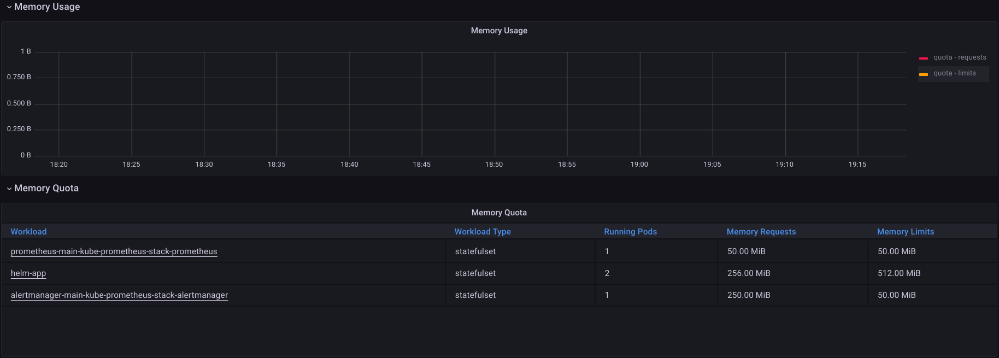

2. Which Pod is using CPU more than others and which is less in the default namespace.

    No data.

    

    Even if we try to try to check metrics for the individual pod, we get no data.

    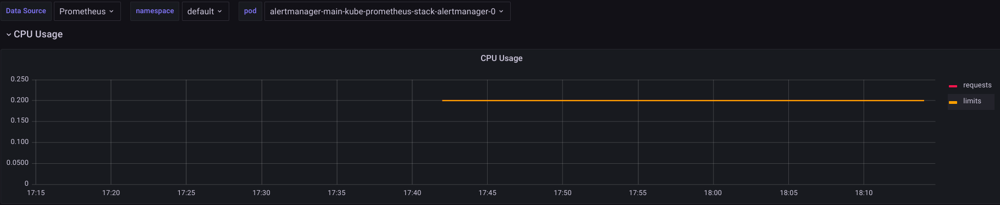

    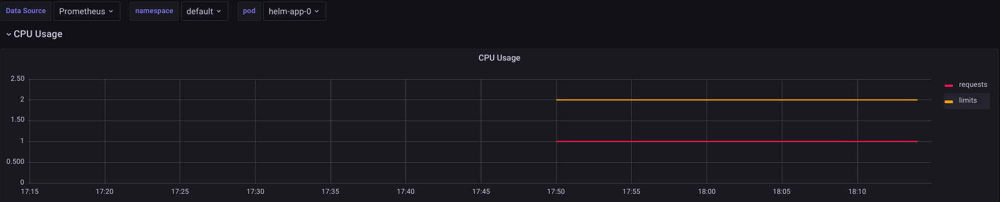

    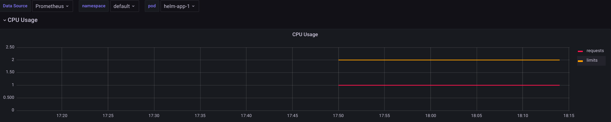

    And so on for others. Only limits and requests are displayed, e.g.:

    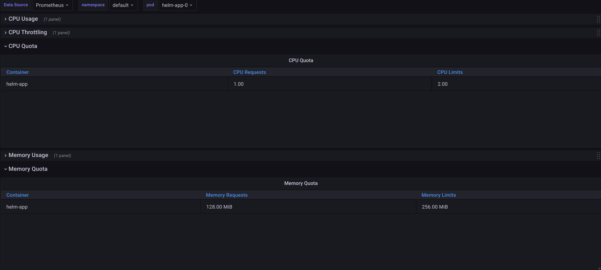

3. How much memory is used on your node, in % and mb.

    We get no data from Compute Resources/Node(Pods).

    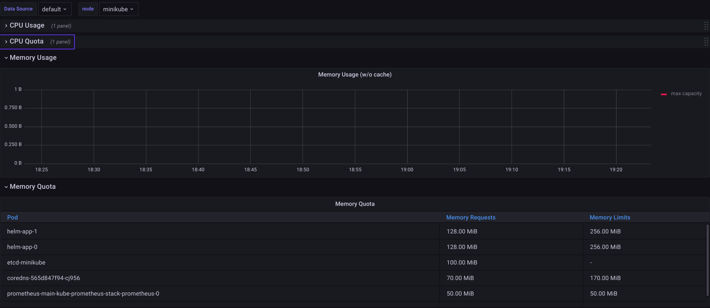

    However, some information can be retrieved from Node Exporter:

    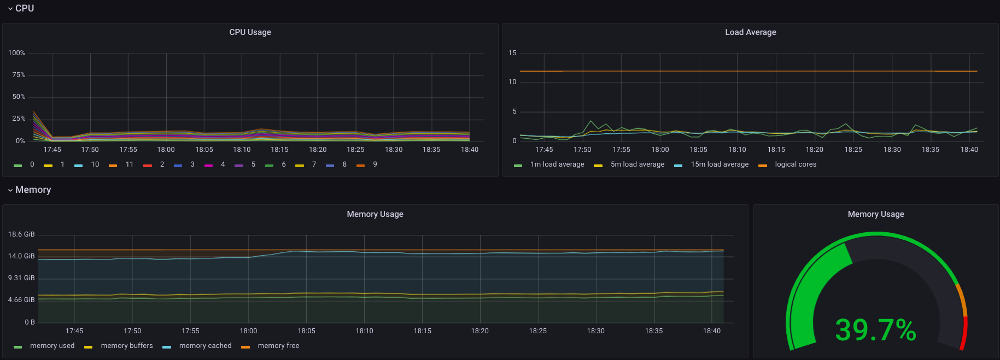

4. How many pods and containers actually ran by the Kubelet service.

    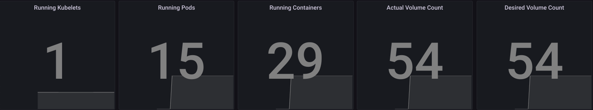

5. Which Pod is using network more than others and which is less in the default namespace.

    No data.

    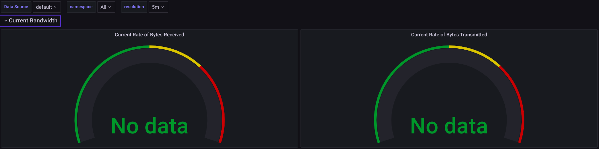

    Even if we try to try to check metrics for the individual pod, we get no data.

    

6. How many alerts you have.

    There are 8 alerts.

    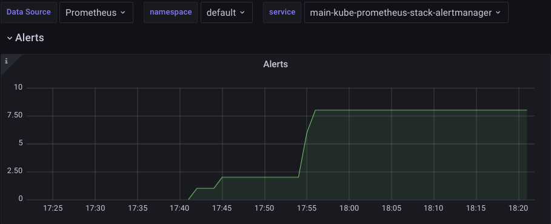

## Init containers

In Init Container I have downloaded page from <http://info.cern.ch> to */workdir/test.html*.

The result is the following:

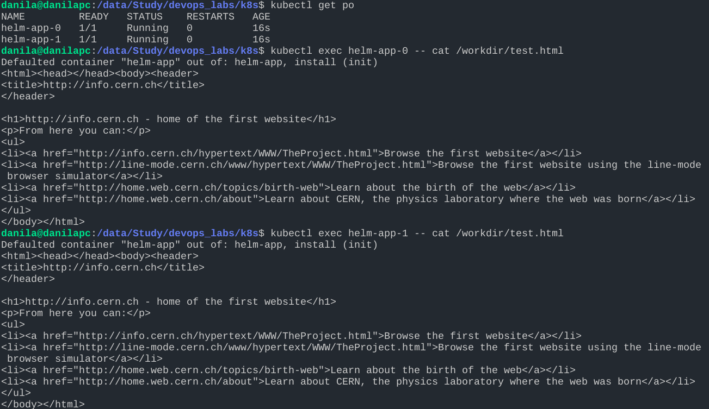

## Metrics from app

I have added additional service monitor to scrape metrics from the app.

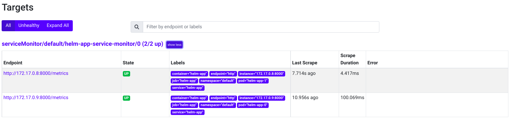

## Three Init Containers

I have added three init containers:

1. First container downloads page from <http://info.cern.ch>
2. Second container append to the resulting html file comment "COMMENT 1"
3. Third container append to the resulting html file comment "COMMENT 2"

Result:

3 init containers run:

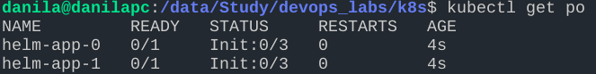

The resulting html file(look at last 2 lines of the output):

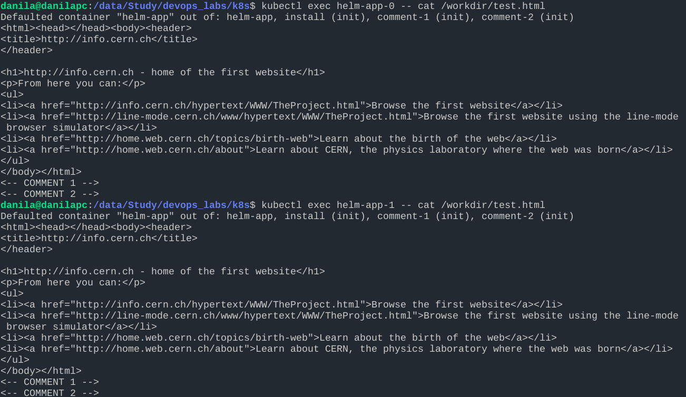
