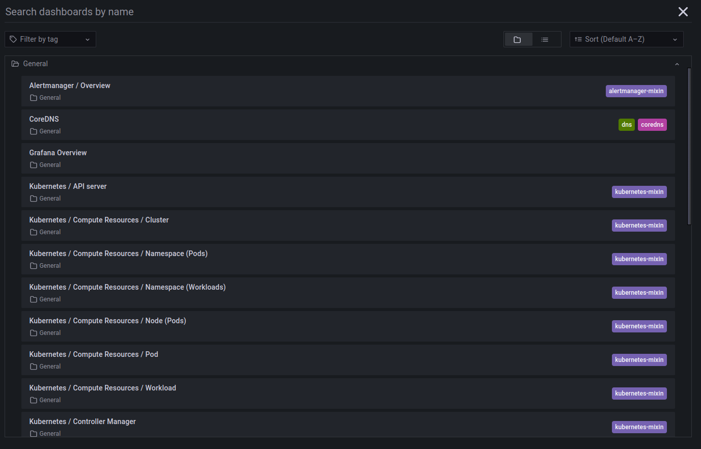
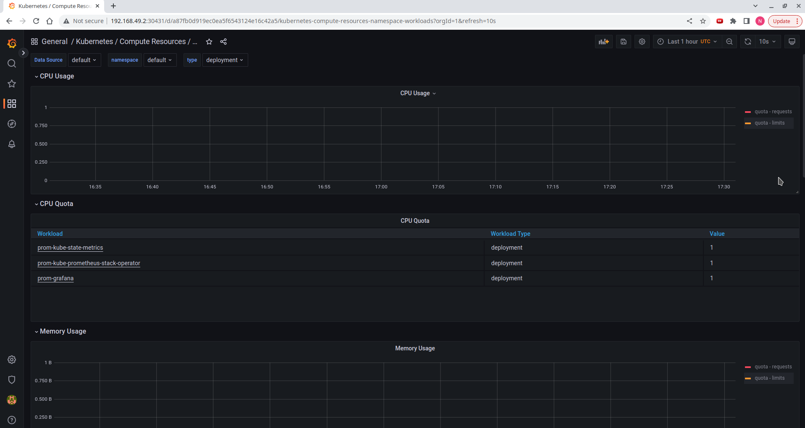
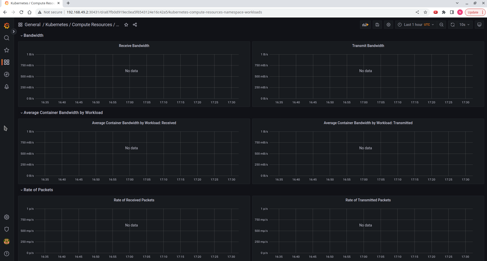
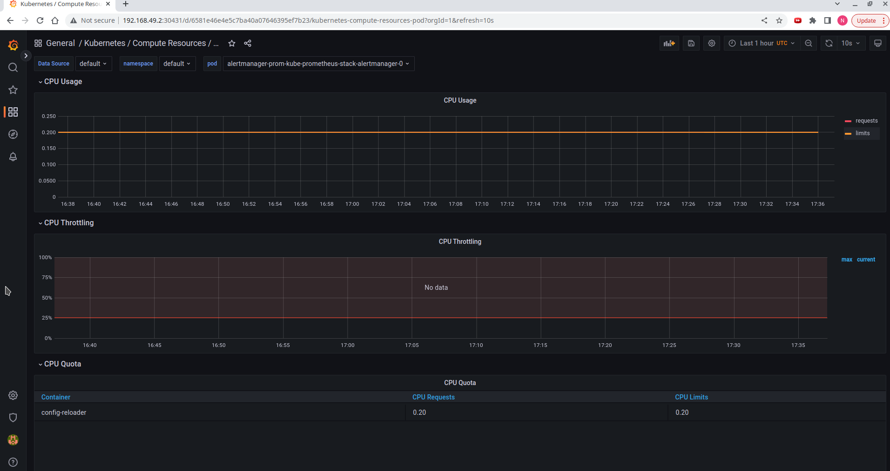
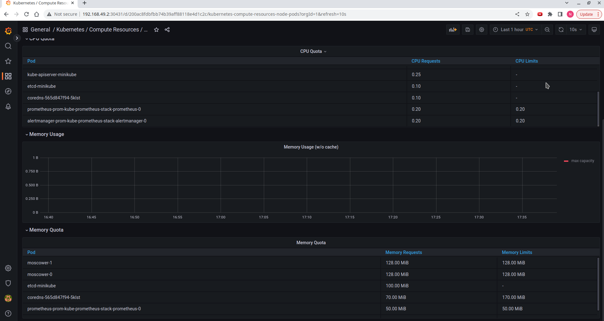
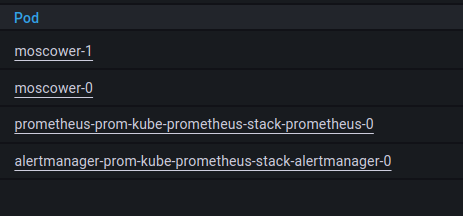
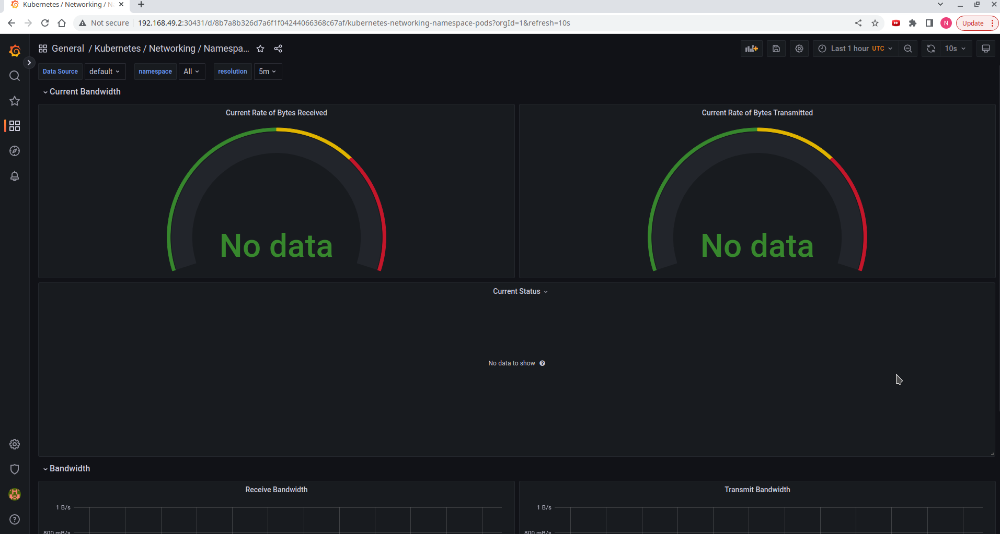
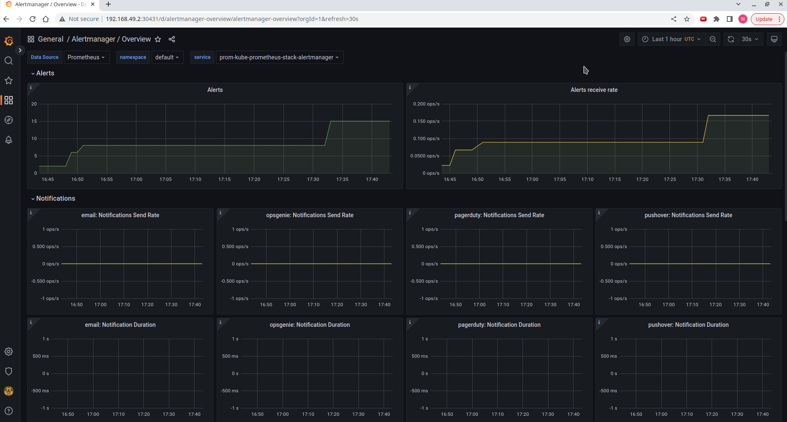

# kube-prometheus

## kube-prometheus-stack

It is important to note the difference between *kube-prometheus* and *kube-prometheus-stack*. The first is an example of a configured cluster monitoring, while the other is a helm chart supported by the community. Both provide similar functionality.

## Components

### Prometheus operator
Makes use of Kubernetes extension API to simplify deployment of several monitoring components

### Prometheus
Nothing new, just plain old prometheus from a previous lab

### Alertmanager
Processes alerts: receives, removes duplicates, groups and redirects further

### Exporter
If needed, Prometheus can be supported by a library to export metrics. This is known as [exporters](https://prometheus.io/docs/instrumenting/exporters/). There is a "Node exporter" for metrics exposed by *nix kernels, as well as Windows and dcgm (for NVIDIA GPU metrics) exporters

### Prometheus Adapter for Kubernetes Metrics APIs
Communicates with Kubernetes' metrics-related API, allows Prometheus to interact with Kubernetes

### kube-state-metrics
Collects metrics from Kubernetes itself, not project related ones. This includes metrics on deployments, nodes and pods

### Grafana
Nothing new, just plain old Grafana from previous labs

## Install

I usually send screenshot, but this time output is too large

```sh
nihon@nihon-pc:~/Inno/devops/k8s$ helm install moscower ./moscower/ -f ./secrets.yaml
W1205 19:31:28.375893   15041 warnings.go:70] unknown field "spec.volumeClaimTemplates[0].spec.storageClass"
NAME: moscower
LAST DEPLOYED: Mon Dec  5 19:31:28 2022
NAMESPACE: default
STATUS: deployed
REVISION: 1
NOTES:
1. Get the application URL by running these commands:
     NOTE: It may take a few minutes for the LoadBalancer IP to be available.
           You can watch the status of by running 'kubectl get --namespace default svc -w moscower'
  export SERVICE_IP=$(kubectl get svc --namespace default moscower --template "{{ range (index .status.loadBalancer.ingress 0) }}{{.}}{{ end }}")
  echo http://$SERVICE_IP:80
nihon@nihon-pc:~/Inno/devops/k8s$ helm install prom prometheus-community/kube-prometheus-stack
NAME: prom
LAST DEPLOYED: Mon Dec  5 19:32:05 2022
NAMESPACE: default
STATUS: deployed
REVISION: 1
NOTES:
kube-prometheus-stack has been installed. Check its status by running:
  kubectl --namespace default get pods -l "release=prom"

Visit https://github.com/prometheus-operator/kube-prometheus for instructions on how to create & configure Alertmanager and Prometheus instances using the Operator.
nihon@nihon-pc:~/Inno/devops/k8s$ kubectl get po,sts,svc,pvc,cm
NAME                                                         READY   STATUS              RESTARTS        AGE
pod/alertmanager-prom-kube-prometheus-stack-alertmanager-0   0/2     ContainerCreating   0               4s
pod/moscower-0                                               1/1     Running             0               106s
pod/moscower-1                                               1/1     Running             0               106s
pod/mysql-1668687253-0                                       1/1     Running             4 (2m43s ago)   18d
pod/prom-grafana-587c8db8b8-t4q8x                            0/3     ContainerCreating   0               54s
pod/prom-kube-prometheus-stack-operator-64697d46f7-wds4h     1/1     Running             0               54s
pod/prom-kube-state-metrics-54c4ff848b-4smch                 1/1     Running             0               54s
pod/prom-prometheus-node-exporter-x26l8                      1/1     Running             0               54s
pod/prometheus-prom-kube-prometheus-stack-prometheus-0       0/2     Init:0/1            0               4s

NAME                                                                    READY   AGE
statefulset.apps/alertmanager-prom-kube-prometheus-stack-alertmanager   0/1     4s
statefulset.apps/moscower                                               2/2     106s
statefulset.apps/mysql-1668687253                                       1/1     18d
statefulset.apps/prometheus-prom-kube-prometheus-stack-prometheus       0/1     4s

NAME                                              TYPE           CLUSTER-IP       EXTERNAL-IP   PORT(S)                      AGE
service/alertmanager-operated                     ClusterIP      None             <none>        9093/TCP,9094/TCP,9094/UDP   4s
service/kubernetes                                ClusterIP      10.96.0.1        <none>        443/TCP                      24d
service/moscower                                  LoadBalancer   10.100.157.79    <pending>     80:30496/TCP                 106s
service/mysql-1668687253                          ClusterIP      10.109.239.254   <none>        3306/TCP                     18d
service/mysql-1668687253-headless                 ClusterIP      None             <none>        3306/TCP                     18d
service/prom-grafana                              ClusterIP      10.99.218.41     <none>        80/TCP                       55s
service/prom-kube-prometheus-stack-alertmanager   ClusterIP      10.106.214.181   <none>        9093/TCP                     55s
service/prom-kube-prometheus-stack-operator       ClusterIP      10.98.132.143    <none>        443/TCP                      55s
service/prom-kube-prometheus-stack-prometheus     ClusterIP      10.97.150.207    <none>        9090/TCP                     55s
service/prom-kube-state-metrics                   ClusterIP      10.101.162.3     <none>        8080/TCP                     55s
service/prom-prometheus-node-exporter             ClusterIP      10.101.87.117    <none>        9100/TCP                     55s
service/prometheus-operated                       ClusterIP      None             <none>        9090/TCP                     4s

NAME                                                 STATUS   VOLUME                                     CAPACITY   ACCESS MODES   STORAGECLASS   AGE
persistentvolumeclaim/data-mysql-1668687253-0        Bound    pvc-8cb3ed70-0846-4d27-aa54-8ac4c5a4ece7   8Gi        RWO            standard       18d
persistentvolumeclaim/persistent-volume-moscower-0   Bound    pvc-51efdeb6-998a-444e-8596-9384ab5a8c2f   128Mi      RWO            standard       106s
persistentvolumeclaim/persistent-volume-moscower-1   Bound    pvc-5ec9cfaa-2c71-497f-a9f3-4e09674bbf54   128Mi      RWO            standard       106s

NAME                                                                     DATA   AGE
configmap/kube-root-ca.crt                                               1      24d
configmap/moscower-config                                                1      106s
configmap/mysql-1668687253                                               1      18d
configmap/prom-grafana                                                   1      55s
configmap/prom-grafana-config-dashboards                                 1      55s
configmap/prom-kube-prometheus-stack-alertmanager-overview               1      55s
configmap/prom-kube-prometheus-stack-apiserver                           1      55s
configmap/prom-kube-prometheus-stack-cluster-total                       1      55s
configmap/prom-kube-prometheus-stack-controller-manager                  1      55s
configmap/prom-kube-prometheus-stack-etcd                                1      55s
configmap/prom-kube-prometheus-stack-grafana-datasource                  1      55s
configmap/prom-kube-prometheus-stack-grafana-overview                    1      55s
configmap/prom-kube-prometheus-stack-k8s-coredns                         1      55s
configmap/prom-kube-prometheus-stack-k8s-resources-cluster               1      55s
configmap/prom-kube-prometheus-stack-k8s-resources-namespace             1      55s
configmap/prom-kube-prometheus-stack-k8s-resources-node                  1      55s
configmap/prom-kube-prometheus-stack-k8s-resources-pod                   1      55s
configmap/prom-kube-prometheus-stack-k8s-resources-workload              1      55s
configmap/prom-kube-prometheus-stack-k8s-resources-workloads-namespace   1      55s
configmap/prom-kube-prometheus-stack-kubelet                             1      55s
configmap/prom-kube-prometheus-stack-namespace-by-pod                    1      55s
configmap/prom-kube-prometheus-stack-namespace-by-workload               1      55s
configmap/prom-kube-prometheus-stack-node-cluster-rsrc-use               1      55s
configmap/prom-kube-prometheus-stack-node-rsrc-use                       1      55s
configmap/prom-kube-prometheus-stack-nodes                               1      55s
configmap/prom-kube-prometheus-stack-nodes-darwin                        1      55s
configmap/prom-kube-prometheus-stack-persistentvolumesusage              1      55s
configmap/prom-kube-prometheus-stack-pod-total                           1      55s
configmap/prom-kube-prometheus-stack-prometheus                          1      55s
configmap/prom-kube-prometheus-stack-proxy                               1      55s
configmap/prom-kube-prometheus-stack-scheduler                           1      55s
configmap/prom-kube-prometheus-stack-workload-total                      1      55s
configmap/prometheus-prom-kube-prometheus-stack-prometheus-rulefiles-0   29     4s
```

`kubectl get`command provides information on provided resources.
`kubectl get po,sts,svc,pvc,cm` displays info on five resources:

* po: list pods
* sts: stateful sets
* svc: services
* pvc: persistent volume claims
* cm: configmaps

## Monitoring

`kubectl edit svc prom-grafana` and change *ClusterIP* to *NodePort* since minikube is used

There are numerous dashboards that allow us to monitor a cluster


1) Stateful set



2) Info on Pods


3) Node's memory usage


4) Pods that are actually run



5) Network usage


6) Alerts



## Init containers


<!-- 
Let's use an Init container to download any file, like in the tutorial:

Create a new Volume.
Create Init container.
Use wget to download any file (You can use a site from the example).
Provide a proof of your success, for example kubectl exec pod/demo-0 -- cat /test.html
 -->