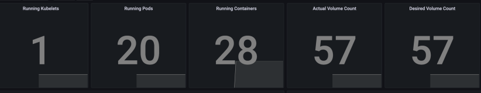
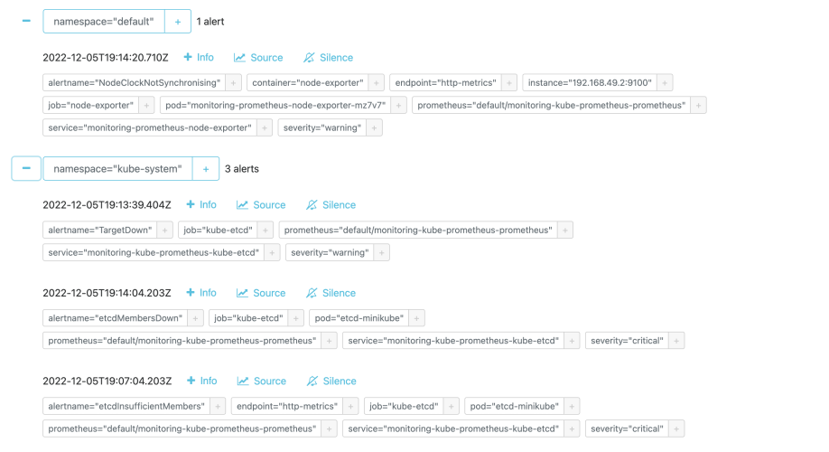

1. Monitoring stack components includes:

- Prometheus Operator - tool for working with prometheus in K8S;
- Prometheus - tool for monitoring which collects and stores different metrics from app;
- Alertmanager - alert tool, it handles alerts;
- Prometheus node-exporter - monitors and collects metrics about k8s nodes;
- Prometheus Adapter for Kubernetes Metrics APIs - monitor and send metrics (cpu/memory usage) from K8S to Prometheus;
- kube-state-metrics - monitor and send state of K8S objects  to  Prometheus;
- Grafana - visualization tool for metrics.


2. 
```bash
$ kubectl get po,sts,svc,pvc,cm


NAME                                                         READY   STATUS    RESTARTS      AGE
pod/alertmanager-monitoring-kube-prometheus-alertmanager-0      2/2     Running   1 (28m ago)   22m
pod/my-app-python-0                                             1/1     Running   0             21m
pod/my-app-python-1                                             1/1     Running   0             21m
pod/my-app-python-2                                             1/1     Running   0             21m
pod/my-app-python-3                                             1/1     Running   0             21m
pod/my-app-python-4                                             1/1     Running   0             21m
pod/monitoring-grafana-23d4c4bb66-7rhrg                         3/3     Running   0             21m
pod/monitoring-kube-prometheus-operator-l3f4fr86-j775v          1/1     Running   0             21m
pod/monitoring-kube-state-metrics-45e4f9efd4-7b4hw              1/1     Running   0             21m
pod/monitoring-prometheus-node-exporter-wg8t5                   1/1     Running   0             22m
pod/prometheus-monitoring-kube-prometheus-prometheus-0          2/2     Running   0             22m
NAME                                                                    READY   AGE
statefulset.apps/alertmanager-monitoring-kube-prometheus-alertmanager      1/1     29m
statefulset.apps/my-app-python                                             5/5     28m
statefulset.apps/prometheus-monitoring-kube-prometheus-prometheus          1/1     29m
NAME                                              TYPE           CLUSTER-IP       EXTERNAL-IP   PORT(S)                      AGE
service/alertmanager-operated                     ClusterIP      None             <none>        9093/TCP,9094/TCP,9094/UDP   22m
service/my-app-python                             ClusterIP      10.112.255.148   <none>        5000/TCP                     21m
service/kubernetes                                ClusterIP      10.96.0.1        <none>        443/TCP                      3m
service/monitoring-grafana                        LoadBalancer   10.109.48.215    <pending>     80:31707/TCP                 24m
service/monitoring-kube-prometheus-alertmanager   LoadBalancer   10.108.6.173     <pending>     9093:31284/TCP               22m
service/monitoring-kube-prometheus-operator       ClusterIP      10.102.229.129   <none>        443/TCP                      22m
service/monitoring-kube-prometheus-prometheus     ClusterIP      10.108.222.75    <none>        9090/TCP                     22m
service/monitoring-kube-state-metrics             ClusterIP      10.103.242.151   <none>        8080/TCP                     22m
service/monitoring-prometheus-node-exporter       ClusterIP      10.103.56.34     <none>        9100/TCP                     22m
service/prometheus-operated                       ClusterIP      None             <none>        9090/TCP                     22m
NAME                                                                     DATA   AGE
configmap/kube-root-ca.crt                                               1      24m
configmap/monitoring-grafana                                             1      22m
configmap/monitoring-grafana-config-dashboards                           1      22m
configmap/monitoring-kube-prometheus-alertmanager-overview               1      22m
configmap/monitoring-kube-prometheus-apiserver                           1      22m
configmap/monitoring-kube-prometheus-cluster-total                       1      22m
configmap/monitoring-kube-prometheus-controller-manager                  1      22m
configmap/monitoring-kube-prometheus-etcd                                1      22m
configmap/monitoring-kube-prometheus-grafana-datasource                  1      22m
configmap/monitoring-kube-prometheus-grafana-overview                    1      22m
configmap/monitoring-kube-prometheus-k8s-coredns                         1      22m
configmap/monitoring-kube-prometheus-k8s-resources-cluster               1      22m
configmap/monitoring-kube-prometheus-k8s-resources-namespace             1      22m
configmap/monitoring-kube-prometheus-k8s-resources-node                  1      22m
configmap/monitoring-kube-prometheus-k8s-resources-pod                   1      22m
configmap/monitoring-kube-prometheus-k8s-resources-workload              1      22m
configmap/monitoring-kube-prometheus-k8s-resources-workloads-namespace   1      22m
configmap/monitoring-kube-prometheus-kubelet                             1      22m
configmap/monitoring-kube-prometheus-namespace-by-pod                    1      22m
configmap/monitoring-kube-prometheus-namespace-by-workload               1      22m
configmap/monitoring-kube-prometheus-node-cluster-rsrc-use               1      22m
configmap/monitoring-kube-prometheus-node-rsrc-use                       1      22m
configmap/monitoring-kube-prometheus-nodes                               1      22m
configmap/monitoring-kube-prometheus-nodes-darwin                        1      22m
configmap/monitoring-kube-prometheus-persistentvolumesusage              1      22m
configmap/monitoring-kube-prometheus-pod-total                           1      22m
configmap/monitoring-kube-prometheus-prometheus                          1      22m
configmap/monitoring-kube-prometheus-proxy                               1      22m
configmap/monitoring-kube-prometheus-scheduler                           1      22m
configmap/monitoring-kube-prometheus-workload-total                      1      22m
configmap/prometheus-monitoring-kube-prometheus-prometheus-rulefiles-0   22     22m
```

3.
- 25.4% CPU and 313% Memory my StatefulSet is consuming.
- I have 4 pods overall, first 3 use the dame amount of cpu, which is 0.02, at thr 4th one uses 0
- pods and containers actually ran by the Kubelet service


- alrets



4. 
```bash
$ kubectl exec -it init-demo -- cat /usr/share/nginx/html/index.html

Defaulted container "nginx" out of: nginx, install (init)
<html><head></head><body><header>
<title>http://info.cern.ch</title>
</header>
<h1>http://info.cern.ch - home of the first website</h1>
<p>From here you can:</p>
<ul>
<li><a href="http://info.cern.ch/hypertext/WWW/TheProject.html">Browse the first website</a></li>
<li><a href="http://line-mode.cern.ch/www/hypertext/WWW/TheProject.html">Browse the first website using the line-mode browser simulator</a></li>
<li><a href="http://home.web.cern.ch/topics/birth-web">Learn about the birth of the web</a></li>
<li><a href="http://home.web.cern.ch/about">Learn about CERN, the physics laboratory where the web was born</a></li>
</ul>
</body></html>
```