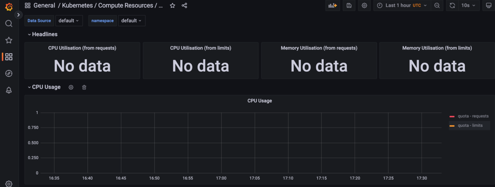
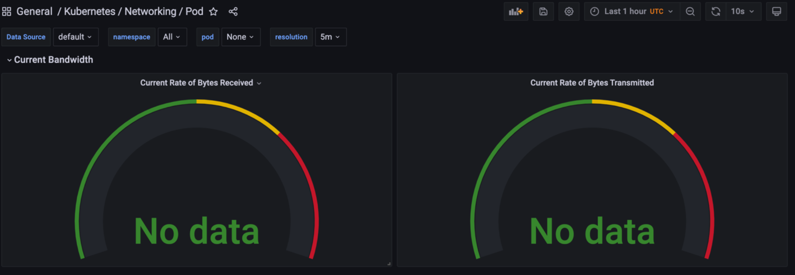

## Description of components of the stack
___
* **Prometheus Operator** - helps to manage components of Prometheus.
* **Highly available Prometheus** - helps with monitoring system, by collecting metrics.
* **Highly available Alertmanager** - helps with handling alerts, sent by client apps.
* **Prometheus Node Exporter** - helps to gather hardware/OS metrics.
* **Prometheus Adapter for Kubernetes Metrics APIs** - helps Prometheus work with Kubernetes.
* **kube-state-metrics** - helps to gather metrics from Kubernetes components.
* **Grafana** - helps to monitor data, by visualizing it.

## Result of kubectl get po,sts,svc,pvc,cm:
___
```
nurbakzh-osx:k8s nurbakzh$ 
 kubectl get po,sts,svc,pvc,cm
NAME                                                         READY   STATUS              RESTARTS   AGE
pod/alertmanager-prom-kube-prometheus-stack-alertmanager-0   0/2     ContainerCreating   0          22s
pod/app-python-app-chard-0                                   1/1     Running             0          9m31s
pod/app-python-app-chard-1                                   1/1     Running             0          9m31s
pod/init-python-containerz                                   1/1     Running             0          9m31s
pod/prom-grafana-587b55c5c8-jj5qw                            0/3     ContainerCreating   0          86s
pod/prom-kube-prometheus-stack-operator-669c9d64f7-s7m2j     1/1     Running             0          86s
pod/prom-kube-state-metrics-54c4ff848b-7ckct                 0/1     ContainerCreating   0          86s
pod/prom-prometheus-node-exporter-wx6nz                      1/1     Running             0          86s
pod/prometheus-prom-kube-prometheus-stack-prometheus-0       0/2     Init:0/1            0          22s

NAME                                                                    READY   AGE
statefulset.apps/alertmanager-prom-kube-prometheus-stack-alertmanager   0/1     22s
statefulset.apps/app-python-app-chard                                   2/2     9m31s
statefulset.apps/prometheus-prom-kube-prometheus-stack-prometheus       0/1     22s

NAME                                              TYPE           CLUSTER-IP       EXTERNAL-IP   PORT(S)                      AGE
service/alertmanager-operated                     ClusterIP      None             <none>        9093/TCP,9094/TCP,9094/UDP   22s
service/app-python-app-chard                      LoadBalancer   10.109.1.142     <pending>     80:31801/TCP                 9m31s
service/kubernetes                                ClusterIP      10.96.0.1        <none>        443/TCP                      16m
service/prom-grafana                              ClusterIP      10.97.136.193    <none>        80/TCP                       86s
service/prom-kube-prometheus-stack-alertmanager   ClusterIP      10.109.52.18     <none>        9093/TCP                     86s
service/prom-kube-prometheus-stack-operator       ClusterIP      10.111.29.248    <none>        443/TCP                      86s
service/prom-kube-prometheus-stack-prometheus     ClusterIP      10.106.182.23    <none>        9090/TCP                     86s
service/prom-kube-state-metrics                   ClusterIP      10.97.250.33     <none>        8080/TCP                     86s
service/prom-prometheus-node-exporter             ClusterIP      10.108.177.186   <none>        9100/TCP                     86s
service/prometheus-operated                       ClusterIP      None             <none>        9090/TCP                     22s

NAME                                                                  STATUS   VOLUME                                     CAPACITY   ACCESS MODES   STORAGECLASS   AGE
persistentvolumeclaim/app-python-pers-volume-app-python-app-chard-0   Bound    pvc-915c5289-1a0c-47dd-8095-16a364dd750d   256Mi      RWO            standard       9m31s
persistentvolumeclaim/app-python-pers-volume-app-python-app-chard-1   Bound    pvc-07c938bf-b072-41c9-8497-bfa8bb9fb463   256Mi      RWO            standard       9m31s

NAME                                                                     DATA   AGE
configmap/app-python-config                                              1      9m31s
configmap/kube-root-ca.crt                                               1      16m
configmap/prom-grafana                                                   1      86s
configmap/prom-grafana-config-dashboards                                 1      86s
configmap/prom-kube-prometheus-stack-alertmanager-overview               1      86s
configmap/prom-kube-prometheus-stack-apiserver                           1      86s
configmap/prom-kube-prometheus-stack-cluster-total                       1      86s
configmap/prom-kube-prometheus-stack-controller-manager                  1      86s
configmap/prom-kube-prometheus-stack-etcd                                1      86s
configmap/prom-kube-prometheus-stack-grafana-datasource                  1      86s
configmap/prom-kube-prometheus-stack-grafana-overview                    1      86s
configmap/prom-kube-prometheus-stack-k8s-coredns                         1      86s
configmap/prom-kube-prometheus-stack-k8s-resources-cluster               1      86s
configmap/prom-kube-prometheus-stack-k8s-resources-namespace             1      86s
configmap/prom-kube-prometheus-stack-k8s-resources-node                  1      86s
configmap/prom-kube-prometheus-stack-k8s-resources-pod                   1      86s
configmap/prom-kube-prometheus-stack-k8s-resources-workload              1      86s
configmap/prom-kube-prometheus-stack-k8s-resources-workloads-namespace   1      86s
configmap/prom-kube-prometheus-stack-kubelet                             1      86s
configmap/prom-kube-prometheus-stack-namespace-by-pod                    1      86s
configmap/prom-kube-prometheus-stack-namespace-by-workload               1      86s
configmap/prom-kube-prometheus-stack-node-cluster-rsrc-use               1      86s
configmap/prom-kube-prometheus-stack-node-rsrc-use                       1      86s
configmap/prom-kube-prometheus-stack-nodes                               1      86s
configmap/prom-kube-prometheus-stack-nodes-darwin                        1      86s
configmap/prom-kube-prometheus-stack-persistentvolumesusage              1      86s
configmap/prom-kube-prometheus-stack-pod-total                           1      86s
configmap/prom-kube-prometheus-stack-prometheus                          1      86s
configmap/prom-kube-prometheus-stack-proxy                               1      86s
configmap/prom-kube-prometheus-stack-scheduler                           1      86s
configmap/prom-kube-prometheus-stack-workload-total                      1      86s
configmap/prometheus-prom-kube-prometheus-stack-prometheus-rulefiles-0   29     22s
```
This command shows us information about pods, 
statefulSets, services, persistent volumes, and ConfigMaps 

## Check how much CPU and Memory your StatefulSet is consuming.
___

## Check which Pod is using CPU more than others and which is less in the default namespace. 
___
Most - Prometheus

## Check how much memory is used on your node, in % and mb.
___

## Check which Pod is using network more than others and which is less in the default namespace.
___



## Init Container
___
```
nurbakzh-osx:k8s nurbakzh$ kubectl get pod init-python-container 
NAME                     READY   STATUS    RESTARTS   AGE
init-python-container    1/1     Running   0          60m
MacBook-Pro-mac:k8s mac$ kubectl exec -it init-python-container -- /bin/bash
Defaulted container "init-container-application" out of: init-container-application, install (init)
root@init-python-container:/# curl localhost
<html><head></head><body><header>
<title>http://info.cern.ch</title>
</header>

<h1>http://info.cern.ch - home of the first website</h1>
<p>From here you can:</p>
<ul>
<li><a href="http://info.cern.ch/hypertext/WWW/TheProject.html">Browse the first website</a></li>
<li><a href="http://line-mode.cern.ch/www/hypertext/WWW/TheProject.html">Browse the first website using the line-mode browser simulator</a></li>
<li><a href="http://home.web.cern.ch/topics/birth-web">Learn about the birth of the web</a></li>
<li><a href="http://home.web.cern.ch/about">Learn about CERN, the physics laboratory where the web was born</a></li>
</ul>
</body></html>
```