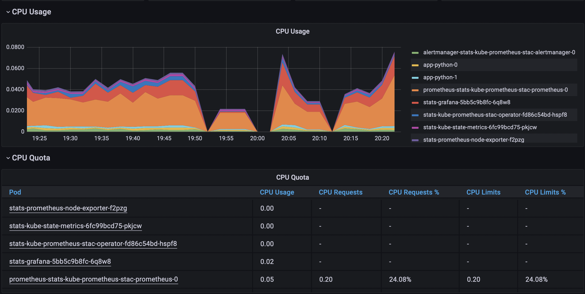
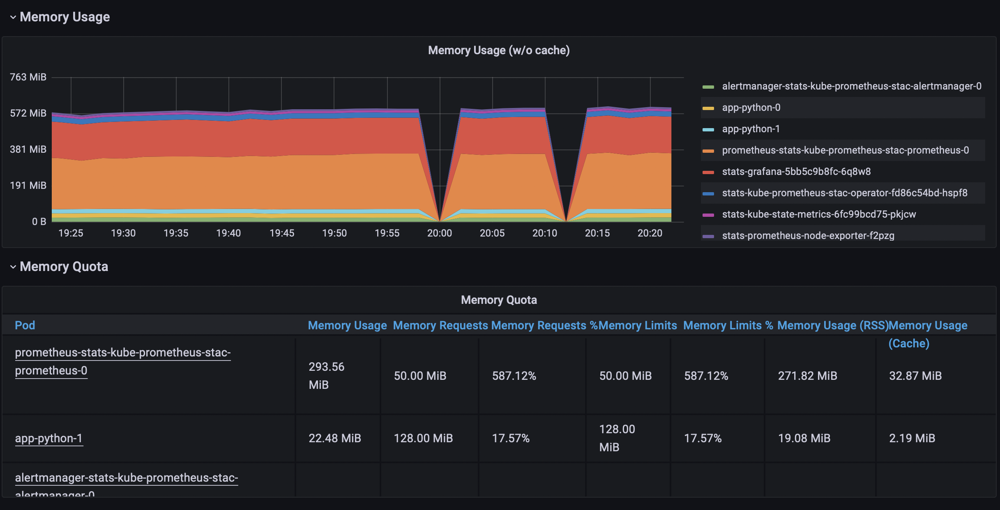
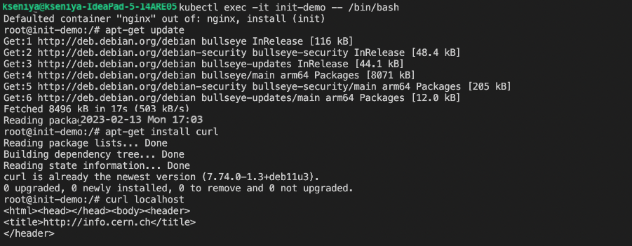

# Lab 14. K8s Prometheus

## Components

*The Prometheus Operator* is a tool for deploying, managing, and monitoring applications on Kubernetes clusters. It provides all the necessary components, such as *Prometheus, Alertmanager, Prometheus node-exporter, Prometheus Adapter for Kubernetes Metrics APIs, kube-state-metrics, and Grafana*, to monitor and manage applications in real-time. *Prometheus* is an open-source monitoring platform that collects and aggregates metrics, while *Alertmanager* is a program that allows for sorting alerts and sending messages. *Prometheus node-exporter* is a tool used in Kubernetes to analyze real-time metrics of nodes. *Prometheus Adapter for Kubernetes Metrics APIs* is an adapter used to monitor Kubernetes resource metrics, custom metrics, and external metrics APIs. *Kube-state-metrics* is a service that generates metrics about the state of objects such as deployments, nodes, and pods. Finally, *Grafana* is a monitoring tool used to visualize metrics.

## Preparation

1. Start minikube with the following command:

    ```sh
    minikube delete && minikube start --kubernetes-version=v1.23.0 --memory=2g --bootstrapper=kubeadm --extra-config=kubelet.authentication-token-webhook=true --extra-config=kubelet.authorization-mode=Webhook --extra-config=scheduler.bind-address=0.0.0.0 --extra-config=controller-manager.bind-address=0.0.0.0
    ```
1. Install the helm chart to k8s cluster:

    ```sh
    helm repo add prometheus-community https://prometheus-community.github.io/helm-charts
    helm repo update
    helm install stats prometheus-community/kube-prometheus-stack
    ```
1. Install app's helm chart.

## Output

1. The output of the `kubectl get po,sts,svc,pvc,cm` command:

    ```sh
    NAME                                                         READY   STATUS    RESTARTS      AGE
    pod/alertmanager-stats-kube-prometheus-stac-alertmanager-0   2/2     Running   1 (20m ago)   20m
    pod/prometheus-stats-kube-prometheus-stac-prometheus-0       2/2     Running   0             20m
    pod/stats-grafana-5bb5c9b8fc-6q8w8                           3/3     Running   0             21m
    pod/stats-kube-prometheus-stac-operator-fd86c54bd-hspf8      1/1     Running   0             21m
    pod/stats-kube-state-metrics-6fc99bcd75-pkjcw                1/1     Running   0             21m
    pod/stats-prometheus-node-exporter-f2pzg                     1/1     Running   0             21m
    NAME                                                                    READY   AGE
    statefulset.apps/alertmanager-stats-kube-prometheus-stac-alertmanager   1/1     20m
    statefulset.apps/app-python                                             0/2     5s
    statefulset.apps/prometheus-stats-kube-prometheus-stac-prometheus       1/1     20m
    NAME                                              TYPE           CLUSTER-IP       EXTERNAL-IP   PORT(S)                      AGE
    service/alertmanager-operated                     ClusterIP      None             <none>        9093/TCP,9094/TCP,9094/UDP   20m
    service/app-python                                LoadBalancer   10.98.173.144    <pending>     80:31042/TCP                 5s
    service/kubernetes                                ClusterIP      10.96.0.1        <none>        443/TCP                      124m
    service/prometheus-operated                       ClusterIP      None             <none>        9090/TCP                     20m
    service/stats-grafana                             ClusterIP      10.98.138.116    <none>        80/TCP                       21m
    service/stats-kube-prometheus-stac-alertmanager   ClusterIP      10.108.101.71    <none>        9093/TCP                     21m
    service/stats-kube-prometheus-stac-operator       ClusterIP      10.104.130.17    <none>        443/TCP                      21m
    service/stats-kube-prometheus-stac-prometheus     ClusterIP      10.106.203.216   <none>        9090/TCP                     21m
    service/stats-kube-state-metrics                  ClusterIP      10.102.107.228   <none>        8080/TCP                     21m
    service/stats-prometheus-node-exporter            ClusterIP      10.103.175.86    <none>        9100/TCP                     21m
    NAME                                                   STATUS   VOLUME                                     CAPACITY   ACCESS MODES   STORAGECLASS   AGE
    persistentvolumeclaim/persistent-volume-app-python-0   Bound    pvc-741749d3-c85b-449b-87b1-f471c15fbc1d   64Mi       RWO            standard       27m
    persistentvolumeclaim/persistent-volume-app-python-1   Bound    pvc-a5de41fb-b6cf-4a41-9a90-d09ac4477807   64Mi       RWO            standard       27m
    NAME                                                                     DATA   AGE
    configmap/app-python-config                                              1      5s
    configmap/kube-root-ca.crt                                               1      124m
    configmap/prometheus-stats-kube-prometheus-stac-prometheus-rulefiles-0   29     20m
    configmap/stats-grafana                                                  1      21m
    configmap/stats-grafana-config-dashboards                                1      21m
    configmap/stats-kube-prometheus-stac-alertmanager-overview               1      21m
    configmap/stats-kube-prometheus-stac-apiserver                           1      21m
    configmap/stats-kube-prometheus-stac-cluster-total                       1      21m
    configmap/stats-kube-prometheus-stac-controller-manager                  1      21m
    configmap/stats-kube-prometheus-stac-etcd                                1      21m
    configmap/stats-kube-prometheus-stac-grafana-datasource                  1      21m
    configmap/stats-kube-prometheus-stac-grafana-overview                    1      21m
    configmap/stats-kube-prometheus-stac-k8s-coredns                         1      21m
    configmap/stats-kube-prometheus-stac-k8s-resources-cluster               1      21m
    configmap/stats-kube-prometheus-stac-k8s-resources-namespace             1      21m
    configmap/stats-kube-prometheus-stac-k8s-resources-node                  1      21m
    configmap/stats-kube-prometheus-stac-k8s-resources-pod                   1      21m
    configmap/stats-kube-prometheus-stac-k8s-resources-workload              1      21m
    configmap/stats-kube-prometheus-stac-k8s-resources-workloads-namespace   1      21m
    configmap/stats-kube-prometheus-stac-kubelet                             1      21m
    configmap/stats-kube-prometheus-stac-namespace-by-pod                    1      21m
    configmap/stats-kube-prometheus-stac-namespace-by-workload               1      21m
    configmap/stats-kube-prometheus-stac-node-cluster-rsrc-use               1      21m
    configmap/stats-kube-prometheus-stac-node-rsrc-use                       1      21m
    configmap/stats-kube-prometheus-stac-nodes                               1      21m
    configmap/stats-kube-prometheus-stac-nodes-darwin                        1      21m
    configmap/stats-kube-prometheus-stac-persistentvolumesusage              1      21m
    configmap/stats-kube-prometheus-stac-pod-total                           1      21m
    configmap/stats-kube-prometheus-stac-prometheus                          1      21m
    configmap/stats-kube-prometheus-stac-proxy                               1      21m
    configmap/stats-kube-prometheus-stac-scheduler                           1      21m
    configmap/stats-kube-prometheus-stac-workload-total                      1      21m
    ```

    This command shows status of pods, stateful sets, services, persistent volume claims and configmaps.

## Grafana

1. Get password:

    ```sh
    helm show values prometheus-community/kube-prometheus-stack | grep  adminPassword
    adminPassword: prom-operator
    ```

1. Run `minikube service stats-grafana`:

    ```sh
    |-----------|---------------|-------------|--------------|
    | NAMESPACE |     NAME      | TARGET PORT |     URL      |
    |-----------|---------------|-------------|--------------|
    | default   | stats-grafana |             | No node port |
    |-----------|---------------|-------------|--------------|
    😿  service default/stats-grafana has no node port
    🏃  Starting tunnel for service stats-grafana.
    |-----------|---------------|-------------|------------------------|
    | NAMESPACE |     NAME      | TARGET PORT |          URL           |
    |-----------|---------------|-------------|------------------------|
    | default   | stats-grafana |             | http://127.0.0.1:52053 |
    |-----------|---------------|-------------|------------------------|
    🎉  Opening service default/stats-grafana in default browser...
    ❗  Because you are using a Docker driver on darwin, the terminal needs to be open to run it.
    ```

    
    
    
    
    
    

## Init Containers

1. Firstly, I created the Pod:

    `kubectl apply -f https://k8s.io/examples/pods/init-containers.yaml`

1. Then, I verified that the nginx container is running:

    ```sh
    kubectl get pod init-demo
    NAME        READY   STATUS    RESTARTS   AGE
    init-demo   1/1     Running   0          104s
    ```

1. I got a shell into the nginx container running in the init-demo Pod:

    `kubectl exec -it init-demo -- /bin/bash`

1. In my shell, I sent a GET request to the nginx server:

    ```sh
    root@nginx:~# apt-get update
    root@nginx:~# apt-get install curl
    root@nginx:~# curl localhost
    ```

1. The output shows that nginx is serving the web page that was written by the init container:

    