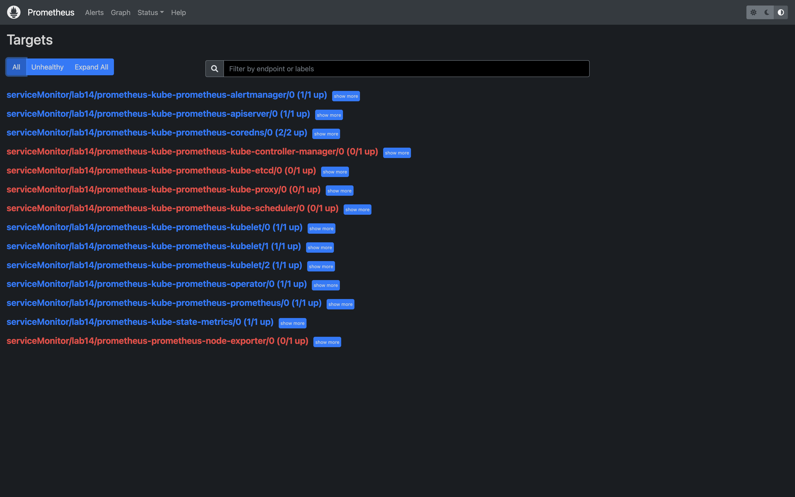
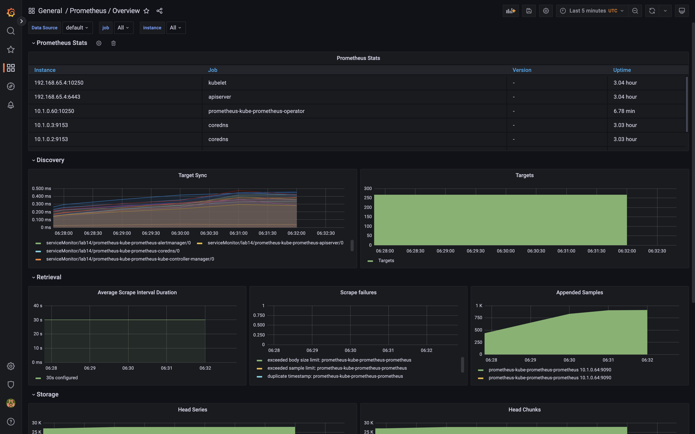
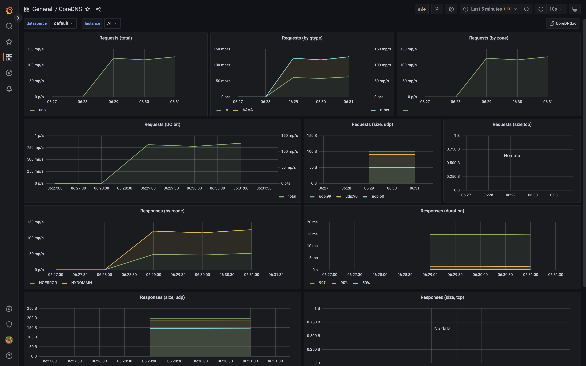
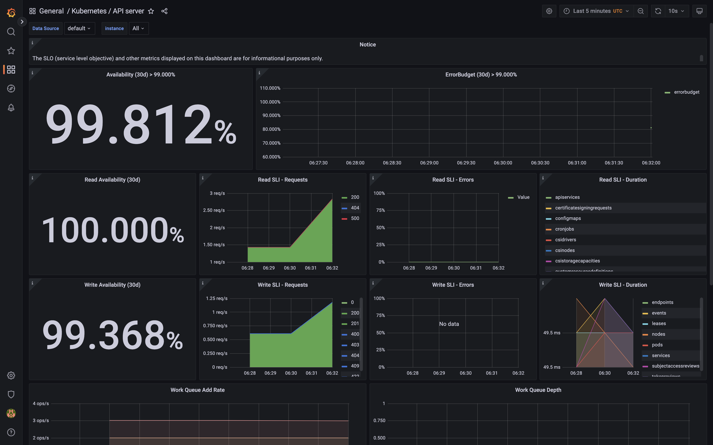
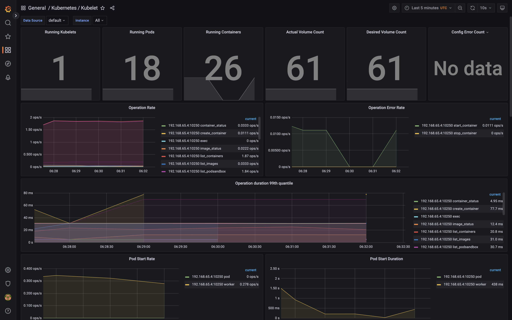
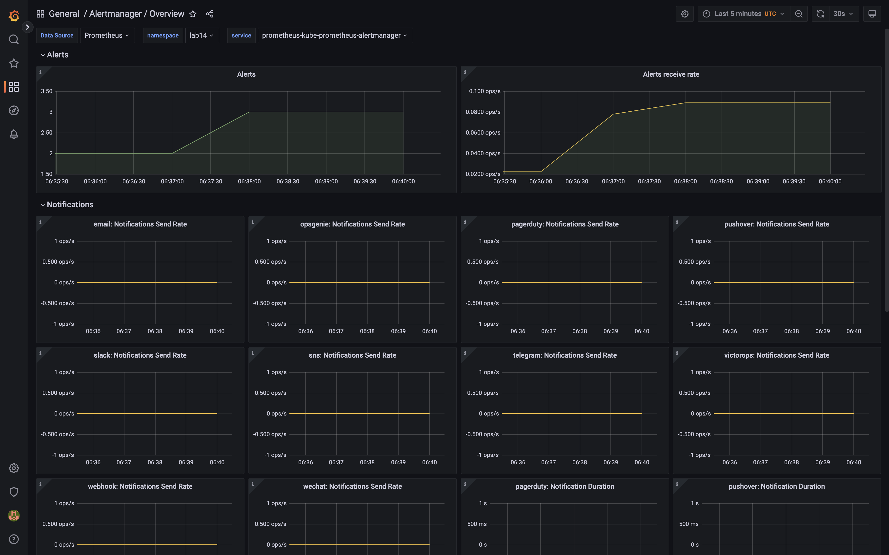

## Lab14

### 2

- Prometheus Operator - tool that manages Prometeus cluster on top of Kubernetes
- Prometheus - monitoring/alerting system and time series db
- Alertmanager - alerts system, when some trigger is activated, notifies you
- Node Exporter - collects OS and hardware metrics
- Prometheus Adapter for Kubernetes Metrics APIs - gives access to Prometheus metrics for Kubernetes features like autoscaling
- Grafana - visual dashboard to check and analyze all data collected with these things

### 3

```
NAME                                                         READY   STATUS             RESTARTS      AGE
pod/alertmanager-prometheus-kube-prometheus-alertmanager-0   2/2     Running            1 (31s ago)   33s
pod/app-python-0                                             1/1     Running            0             33m
pod/app-python-1                                             1/1     Running            0             33m
pod/app-python-2                                             1/1     Running            0             33m
pod/prometheus-grafana-f876b76ff-g6rh8                       3/3     Running            0             34s
pod/prometheus-kube-prometheus-operator-54b9d7fdc-qzqz9      1/1     Running            0             34s
pod/prometheus-kube-state-metrics-6cfd96f4c8-pg9zz           1/1     Running            0             34s
pod/prometheus-prometheus-kube-prometheus-prometheus-0       2/2     Running            0             33s
pod/prometheus-prometheus-node-exporter-8txw4                0/1     CrashLoopBackOff   2 (23s ago)   34s

NAME                                                                    READY   AGE
statefulset.apps/alertmanager-prometheus-kube-prometheus-alertmanager   1/1     33s
statefulset.apps/app-python                                             3/3     33m
statefulset.apps/prometheus-prometheus-kube-prometheus-prometheus       1/1     33s

NAME                                              TYPE        CLUSTER-IP      EXTERNAL-IP   PORT(S)                      AGE
service/alertmanager-operated                     ClusterIP   None            <none>        9093/TCP,9094/TCP,9094/UDP   33s
service/app-python                                ClusterIP   10.96.199.54    <none>        80/TCP                       33m
service/prometheus-grafana                        ClusterIP   10.110.34.120   <none>        80/TCP                       35s
service/prometheus-kube-prometheus-alertmanager   ClusterIP   10.106.143.47   <none>        9093/TCP                     35s
service/prometheus-kube-prometheus-operator       ClusterIP   10.97.254.107   <none>        443/TCP                      35s
service/prometheus-kube-prometheus-prometheus     ClusterIP   10.109.9.87     <none>        9090/TCP                     35s
service/prometheus-kube-state-metrics             ClusterIP   10.102.252.47   <none>        8080/TCP                     35s
service/prometheus-operated                       ClusterIP   None            <none>        9090/TCP                     33s
service/prometheus-prometheus-node-exporter       ClusterIP   10.98.172.133   <none>        9100/TCP                     35s

NAME                                        STATUS   VOLUME                                     CAPACITY   ACCESS MODES   STORAGECLASS   AGE
persistentvolumeclaim/volume-app-python-0   Bound    pvc-c746b88d-4782-444f-bc0c-6b8cab39f6fc   1Mi        RWO            hostpath       33m
persistentvolumeclaim/volume-app-python-1   Bound    pvc-a3c49cbc-ce99-489d-98b6-0b76ca0887bb   1Mi        RWO            hostpath       33m
persistentvolumeclaim/volume-app-python-2   Bound    pvc-90086667-e40c-44c5-b1ca-59ad6c9fb66a   1Mi        RWO            hostpath       33m

NAME                                                                     DATA   AGE
configmap/app-python                                                     1      33m
configmap/kube-root-ca.crt                                               1      33m
configmap/prometheus-grafana                                             1      35s
configmap/prometheus-grafana-config-dashboards                           1      35s
configmap/prometheus-kube-prometheus-alertmanager-overview               1      35s
configmap/prometheus-kube-prometheus-apiserver                           1      35s
configmap/prometheus-kube-prometheus-cluster-total                       1      35s
configmap/prometheus-kube-prometheus-controller-manager                  1      35s
configmap/prometheus-kube-prometheus-etcd                                1      35s
configmap/prometheus-kube-prometheus-grafana-datasource                  1      35s
configmap/prometheus-kube-prometheus-grafana-overview                    1      35s
configmap/prometheus-kube-prometheus-k8s-coredns                         1      35s
configmap/prometheus-kube-prometheus-k8s-resources-cluster               1      35s
configmap/prometheus-kube-prometheus-k8s-resources-namespace             1      35s
configmap/prometheus-kube-prometheus-k8s-resources-node                  1      35s
configmap/prometheus-kube-prometheus-k8s-resources-pod                   1      35s
configmap/prometheus-kube-prometheus-k8s-resources-workload              1      35s
configmap/prometheus-kube-prometheus-k8s-resources-workloads-namespace   1      35s
configmap/prometheus-kube-prometheus-kubelet                             1      35s
configmap/prometheus-kube-prometheus-namespace-by-pod                    1      35s
configmap/prometheus-kube-prometheus-namespace-by-workload               1      35s
configmap/prometheus-kube-prometheus-node-cluster-rsrc-use               1      35s
configmap/prometheus-kube-prometheus-node-rsrc-use                       1      35s
configmap/prometheus-kube-prometheus-nodes                               1      35s
configmap/prometheus-kube-prometheus-nodes-darwin                        1      35s
configmap/prometheus-kube-prometheus-persistentvolumesusage              1      35s
configmap/prometheus-kube-prometheus-pod-total                           1      35s
configmap/prometheus-kube-prometheus-prometheus                          1      35s
configmap/prometheus-kube-prometheus-proxy                               1      35s
configmap/prometheus-kube-prometheus-scheduler                           1      35s
configmap/prometheus-kube-prometheus-workload-total                      1      35s
configmap/prometheus-prometheus-kube-prometheus-prometheus-rulefiles-0   29     33s
```

### 4

Unfortunately it does not collect expected metrics. So I'm providing what I got
This seems to be an issue with Kubernetes in Docker Desktop, which I use for development. It has strict rules for access control and won't let it work

#### This thing is not completely working


#### Overall prometheus metrics about itself


#### Kubernetes internal DNS service metrics


#### Kubernetes API server metrics (kinda overall cluster health)


#### Overall general statistics


#### Alertmanager metrics


### 6

-
    ```bash
    kubectl -n lab14 apply -f init-container.yml
    ```
-
    ```bash
    kubectl -n lab14 exec pod/init-demo -- head /usr/share/nginx/html/init-container.html
    ```
    ```
    Defaulted container "nginx" out of: nginx, install (init)
    <!doctype html>
    <html>
    <head>
        <title>Example Domain</title>

        <meta charset="utf-8" />
        <meta http-equiv="Content-type" content="text/html; charset=utf-8" />
        <meta name="viewport" content="width=device-width, initial-scale=1" />
        <style type="text/css">
        body {
    ```