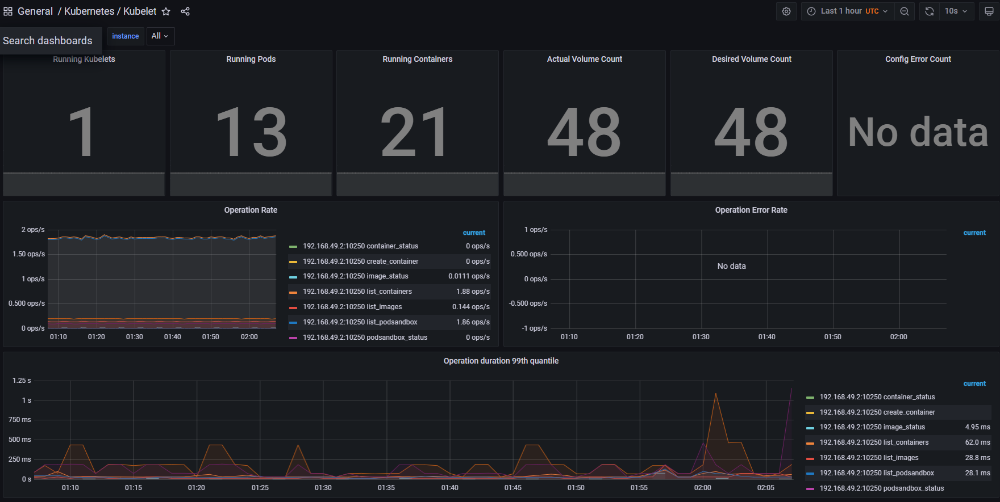
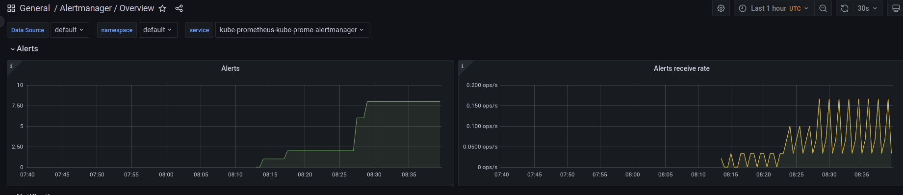
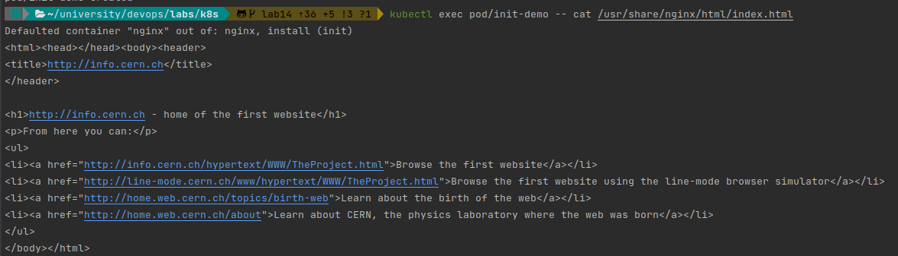

# 14. K8s

## Kube Prometheus Stack components

- The [Prometheus Operator](https://github.com/prometheus-operator/prometheus-operator)
  - Configuration, management, and deployment helper of Prometheus components in K8s.
- [Prometheus](https://prometheus.io/)
  - Stash of different metrics. Can send alerts to Alertmanager.
  - Metrics needs for monitoring and debugging of system components. 
- [Alertmanager](https://github.com/prometheus/alertmanager)
  - Manage alerts sent by Prometheus or other apps/sources.
  - The sources are only responsible for generating alerts, such entity can aggregate, process, and route them.
- [Prometheus node-exporter](https://github.com/prometheus/node_exporter)
  - Module that collects metrics running machine, e.g. CPU utilization, RAM usage, disk space, etc. After formatting sends them to Prometheus.
  - That module needed to connect and export metrics to Prometheus.
- [Prometheus Adapter for Kubernetes Metrics APIs](https://github.com/kubernetes-sigs/prometheus-adapter)
  - Aggregates kubernetes own metrics for Prometheus.
  - Kubernetes has its own metrics API. This adapter allows to collect them.
- [kube-state-metrics](https://github.com/kubernetes/kube-state-metrics)
  - Generates and exports metrics for Kubernetes objects, e.g. deployments, pods, nodes.
  - kube-state-metrics shows the raw data without any heuristic, unlike kubectl. This allows users to perform their own heuristic on data.
- [Grafana](https://grafana.com/)
  - Visualization tool with dashboards.
  - Visualizes raw data into dashboards in more human understandable way.

## Chart installation

`kubectl get po,sts,svc,pvc,cm`:

```bash
NAME                                                       READY   STATUS              RESTARTS     AGE
pod/app-python-0                                           1/1     Running             1 (6d ago)   9d
pod/app-python-1                                           1/1     Running             1 (6d ago)   9d
pod/kube-prometheus-grafana-9b55579d7-fqmzk                0/3     ContainerCreating   0            31s
pod/kube-prometheus-kube-prome-operator-6cdbfccd77-cmbx4   0/1     ContainerCreating   0            31s
pod/kube-prometheus-kube-state-metrics-66b47fc45d-fh5dx    0/1     ContainerCreating   0            31s
pod/kube-prometheus-prometheus-node-exporter-grj4k         1/1     Running             0            31s

NAME                          READY   AGE
statefulset.apps/app-python   2/2     9d

NAME                                               TYPE           CLUSTER-IP       EXTERNAL-IP   PORT(S)        AGE
service/app-python                                 LoadBalancer   10.110.30.212    <pending>     80:32679/TCP   9d
service/kube-prometheus-grafana                    ClusterIP      10.108.75.217    <none>        80/TCP         32s
service/kube-prometheus-kube-prome-alertmanager    ClusterIP      10.103.53.113    <none>        9093/TCP       32s
service/kube-prometheus-kube-prome-operator        ClusterIP      10.109.42.145    <none>        443/TCP        32s
service/kube-prometheus-kube-prome-prometheus      ClusterIP      10.103.200.142   <none>        9090/TCP       32s
service/kube-prometheus-kube-state-metrics         ClusterIP      10.109.179.242   <none>        8080/TCP       32s
service/kube-prometheus-prometheus-node-exporter   ClusterIP      10.103.197.198   <none>        9100/TCP       32s
service/kubernetes                                 ClusterIP      10.96.0.1        <none>        443/TCP        9d

NAME                                                   STATUS   VOLUME                                     CAPACITY   ACCESS MODES   STORAGECLASS   AGE
persistentvolumeclaim/persistent-volume-app-python-0   Bound    pvc-7a2f2607-f4ee-43f9-8a96-b29e6650dbd7   128Mi      RWO            standard       9d
persistentvolumeclaim/persistent-volume-app-python-1   Bound    pvc-bc5f98f8-4e10-426b-abe7-b3685387d03f   128Mi      RWO            standard       9d

NAME                                                                     DATA   AGE
configmap/42.2.1-grafana                                                 1      69s
configmap/42.2.1-grafana-config-dashboards                               1      69s
configmap/42.2.1-kube-prometheus-sta-alertmanager-overview               1      69s
configmap/42.2.1-kube-prometheus-sta-apiserver                           1      69s
configmap/42.2.1-kube-prometheus-sta-cluster-total                       1      69s
configmap/42.2.1-kube-prometheus-sta-controller-manager                  1      69s
configmap/42.2.1-kube-prometheus-sta-etcd                                1      69s
configmap/42.2.1-kube-prometheus-sta-grafana-datasource                  1      69s
configmap/42.2.1-kube-prometheus-sta-grafana-overview                    1      69s
configmap/42.2.1-kube-prometheus-sta-k8s-coredns                         1      69s
configmap/42.2.1-kube-prometheus-sta-k8s-resources-cluster               1      69s
configmap/42.2.1-kube-prometheus-sta-k8s-resources-namespace             1      69s
configmap/42.2.1-kube-prometheus-sta-k8s-resources-node                  1      69s
configmap/42.2.1-kube-prometheus-sta-k8s-resources-pod                   1      69s
configmap/42.2.1-kube-prometheus-sta-k8s-resources-workload              1      69s
configmap/42.2.1-kube-prometheus-sta-k8s-resources-workloads-namespace   1      69s
configmap/42.2.1-kube-prometheus-sta-kubelet                             1      69s
configmap/42.2.1-kube-prometheus-sta-namespace-by-pod                    1      69s
configmap/42.2.1-kube-prometheus-sta-namespace-by-workload               1      69s
configmap/42.2.1-kube-prometheus-sta-node-cluster-rsrc-use               1      69s
configmap/42.2.1-kube-prometheus-sta-node-rsrc-use                       1      69s
configmap/42.2.1-kube-prometheus-sta-nodes                               1      69s
configmap/42.2.1-kube-prometheus-sta-nodes-darwin                        1      69s
configmap/42.2.1-kube-prometheus-sta-persistentvolumesusage              1      69s
configmap/42.2.1-kube-prometheus-sta-pod-total                           1      69s
configmap/42.2.1-kube-prometheus-sta-prometheus                          1      69s
configmap/42.2.1-kube-prometheus-sta-proxy                               1      69s
configmap/42.2.1-kube-prometheus-sta-scheduler                           1      69s
configmap/42.2.1-kube-prometheus-sta-workload-total                      1      69s
configmap/app-python-config                                              1      9d
configmap/kube-prometheus-grafana                                        1      32s
configmap/kube-prometheus-grafana-config-dashboards                      1      32s
configmap/kube-prometheus-kube-prome-alertmanager-overview               1      32s
configmap/kube-prometheus-kube-prome-apiserver                           1      32s
configmap/kube-prometheus-kube-prome-cluster-total                       1      32s
configmap/kube-prometheus-kube-prome-controller-manager                  1      32s
configmap/kube-prometheus-kube-prome-etcd                                1      32s
configmap/kube-prometheus-kube-prome-grafana-datasource                  1      32s
configmap/kube-prometheus-kube-prome-grafana-overview                    1      32s
configmap/kube-prometheus-kube-prome-k8s-coredns                         1      32s
configmap/kube-prometheus-kube-prome-k8s-resources-cluster               1      32s
configmap/kube-prometheus-kube-prome-k8s-resources-namespace             1      32s
configmap/kube-prometheus-kube-prome-k8s-resources-node                  1      32s
configmap/kube-prometheus-kube-prome-k8s-resources-pod                   1      32s
configmap/kube-prometheus-kube-prome-k8s-resources-workload              1      32s
configmap/kube-prometheus-kube-prome-k8s-resources-workloads-namespace   1      32s
configmap/kube-prometheus-kube-prome-kubelet                             1      32s
configmap/kube-prometheus-kube-prome-namespace-by-pod                    1      32s
configmap/kube-prometheus-kube-prome-namespace-by-workload               1      32s
configmap/kube-prometheus-kube-prome-node-cluster-rsrc-use               1      32s
configmap/kube-prometheus-kube-prome-node-rsrc-use                       1      32s
configmap/kube-prometheus-kube-prome-nodes                               1      32s
configmap/kube-prometheus-kube-prome-nodes-darwin                        1      32s
configmap/kube-prometheus-kube-prome-persistentvolumesusage              1      32s
configmap/kube-prometheus-kube-prome-pod-total                           1      32s
configmap/kube-prometheus-kube-prome-prometheus                          1      32s
configmap/kube-prometheus-kube-prome-proxy                               1      32s
configmap/kube-prometheus-kube-prome-scheduler                           1      32s
configmap/kube-prometheus-kube-prome-workload-total                      1      32s
configmap/kube-prometheus-stack-42.2-alertmanager-overview               1      111s
configmap/kube-prometheus-stack-42.2-apiserver                           1      111s
configmap/kube-prometheus-stack-42.2-cluster-total                       1      111s
configmap/kube-prometheus-stack-42.2-controller-manager                  1      111s
configmap/kube-prometheus-stack-42.2-etcd                                1      111s
configmap/kube-prometheus-stack-42.2-grafana-datasource                  1      111s
configmap/kube-prometheus-stack-42.2-grafana-overview                    1      111s
configmap/kube-prometheus-stack-42.2-k8s-coredns                         1      111s
configmap/kube-prometheus-stack-42.2-k8s-resources-cluster               1      111s
configmap/kube-prometheus-stack-42.2-k8s-resources-namespace             1      111s
configmap/kube-prometheus-stack-42.2-k8s-resources-node                  1      111s
configmap/kube-prometheus-stack-42.2-k8s-resources-pod                   1      111s
configmap/kube-prometheus-stack-42.2-k8s-resources-workload              1      111s
configmap/kube-prometheus-stack-42.2-k8s-resources-workloads-namespace   1      111s
configmap/kube-prometheus-stack-42.2-kubelet                             1      111s
configmap/kube-prometheus-stack-42.2-namespace-by-pod                    1      111s
configmap/kube-prometheus-stack-42.2-namespace-by-workload               1      111s
configmap/kube-prometheus-stack-42.2-node-cluster-rsrc-use               1      111s
configmap/kube-prometheus-stack-42.2-node-rsrc-use                       1      111s
configmap/kube-prometheus-stack-42.2-nodes                               1      111s
configmap/kube-prometheus-stack-42.2-nodes-darwin                        1      111s
configmap/kube-prometheus-stack-42.2-persistentvolumesusage              1      111s
configmap/kube-prometheus-stack-42.2-pod-total                           1      111s
configmap/kube-prometheus-stack-42.2-prometheus                          1      111s
configmap/kube-prometheus-stack-42.2-proxy                               1      111s
configmap/kube-prometheus-stack-42.2-scheduler                           1      111s
configmap/kube-prometheus-stack-42.2-workload-total                      1      111s
configmap/kube-prometheus-stack-42.2.1-grafana                           1      111s
configmap/kube-prometheus-stack-42.2.1-grafana-config-dashboards         1      111s
configmap/kube-root-ca.crt                                               1      9d
```

## Cluster info

4. 
6. 

## Init containers

