# k8s monitoring

## Main task

### Running services

`kube-prometheus-stack` consist of following components:

1. The Prometheus Operator - Deployment of Prometheus into k8s
2. Highly available Prometheus - Time series database, for metrics
3. Highly available Alertmanager - For alerts sent from different sources
4. Prometheus node-exporter - Export hardware and OS metrics
5. Prometheus Adapter for Kubernetes Metrics APIs - Generates metrics from k8s API
6. kube-state-metrics - Generates metrics from k8s API about the state of the objects
7. Grafana - UI for data from different sources

Command below shows info about following entities:

- po - Pod
- sts - StatefulSet
- svc - Service
- pvc - PersistentVolumeClaim
- cm - ConfigMap

```bash
$ kubectl get po,sts,svc,pvc,cm
NAME                                                         READY   STATUS    RESTARTS       AGE
pod/alertmanager-main-kube-prometheus-stack-alertmanager-0   2/2     Running   1 (111m ago)   111m
pod/app-python-app-python-chart-0                            1/1     Running   0              109m
pod/app-python-app-python-chart-1                            1/1     Running   0              109m
pod/main-grafana-7859fdf988-vxj8r                            3/3     Running   0              111m
pod/main-kube-prometheus-stack-operator-6c477f97c4-sf8wl     1/1     Running   0              111m
pod/main-kube-state-metrics-6447948f45-9kxhw                 1/1     Running   0              111m
pod/main-prometheus-node-exporter-p2q82                      1/1     Running   0              111m
pod/prometheus-main-kube-prometheus-stack-prometheus-0       2/2     Running   0              111m

NAME                                                                    READY   AGE
statefulset.apps/alertmanager-main-kube-prometheus-stack-alertmanager   1/1     111m
statefulset.apps/app-python-app-python-chart                            2/2     109m
statefulset.apps/prometheus-main-kube-prometheus-stack-prometheus       1/1     111m

NAME                                              TYPE           CLUSTER-IP       EXTERNAL-IP   PORT(S)                      AGE
service/alertmanager-operated                     ClusterIP      None             <none>        9093/TCP,9094/TCP,9094/UDP   111m
service/app-python-app-python-chart               LoadBalancer   10.96.151.52     <pending>     80:31026/TCP                 109m
service/kubernetes                                ClusterIP      10.96.0.1        <none>        443/TCP                      152m
service/main-grafana                              ClusterIP      10.106.195.19    <none>        80/TCP                       111m
service/main-kube-prometheus-stack-alertmanager   ClusterIP      10.109.167.202   <none>        9093/TCP                     111m
service/main-kube-prometheus-stack-operator       ClusterIP      10.101.223.83    <none>        443/TCP                      111m
service/main-kube-prometheus-stack-prometheus     ClusterIP      10.106.70.146    <none>        9090/TCP                     111m
service/main-kube-state-metrics                   ClusterIP      10.102.38.71     <none>        8080/TCP                     111m
service/main-prometheus-node-exporter             ClusterIP      10.104.232.70    <none>        9100/TCP                     111m
service/prometheus-operated                       ClusterIP      None             <none>        9090/TCP                     111m

NAME                                                                    STATUS   VOLUME                                     CAPACITY   ACCESS MODES   STORAGECLASS   AGE
persistentvolumeclaim/app-python-volume-app-python-app-python-chart-0   Bound    pvc-bddf6f9a-0de0-436c-8d72-02f04247dcb6   256Mi      RWO            standard       109m
persistentvolumeclaim/app-python-volume-app-python-app-python-chart-1   Bound    pvc-1ef73a89-b6aa-472f-93b7-b647531358e4   256Mi      RWO            standard       109m

NAME                                                                     DATA   AGE
configmap/app-python-app-python-chart-config                             1      109m
configmap/kube-root-ca.crt                                               1      152m
configmap/main-grafana                                                   1      111m
configmap/main-grafana-config-dashboards                                 1      111m
configmap/main-kube-prometheus-stack-alertmanager-overview               1      111m
configmap/main-kube-prometheus-stack-apiserver                           1      111m
configmap/main-kube-prometheus-stack-cluster-total                       1      111m
configmap/main-kube-prometheus-stack-controller-manager                  1      111m
configmap/main-kube-prometheus-stack-etcd                                1      111m
configmap/main-kube-prometheus-stack-grafana-datasource                  1      111m
configmap/main-kube-prometheus-stack-grafana-overview                    1      111m
configmap/main-kube-prometheus-stack-k8s-coredns                         1      111m
configmap/main-kube-prometheus-stack-k8s-resources-cluster               1      111m
configmap/main-kube-prometheus-stack-k8s-resources-namespace             1      111m
configmap/main-kube-prometheus-stack-k8s-resources-node                  1      111m
configmap/main-kube-prometheus-stack-k8s-resources-pod                   1      111m
configmap/main-kube-prometheus-stack-k8s-resources-workload              1      111m
configmap/main-kube-prometheus-stack-k8s-resources-workloads-namespace   1      111m
configmap/main-kube-prometheus-stack-kubelet                             1      111m
configmap/main-kube-prometheus-stack-namespace-by-pod                    1      111m
configmap/main-kube-prometheus-stack-namespace-by-workload               1      111m
configmap/main-kube-prometheus-stack-node-cluster-rsrc-use               1      111m
configmap/main-kube-prometheus-stack-node-rsrc-use                       1      111m
configmap/main-kube-prometheus-stack-nodes                               1      111m
configmap/main-kube-prometheus-stack-nodes-darwin                        1      111m
configmap/main-kube-prometheus-stack-persistentvolumesusage              1      111m
configmap/main-kube-prometheus-stack-pod-total                           1      111m
configmap/main-kube-prometheus-stack-prometheus                          1      111m
configmap/main-kube-prometheus-stack-proxy                               1      111m
configmap/main-kube-prometheus-stack-scheduler                           1      111m
configmap/main-kube-prometheus-stack-workload-total                      1      111m
configmap/prometheus-main-kube-prometheus-stack-prometheus-rulefiles-0   29     111m
```

### Statistics from Grafana

I am done all labs with last version of k8s,
so due to [issue](https://github.com/prometheus-operator/kube-prometheus/issues/1850)
I will have no data in some graphs.
Thankfully, we are allowed to skip such tasks with screenshot as proof,
as it was announced on chat.

#### i. Check how much CPU and Memory your StatefulSet is consuming

There is no data for this task, only limits and quotas.

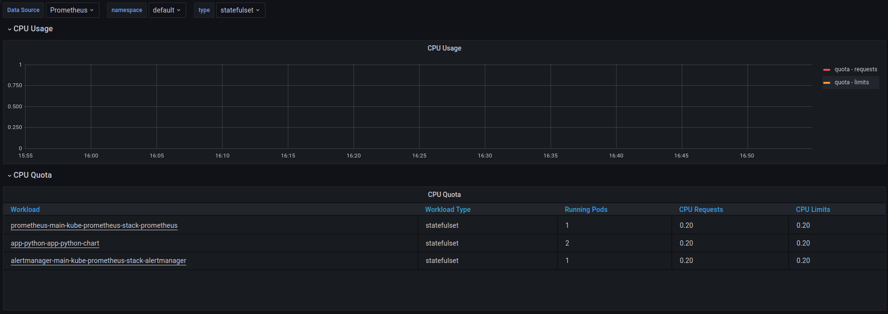
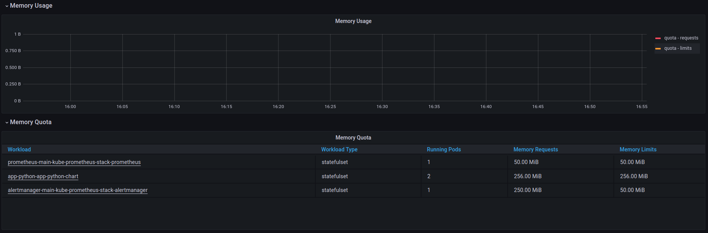
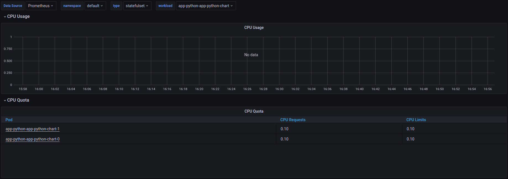
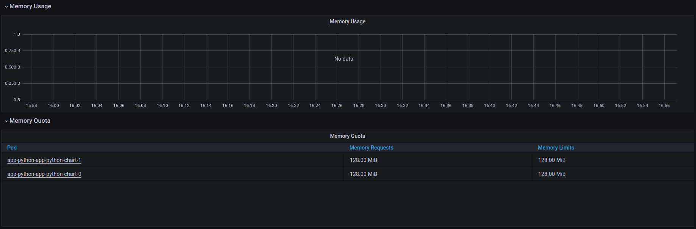

#### ii. Check which Pod is using CPU more than others and which is less in the default namespace

There is no data for this task, only limits and quotas.

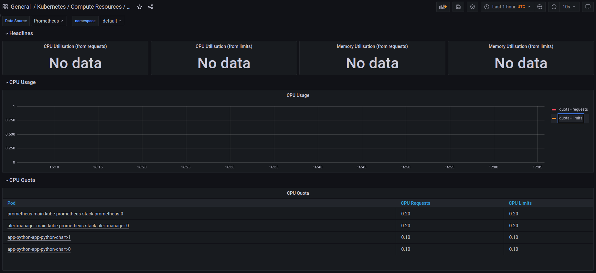

#### iii. Check how much memory is used on your node, in % and mb

My node uses 71.9% of RAM, which is around 10.4 GB (taken from Node Exporter).
Seems like Node Exporter treats my entire OS resources as Node.

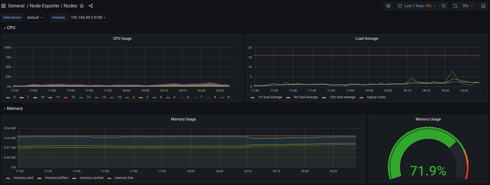
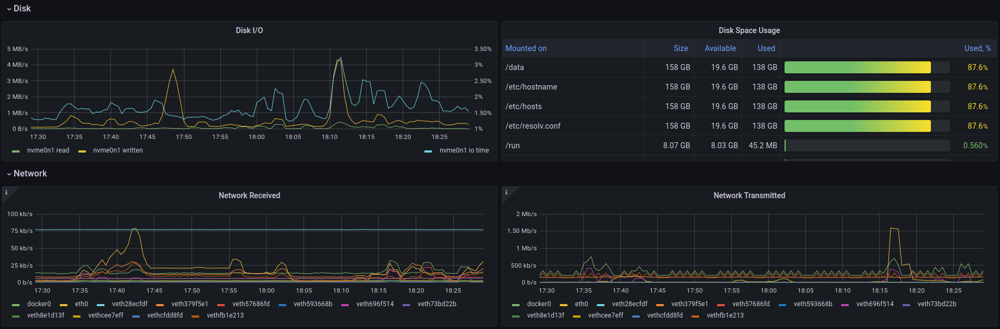

Graphs below should show data for `minikube`, but they also have no data.

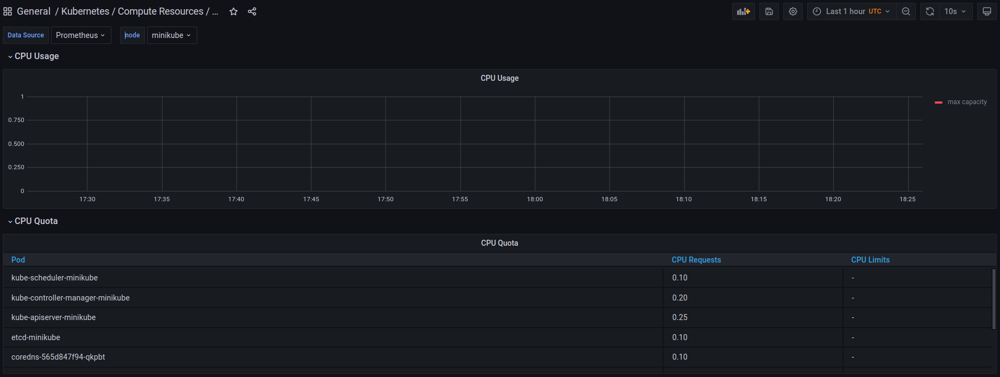
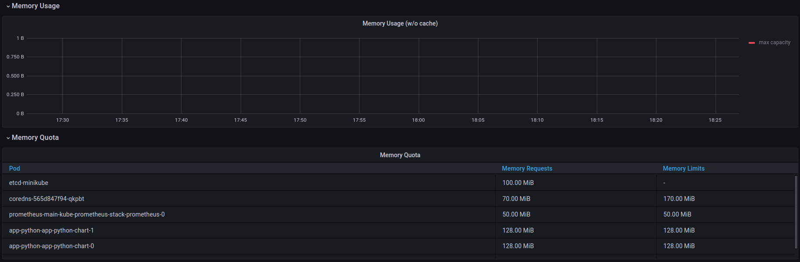

#### iv. Check how many pods and containers actually ran by the Kubelet service

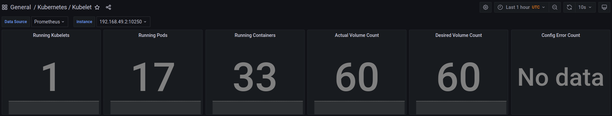

#### v. Check which Pod is using network more than others and which is less in the default namespace

There is no data for this task.

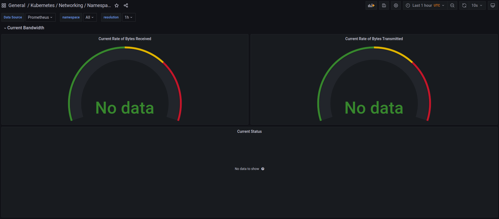
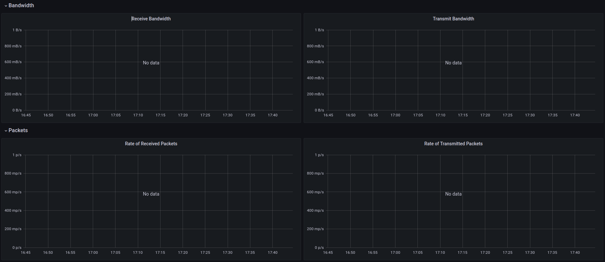
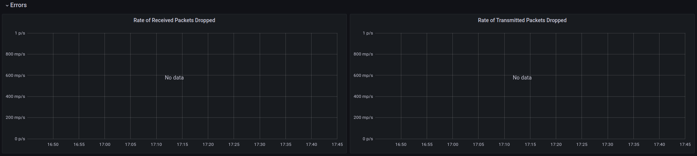

#### vi. Check how many alerts you have. Also you can see them in the Web UI by the `minikube service monitoring-kube-prometheus-alertmanager` command

I have 8 alerts.

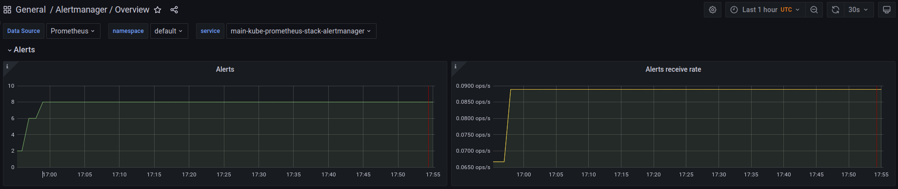

### Init containers

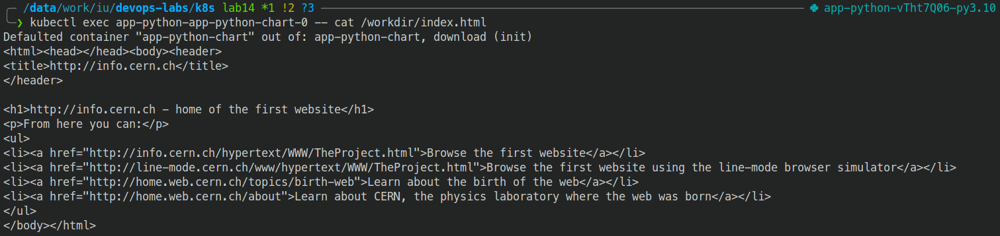


## Bonus task

### Get metrics from your app. Provide a proof

I just reused my dashboard from the `monitoring` lab and edited it
a little bit for this case.

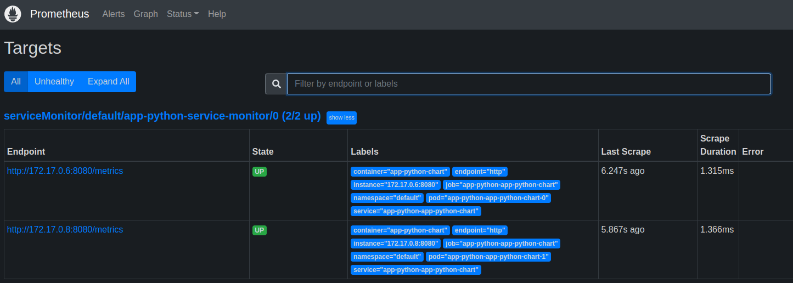
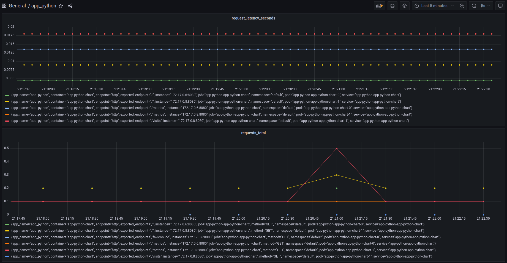

### Create a queue of three Init containers, with any logic like adding new lines to the same file. Provide a proof with the `cat` tool

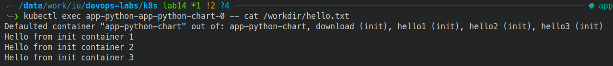
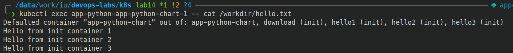
