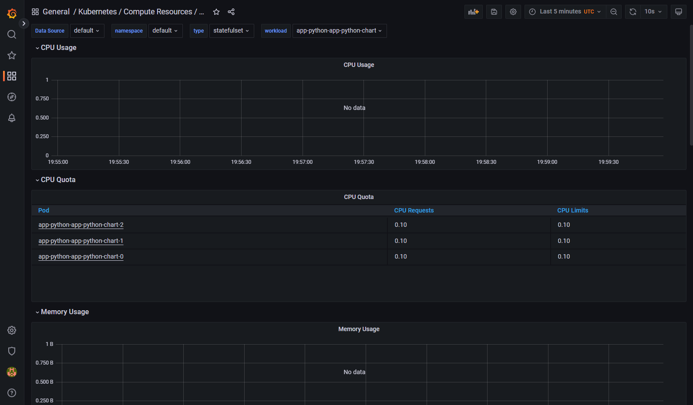
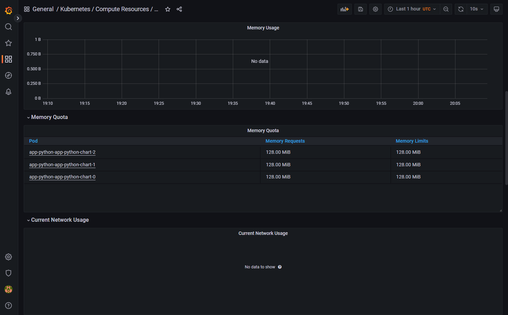
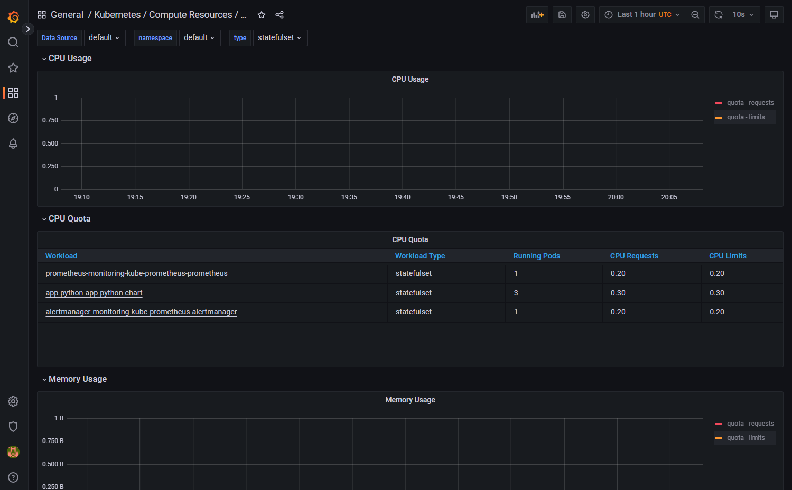
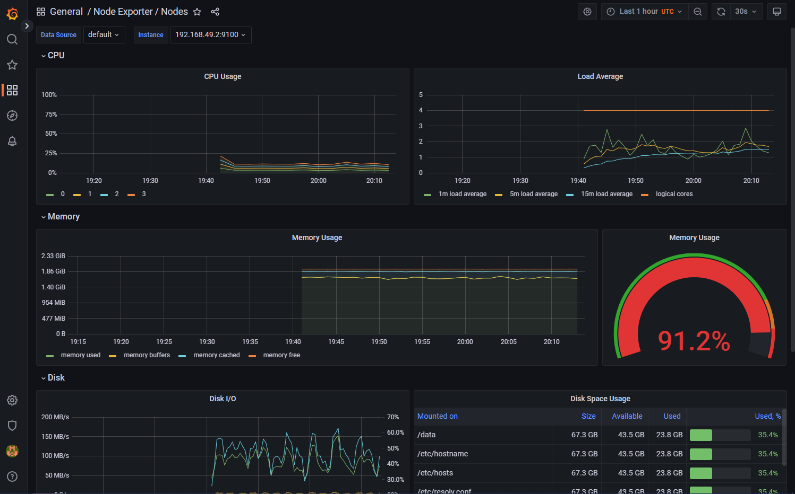
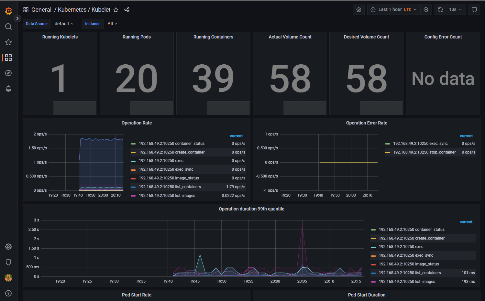
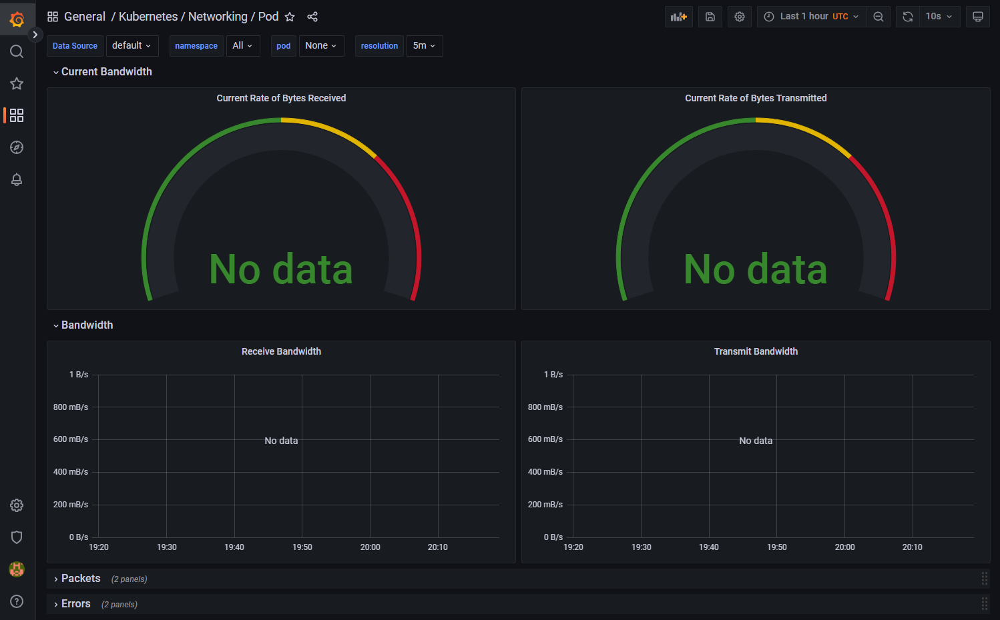
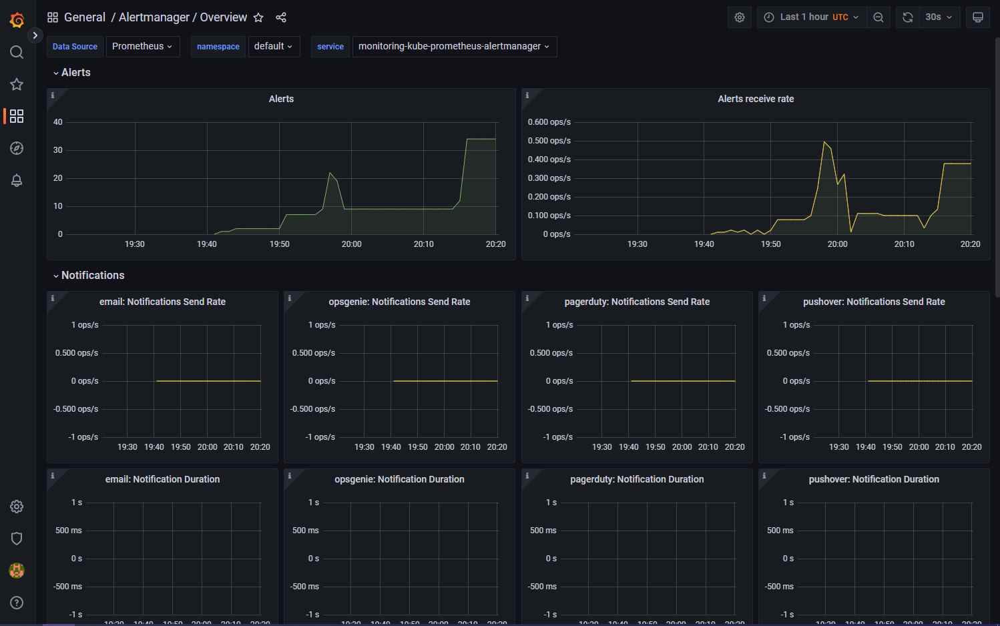
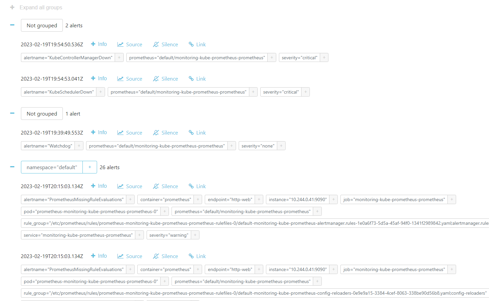

# Kubernetes and Prometheus

## Componenets descriptions
* __Prometheus Operator__: a Kubernetes service that deploy Prometheus natively on Kubernetes
* __Prometheus__: tool that collects metrics from targets
* __Alertmanager__: used to deal with alerts from Prometheus
* __Prometheus node-exporter__: collects info about hardware
* __Prometheus Adapter for Kubernetes Metrics APIs__: used to adjustable scale clusters metrics automatization
* __Grafana__: web interface for accessing and vizualizing metrics with pretty charts, etc.

## Adding Prometheus stack results:
```ps
Δ kubectl get po,sts,svc,pvc,cm
NAME                                                         READY   STATUS    RESTARTS        AGE
pod/alertmanager-monitoring-kube-prometheus-alertmanager-0   2/2     Running   1 (3m37s ago)   3m57s
pod/app-python-app-python-chart-0                            1/1     Running   0               53m
pod/app-python-app-python-chart-1                            1/1     Running   0               53m
pod/app-python-app-python-chart-2                            1/1     Running   0               53m
pod/hello-minikube-77b6f68484-6tgkc                          1/1     Running   2 (21h ago)     22h
pod/monitoring-grafana-8448c6c7b6-jnb7k                      3/3     Running   0               4m9s
pod/monitoring-kube-prometheus-operator-5b4b7dd6dc-bh7vl     1/1     Running   0               4m9s
pod/monitoring-kube-state-metrics-78b876647b-jp7hj           1/1     Running   0               4m9s
pod/monitoring-prometheus-node-exporter-7jbtp                1/1     Running   0               4m9s
pod/prometheus-monitoring-kube-prometheus-prometheus-0       2/2     Running   0               3m56s

NAME                                                                    READY   AGE
statefulset.apps/alertmanager-monitoring-kube-prometheus-alertmanager   1/1     3m57s
statefulset.apps/app-python-app-python-chart                            3/3     53m
statefulset.apps/prometheus-monitoring-kube-prometheus-prometheus       1/1     3m56s

NAME                                              TYPE           CLUSTER-IP       EXTERNAL-IP   PORT(S)                      AGE
service/alertmanager-operated                     ClusterIP      None             <none>        9093/TCP,9094/TCP,9094/UDP   3m57s
service/app-python-app-python-chart               LoadBalancer   10.102.2.92      <pending>     5000:31085/TCP               84m
service/hello-minikube                            NodePort       10.109.181.242   <none>        8080:30112/TCP               22h
service/kubernetes                                ClusterIP      10.96.0.1        <none>        443/TCP                      22h
service/monitoring-grafana                        ClusterIP      10.111.38.240    <none>        80/TCP                       4m10s
service/monitoring-kube-prometheus-alertmanager   ClusterIP      10.97.175.134    <none>        9093/TCP                     4m10s
service/monitoring-kube-prometheus-operator       ClusterIP      10.100.79.42     <none>        443/TCP                      4m10s
service/monitoring-kube-prometheus-prometheus     ClusterIP      10.103.30.83     <none>        9090/TCP                     4m10s
service/monitoring-kube-state-metrics             ClusterIP      10.106.49.180    <none>        8080/TCP                     4m10s
service/monitoring-prometheus-node-exporter       ClusterIP      10.100.242.216   <none>        9100/TCP                     4m10s
service/prometheus-operated                       ClusterIP      None             <none>        9090/TCP                     3m56s

NAME                                                             STATUS   VOLUME                                     CAPACITY   ACCESS MODES   STORAGECLASS   AGE
persistentvolumeclaim/app-volume-app-python-app-python-chart-0   Bound    pvc-12e1e6ee-7c83-497a-b63d-6431fae5311e   1Gi        RWO
   standard       53m
persistentvolumeclaim/app-volume-app-python-app-python-chart-1   Bound    pvc-d5ed01b7-c61b-4ddc-9d8d-03cb5f5c0cce   1Gi        RWO
   standard       53m
persistentvolumeclaim/app-volume-app-python-app-python-chart-2   Bound    pvc-e596eb96-be4f-4f82-971f-ce8254003588   1Gi        RWO
   standard       53m
persistentvolumeclaim/data-mysql-1676813931-0                    Bound    pvc-2dfcd893-bdb5-4e04-87d6-5adb6cc79596   8Gi        RWO
   standard       6h3m
persistentvolumeclaim/data-mysql-1676813959-0                    Bound    pvc-b0ef418d-149a-4bcb-b4a2-1d02b38d4783   8Gi        RWO
   standard       6h3m

NAME                                                                     DATA   AGE
configmap/app-python-config-map                                          1      88m
configmap/kube-root-ca.crt                                               1      22h
configmap/monitoring-grafana                                             1      4m10s
configmap/monitoring-grafana-config-dashboards                           1      4m10s
configmap/monitoring-kube-prometheus-alertmanager-overview               1      4m10s
configmap/monitoring-kube-prometheus-apiserver                           1      4m10s
configmap/monitoring-kube-prometheus-cluster-total                       1      4m10s
configmap/monitoring-kube-prometheus-controller-manager                  1      4m10s
configmap/monitoring-kube-prometheus-etcd                                1      4m10s
configmap/monitoring-kube-prometheus-grafana-datasource                  1      4m10s
configmap/monitoring-kube-prometheus-grafana-overview                    1      4m10s
configmap/monitoring-kube-prometheus-k8s-coredns                         1      4m10s
configmap/monitoring-kube-prometheus-k8s-resources-cluster               1      4m10s
configmap/monitoring-kube-prometheus-k8s-resources-namespace             1      4m10s
configmap/monitoring-kube-prometheus-k8s-resources-node                  1      4m10s
configmap/monitoring-kube-prometheus-k8s-resources-pod                   1      4m10s
configmap/monitoring-kube-prometheus-k8s-resources-workload              1      4m10s
configmap/monitoring-kube-prometheus-k8s-resources-workloads-namespace   1      4m10s
configmap/monitoring-kube-prometheus-kubelet                             1      4m10s
configmap/monitoring-kube-prometheus-namespace-by-pod                    1      4m10s
configmap/monitoring-kube-prometheus-namespace-by-workload               1      4m10s
configmap/monitoring-kube-prometheus-node-cluster-rsrc-use               1      4m10s
configmap/monitoring-kube-prometheus-node-rsrc-use                       1      4m10s
configmap/monitoring-kube-prometheus-nodes                               1      4m10s
configmap/monitoring-kube-prometheus-nodes-darwin                        1      4m10s
configmap/monitoring-kube-prometheus-persistentvolumesusage              1      4m10s
configmap/monitoring-kube-prometheus-pod-total                           1      4m10s
configmap/monitoring-kube-prometheus-prometheus                          1      4m10s
configmap/monitoring-kube-prometheus-proxy                               1      4m10s
configmap/monitoring-kube-prometheus-scheduler                           1      4m10s
configmap/monitoring-kube-prometheus-workload-total                      1      4m10s
configmap/prometheus-monitoring-kube-prometheus-prometheus-rulefiles-0   29     3m56s
```

The command above lists all pods, stateful sets, services, persistent volume claims and config maps as in `po,sts,svc,pvc,cm` respectively.

## Grafana data
1.Check how much CPU and Memory your StatefulSet is consuming.
> No data is received except quotas




2.Check which Pod is using CPU more than others and which is less in the default namespace.
> Still no data



3.Check how much memory is used on your node, in % and mb.
> ~1.7Gb or ~92%



4.Check how many pods and containers actually ran by the Kubelet service.
> 39 and 20



5.Check which Pod is using network more than others and which is less in the default namespace.
> No data



6.Check how many alerts you have. Also you can see them in the Web UI by the `minikube service monitoring-kube-prometheus-alertmanager` command.
> About 35



Here are examples:


## Init containers

```ps
Δ kubectl apply -f .\init_containers.yaml
pod/init-demo created
```
```ps
Δ kubectl exec init-demo -- cat /usr/share/nginx/html/index.html
Defaulted container "nginx" out of: nginx, install (init)
<html><head></head><body><header>
<title>http://info.cern.ch</title>
</header>

<h1>http://info.cern.ch - home of the first website</h1>
<p>From here you can:</p>
<ul>
<li><a href="http://info.cern.ch/hypertext/WWW/TheProject.html">Browse the first website</a></li>
<li><a href="http://line-mode.cern.ch/www/hypertext/WWW/TheProject.html">Browse the first website using the line-mode browser simulator</a></li>
<li><a href="http://home.web.cern.ch/topics/birth-web">Learn about the birth of the web</a></li>
<li><a href="http://home.web.cern.ch/about">Learn about CERN, the physics laboratory where the web was born</a></li>
</ul>
</body></html>
```

Looks like everything is working.