# Lab 14

## Explanation of components of `kube-prometheus-stack` (Task 2)

The following components exist in `kube-prometheus-stack`:
* The Prometheus Operator - deployment and management of Prometheus (and some related monitoring components) in K8s.
* Highly available Prometheus - time-series database for collecting of metrics and metrics collector(from exporters).
* Highly available Alertmanager - notificator of problems in the system(it groups, routes and delivers messages to the receivers).
* Prometheus node-exporter - fetching statistics from an app and hardware, converting obtained statistics into metrics that Prometheus can utilize.
* Prometheus Adapter for Kubernetes Metrics APIs - converter of K8s metrics(obtained via API) into metrics that Prometheus can utilize.
* kube-state-metrics - converter of K8s metrics(obtained via API) about health of the various objects(deployments, nodes and pods) into metrics that Prometheus can utilize.
* Grafana - tool to see beautiful dashboards built from Prometheus metrics.

## After installation of `kube-prometheus-stack` (Task 3)

* Result of execution of the command `kubectl get po`(get pods):
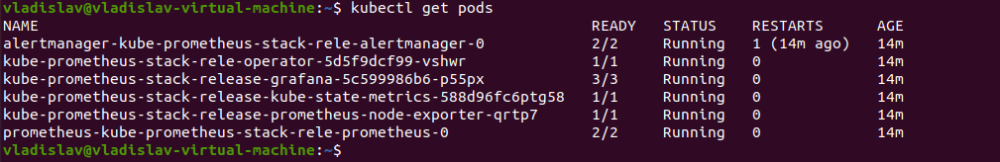

* Result of execution of the command `kubectl get svc`(get services):
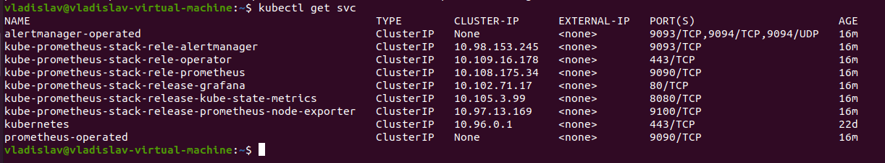

* Result of execution of the command `kubectl get sts`(get statefulsets):
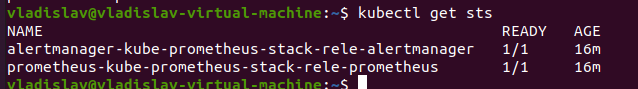

* Result of execution of the command `kubectl get pvc`(get persistent volume claims):
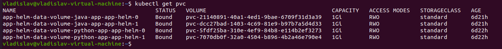

* Result of execution of the command `kubectl get cm`(get config maps):
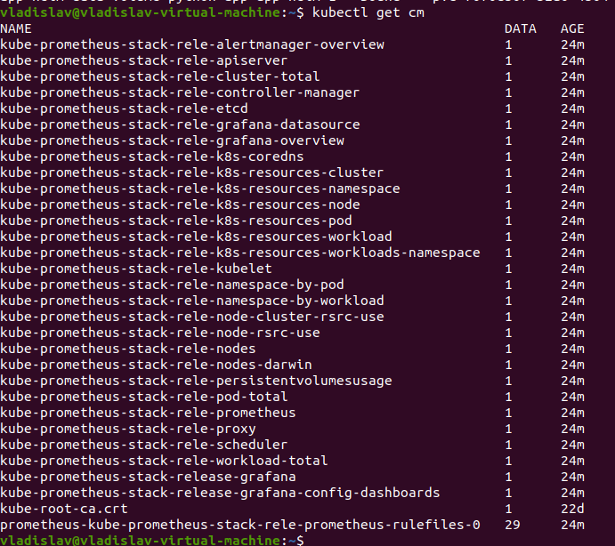

## Grafana dashboards (Task 4)

* Check how much CPU and Memory your StatefulSet is consuming

*There are some problems with my minikube version, as a result, there is no data.*

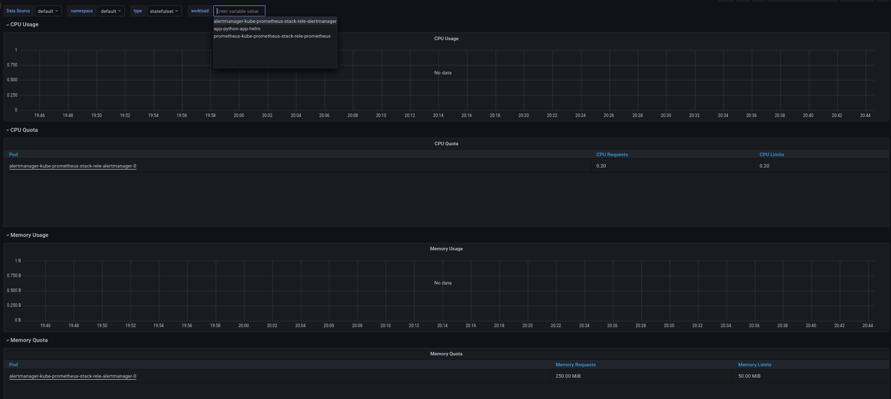

* Check which Pod is using CPU more than others and which is less in the default namespace

*There are some problems with my minikube version, as a result, there is no data. As a result, I cannot determine the pods from the task.*

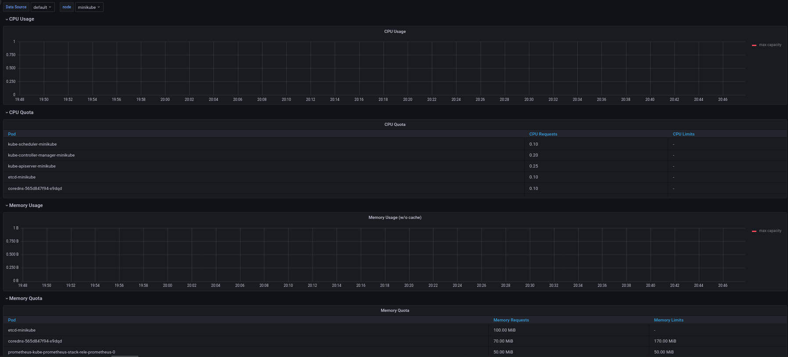

* Check how much memory is used on your node, in % and mb

Memory used total - 4.97 GB(83%).

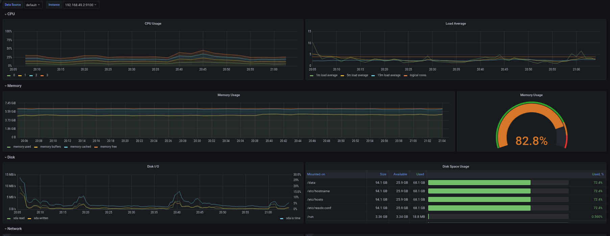

* Check how many pods and containers actually ran by the Kubelet service

Pods - 15.
Containers - 30.

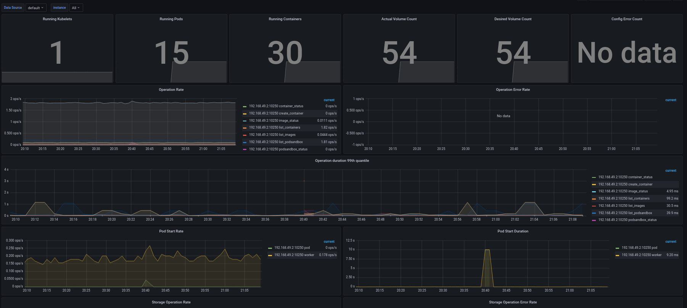

* Check which Pod is using network more than others and which is less in the default namespace

*There are some problems with my minikube version, as a result, there is no data. As a result, I cannot determine the pods from the task.*

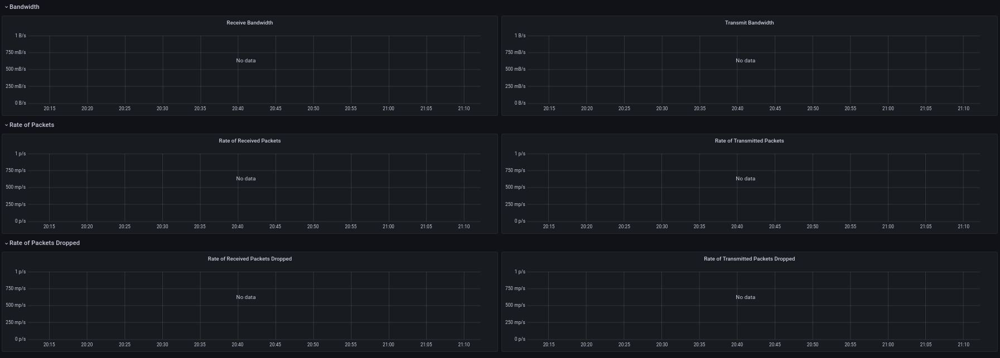

* Check how many alerts you have

I have 8 alerts in total.

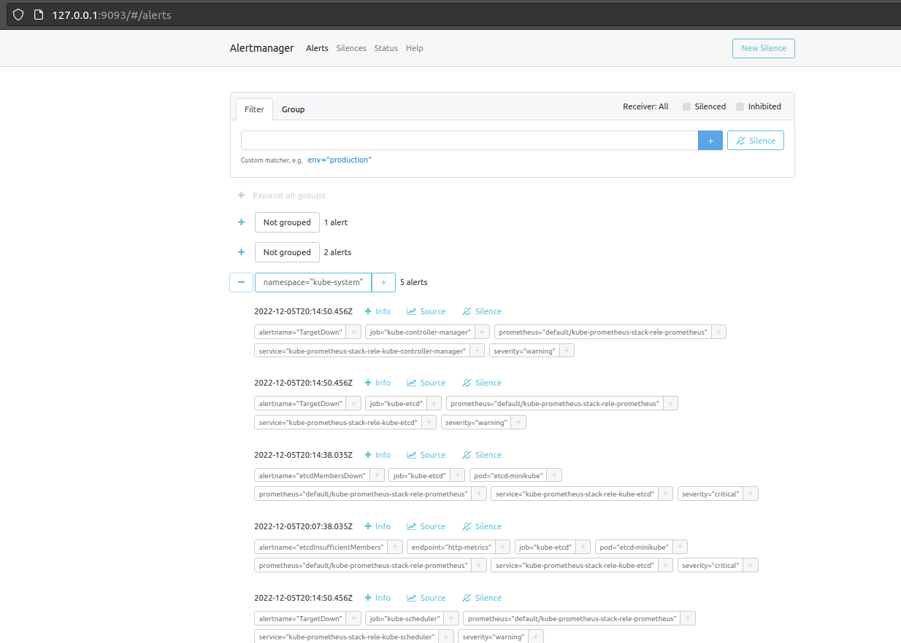

## Init containers

In my init container I download page from `http://info.cern.ch` and save it to the file `/work-dir/test.html`.

* Result of execution of the command `kubectl exec -it app-python-app-helm-0 -- cat /work-dir/test.html`:
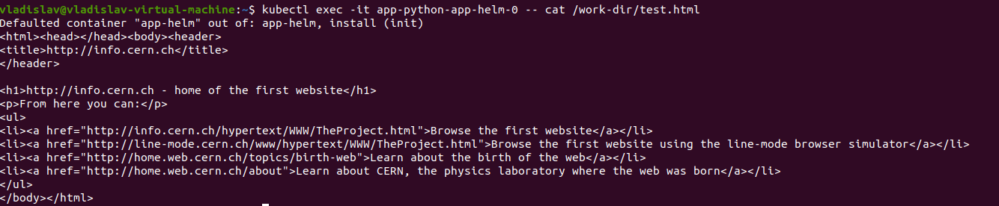

## Bonus task

### Getting metrics from Python app

I used Prometheus service monitor to get metrics from my app. The file is located in `/k8s/monitoring/prometheus_monitoring.yaml`.

I connected 2 instances of Python app(pods) to the Prometheus targets.

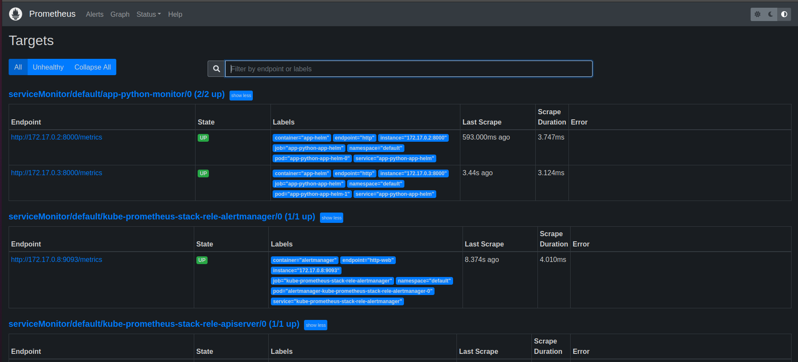

### Creating a queue of three Init containers

I created the queue consisting of 3 init containers where each container write 1 line to the file `/work-dir/file.txt`.

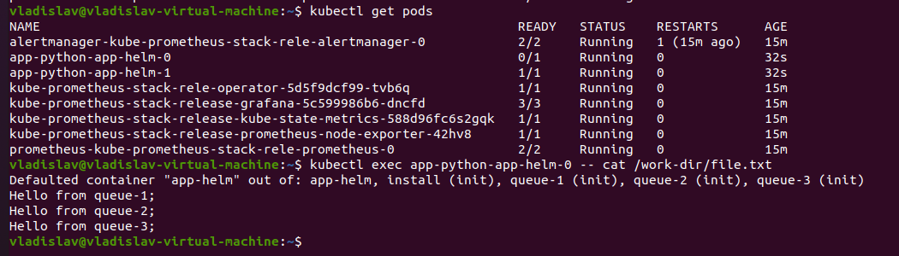

