# lab14

## all components of the stack

- **Prometheus** - Tool with set of various metrics. Monitoring service
- **Prometheus Operator** - add support of prometheus in k8s environment
- **Alertmanager** - alerts handling
- **Grafana** - painting the metrics(we had experience in one of previous labs)
- **Prometheus Adapter for Kubernetes Metrics** - gathher metrics from k8s and send to prometheus
- **Prometheus node-exporter** - gather OS and hardware metrics
- **kube-state-metrics** - gather metrics for deployments,pods and exposing it to prometheus

## kubectl get po,sts,svc,pvc,cm

Displays cluster-deployed pods, statefulsets, services, persistent volume claims and configmaps deployed.
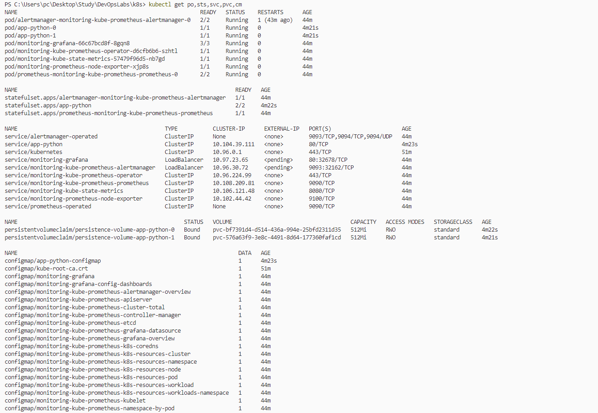

## Grafana

### Launhcing

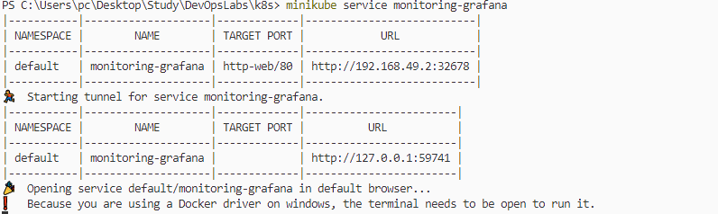
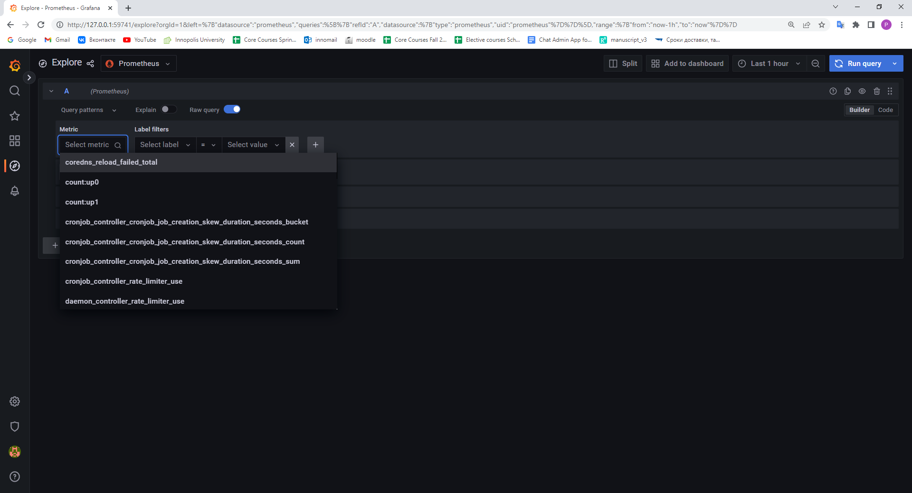

    1. Check how much CPU and Memory your StatefulSet is consuming.

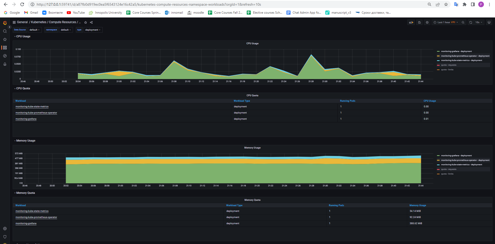
**grafana consumes most in terms of memory**

    2. Check which Pod is using CPU more than others and which is less in the default namespace.

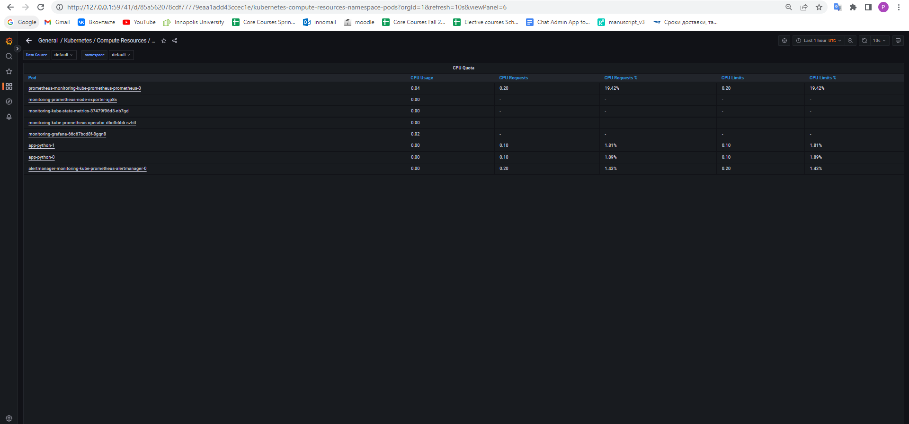
**prometheus uses the most, app-python uses less**

    3. Check how much memory is used on your node, in % and mb.

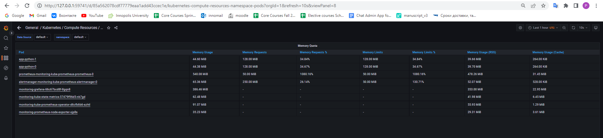
**both of nodes uses approximetly 34.8% of memory and 128 mib each**

    4. Check how many pods and containers actually ran by the Kubelet service.

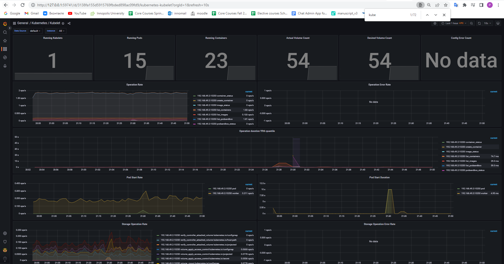
**15 pods and 54 containers**

    5. Check which Pod is using network more than others and which is less in the default namespace.

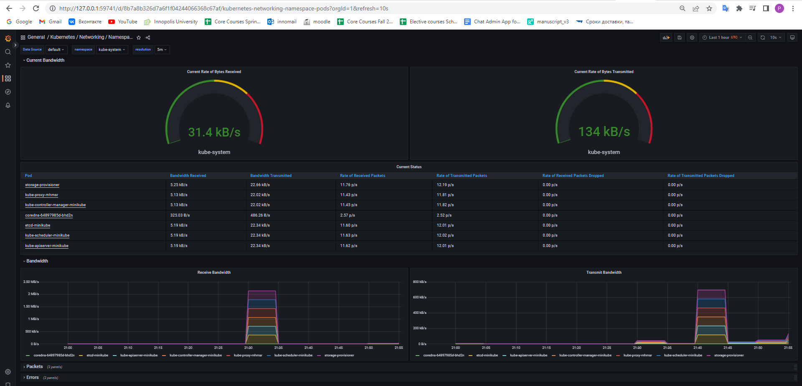
**coredns used most of bandwidth, others the same amount**
---

    6. Check how many alerts you have. Also you can see them in the Web UI by the `minikube service monitoring-kube-prometheus-alertmanager` command.

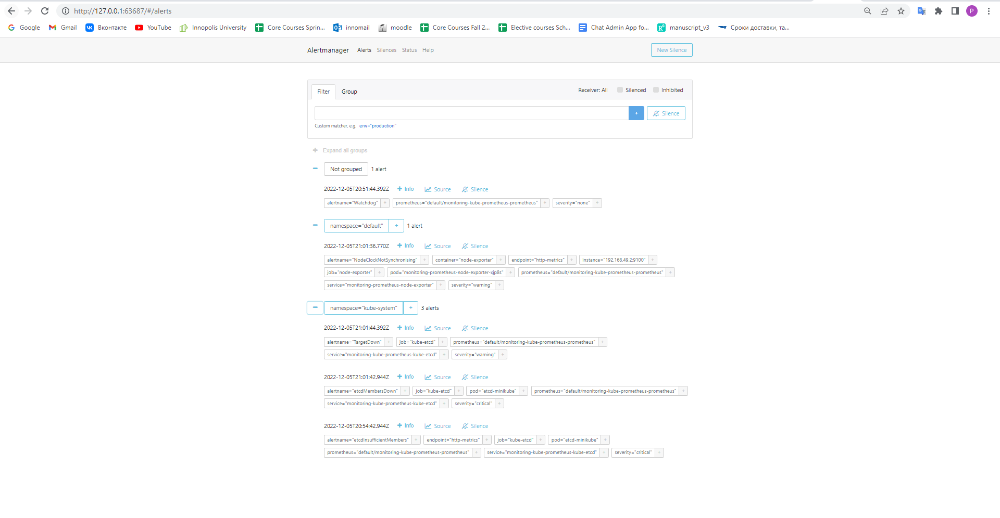
**5 alerts overall**
---

## Init container

### creating pod
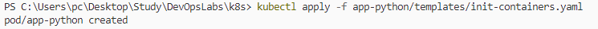

### proof
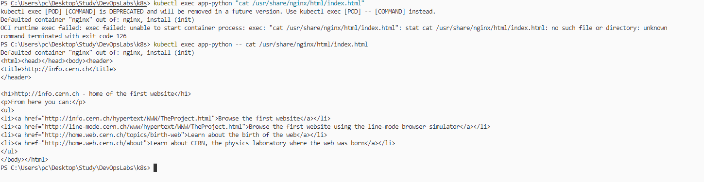
