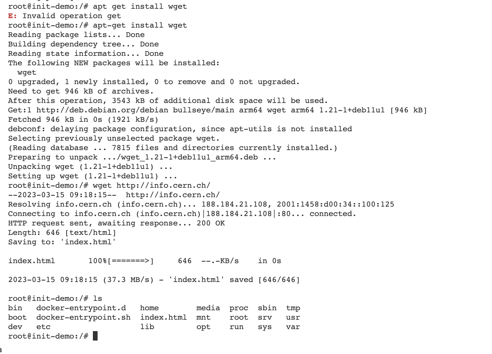
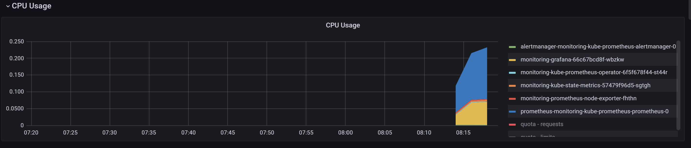
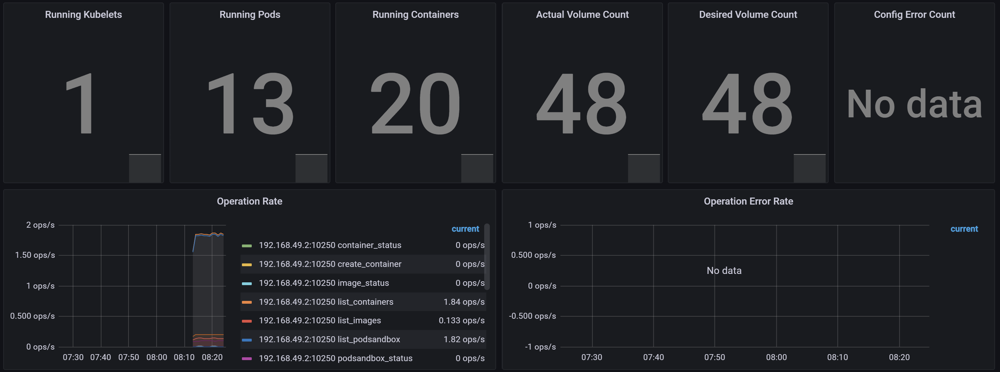
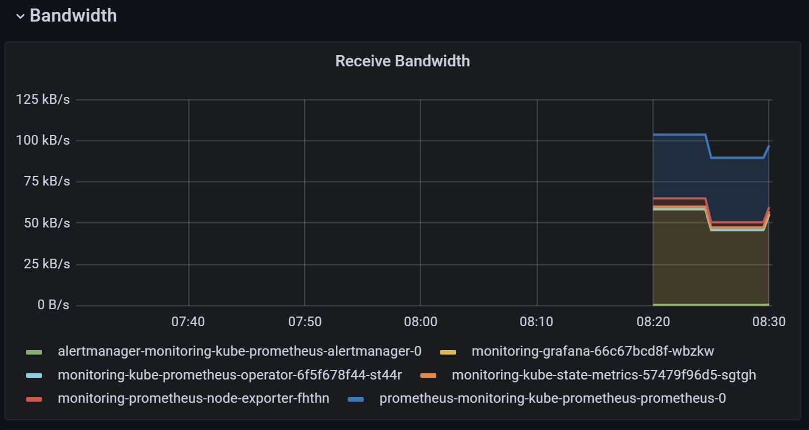
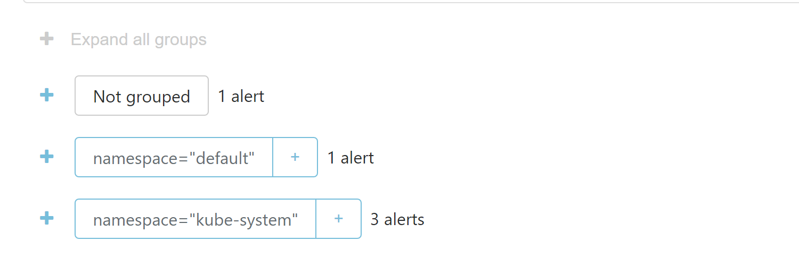

## Explanation

- Prometheus Operator - monitoring components for k8s
- Prometheus - monitoring system
- Alertmanager - alerts handler for applications such as the prometheus server
- Peometheus node exporter - prometheus exporter for hardware and OS metrics
- Prometheus Adapter for Kubernetes Metrics APIs - provides different metrics APIs for k8s
- Grafana - tool for analytics
- kube-state-metrics - k8s objects metrics generator

## Output

to avoid problems with the new version

```bash
minikube delete
minikube delete && minikube start --kubernetes-version=v1.23.0 --memory=6g --bootstrapper=kubeadm --extra-config=kubelet.authentication-token-webhook=true --extra-config=kubelet.authorization-mode=Webhook --extra-config=scheduler.bind-address=0.0.0.0 --extra-config=controller-manager.bind-address=0.0.0.0
```

```bash
$ helm repo add prometheus-community https://prometheus-community.github.io/helm-charts
$ helm repo update
$ helm install -f helm-monitoring/values.yaml monitoring prometheus-community/kube-prometheus-stack
NAME: monitoring
LAST DEPLOYED: Tue Dec  6 11:04:53 2022
NAMESPACE: default
STATUS: deployed
REVISION: 1
NOTES:
kube-prometheus-stack has been installed. Check its status by running:
  kubectl --namespace default get pods -l "release=monitoring"

Visit https://github.com/prometheus-operator/kube-prometheus for instructions on how to create & configure Alertmanager and Prometheus instances using the Operator.
```

The next command shows all pods, statefulsets, services, persistentvolumeclaims, and configmaps

```bash
$ kubectl get po,sts,svc,pvc,cm ()
NAME                                                         READY   STATUS              RESTARTS   AGE
pod/alertmanager-monitoring-kube-prometheus-alertmanager-0   0/2     ContainerCreating   0          8s
pod/monitoring-grafana-66c67bcd8f-wbzkw                      0/3     ContainerCreating   0          52s
pod/monitoring-kube-prometheus-operator-6f5f678f44-st44r     1/1     Running             0          52s
pod/monitoring-kube-state-metrics-57479f96d5-sgtgh           0/1     ContainerCreating   0          52s
pod/monitoring-prometheus-node-exporter-fhthn                1/1     Running             0          52s
pod/prometheus-monitoring-kube-prometheus-prometheus-0       0/2     Init:0/1            0          6s

NAME                                                                    READY   AGE
statefulset.apps/alertmanager-monitoring-kube-prometheus-alertmanager   0/1     8s
statefulset.apps/prometheus-monitoring-kube-prometheus-prometheus       0/1     6s

NAME                                              TYPE           CLUSTER-IP      EXTERNAL-IP   PORT(S)                   
   AGE
service/alertmanager-operated                     ClusterIP      None            <none>        9093/TCP,9094/TCP,9094/UDP   8s
service/kubernetes                                ClusterIP      10.96.0.1       <none>        443/TCP                   
   2m6s
service/monitoring-grafana                        LoadBalancer   10.111.82.68    <pending>     80:32057/TCP              
   53s
service/monitoring-kube-prometheus-alertmanager   LoadBalancer   10.111.70.87    <pending>     9093:30882/TCP            
   53s
service/monitoring-kube-prometheus-operator       ClusterIP      10.101.83.234   <none>        443/TCP                   
   53s
service/monitoring-kube-prometheus-prometheus     ClusterIP      10.111.23.30    <none>        9090/TCP                  
   53s
service/monitoring-kube-state-metrics             ClusterIP      10.102.60.25    <none>        8080/TCP                  
   53s
service/monitoring-prometheus-node-exporter       ClusterIP      10.101.220.54   <none>        9100/TCP                  
   53s
service/prometheus-operated                       ClusterIP      None            <none>        9090/TCP                  
   6s

NAME                                                                     DATA   AGE
configmap/kube-root-ca.crt                                               1      112s
configmap/monitoring-grafana                                             1      54s
configmap/monitoring-grafana-config-dashboards                           1      54s
configmap/monitoring-kube-prometheus-alertmanager-overview               1      53s
configmap/monitoring-kube-prometheus-apiserver                           1      54s
configmap/monitoring-kube-prometheus-cluster-total                       1      53s
configmap/monitoring-kube-prometheus-controller-manager                  1      53s
configmap/monitoring-kube-prometheus-etcd                                1      53s
configmap/monitoring-kube-prometheus-grafana-datasource                  1      53s
configmap/monitoring-kube-prometheus-grafana-overview                    1      53s
configmap/monitoring-kube-prometheus-k8s-coredns                         1      53s
configmap/monitoring-kube-prometheus-k8s-resources-cluster               1      53s
configmap/monitoring-kube-prometheus-k8s-resources-namespace             1      53s
configmap/monitoring-kube-prometheus-k8s-resources-node                  1      53s
configmap/monitoring-kube-prometheus-k8s-resources-pod                   1      53s
configmap/monitoring-kube-prometheus-k8s-resources-workload              1      53s
configmap/monitoring-kube-prometheus-k8s-resources-workloads-namespace   1      53s
configmap/monitoring-kube-prometheus-kubelet                             1      53s
configmap/monitoring-kube-prometheus-namespace-by-pod                    1      53s
configmap/monitoring-kube-prometheus-namespace-by-workload               1      53s
configmap/monitoring-kube-prometheus-node-cluster-rsrc-use               1      53s
configmap/monitoring-kube-prometheus-node-rsrc-use                       1      53s
configmap/monitoring-kube-prometheus-nodes                               1      53s
configmap/monitoring-kube-prometheus-nodes-darwin                        1      53s
configmap/monitoring-kube-prometheus-persistentvolumesusage              1      53s
configmap/monitoring-kube-prometheus-pod-total                           1      53s
configmap/monitoring-kube-prometheus-prometheus                          1      53s
configmap/monitoring-kube-prometheus-proxy                               1      53s
configmap/monitoring-kube-prometheus-scheduler                           1      53s
configmap/monitoring-kube-prometheus-workload-total                      1      54s
configmap/prometheus-monitoring-kube-prometheus-prometheus-rulefiles-0   29     7s
```

## Access Grafana

```bash
minikube service monitoring-grafana
```

- Check how much CPU and Memory your StatefulSet is consuming

- Check which Pod is using CPU more than others and which is less in the default namespace.

Grafana and Prometheus use more CPU
- Check how much memory is used on your node, in % and mb.
- Check how many pods and containers actually ran by the Kubelet service.

13 pods and 20 containers
- Check which Pod is using network more than others and which is less in the default namespace.

monitoring-grafana-66c67bcd8f-wbzkw using the most and monitoring-kube-prometheus-operator-6f5f678f44-st44r using the least
- Check how many alerts you have

- I have 5

## init container

```bash
$ kubectl apply -f k8s/app-python/templates/init-containers.yaml
pod/init-time-app created

$ kubectl exec init-time-app -- cat /usr/share/nginx/html/index.html
Defaulted container "nginx" out of: nginx, install (init)
<html><head></head><body><header>
<title>http://info.cern.ch</title>
</header>

<h1>http://info.cern.ch — home of the first website</h1>
<p>From here you can:</p>
<ul>
<li><a href="http://info.cern.ch/hypertext/WWW/TheProject.html">Browse the first website</a></li>
<li><a href="http://line-mode.cern.ch/www/hypertext/WWW/TheProject.html">Browse the first website using the line-mode browser simulator</a></li>
<li><a href="http://home.web.cern.ch/topics/birth-web">Learn about the birth of the web</a></li>
<li><a href="http://home.web.cern.ch/about">Learn about CERN, the physics laboratory where the web was born</a></li>
</ul>
</body></html>
```
