# k8s prometheus stack

## components
- prometheus operator is simply a plugin for kubernetes that allows us to deploy prometheus stack and manage it
- prometheus is a monitoring system and time series database
- alertmanager is a component that allows us to send alerts to different destinations, e.g. slack, email, pagerduty
- node exporter is a component that allows us to monitor kubernetes nodes
- adapter for metrics api is a component that allows us to use prometheus metrics in kubernetes hpa
- kube-state-metrics is a component that allows us to monitor kubernetes objects
- grafana is a component that allows us to visualize metrics

## installing 
```plain
$ helm repo add prometheus-community https://prometheus-community.github.io/helm-charts  

"prometheus-community" has been added to your repositories

$ helm repo update
Hang tight while we grab the latest from your chart repositories...
...Successfully got an update from the "prometheus-community" chart repository
Update Complete. ⎈Happy Helming!⎈

$ helm install --debug --timeout=30m kube-prometheus-stack prometheus-community/kube-prometheus-stack
$ # output ommited, had some problems with installing which lead me to use --debug and increase timeout for the job

$ kubectl get po,sts,svc,pvc,cm 
NAME                                                            READY   STATUS            RESTARTS      AGE
pod/alertmanager-kube-prometheus-stack-alertmanager-0           2/2     Running           1 (15s ago)   38s
pod/kps-kube-prometheus-stack-admission-create-6qd5f            0/1     Completed         4             4m54s
pod/kube-prometheus-stack-grafana-7ff548888b-qgsjw              3/3     Running           0             67s
pod/kube-prometheus-stack-kube-state-metrics-75b97d7857-c8jp2   1/1     Running           0             67s
pod/kube-prometheus-stack-operator-6f846c94d6-rmwnm             1/1     Running           0             67s
pod/kube-prometheus-stack-prometheus-node-exporter-w82wb        1/1     Running           0             67s
pod/prometheus-kube-prometheus-stack-prometheus-0               0/2     PodInitializing   0             37s

NAME                                                               READY   AGE
statefulset.apps/alertmanager-kube-prometheus-stack-alertmanager   1/1     38s
statefulset.apps/app-python-1                                      0/2     11h
statefulset.apps/prometheus-kube-prometheus-stack-prometheus       0/1     37s

NAME                                                     TYPE        CLUSTER-IP       EXTERNAL-IP   PORT(S)                      AGE
service/alertmanager-operated                            ClusterIP   None             <none>        9093/TCP,9094/TCP,9094/UDP   38s
service/kube-prometheus-stack-alertmanager               ClusterIP   10.100.196.20    <none>        9093/TCP                     67s
service/kube-prometheus-stack-grafana                    ClusterIP   10.97.162.119    <none>        80/TCP                       67s
service/kube-prometheus-stack-kube-state-metrics         ClusterIP   10.100.173.114   <none>        8080/TCP                     67s
service/kube-prometheus-stack-operator                   ClusterIP   10.103.20.106    <none>        443/TCP                      67s
service/kube-prometheus-stack-prometheus                 ClusterIP   10.108.62.192    <none>        9090/TCP                     67s
service/kube-prometheus-stack-prometheus-node-exporter   ClusterIP   10.108.102.216   <none>        9100/TCP                     67s
service/kubernetes                                       ClusterIP   10.96.0.1        <none>        443/TCP                      218d
service/prometheus-operated                              ClusterIP   None             <none>        9090/TCP                     37s

NAME                                                                DATA   AGE
configmap/helm-app-config                                           1      11h
configmap/kube-prometheus-stack-alertmanager-overview               1      67s
configmap/kube-prometheus-stack-apiserver                           1      67s
configmap/kube-prometheus-stack-cluster-total                       1      67s
configmap/kube-prometheus-stack-controller-manager                  1      67s
configmap/kube-prometheus-stack-etcd                                1      67s
configmap/kube-prometheus-stack-grafana                             1      67s
configmap/kube-prometheus-stack-grafana-config-dashboards           1      67s
configmap/kube-prometheus-stack-grafana-datasource                  1      67s
configmap/kube-prometheus-stack-grafana-overview                    1      67s
configmap/kube-prometheus-stack-k8s-coredns                         1      67s
configmap/kube-prometheus-stack-k8s-resources-cluster               1      67s
configmap/kube-prometheus-stack-k8s-resources-namespace             1      67s
configmap/kube-prometheus-stack-k8s-resources-node                  1      67s
configmap/kube-prometheus-stack-k8s-resources-pod                   1      67s
configmap/kube-prometheus-stack-k8s-resources-workload              1      67s
configmap/kube-prometheus-stack-k8s-resources-workloads-namespace   1      67s
configmap/kube-prometheus-stack-kubelet                             1      67s
configmap/kube-prometheus-stack-namespace-by-pod                    1      67s
configmap/kube-prometheus-stack-namespace-by-workload               1      67s
configmap/kube-prometheus-stack-node-cluster-rsrc-use               1      67s
configmap/kube-prometheus-stack-node-rsrc-use                       1      67s
configmap/kube-prometheus-stack-nodes                               1      67s
configmap/kube-prometheus-stack-nodes-darwin                        1      67s
configmap/kube-prometheus-stack-persistentvolumesusage              1      67s
configmap/kube-prometheus-stack-pod-total                           1      67s
configmap/kube-prometheus-stack-prometheus                          1      67s
configmap/kube-prometheus-stack-proxy                               1      67s
configmap/kube-prometheus-stack-scheduler                           1      67s
configmap/kube-prometheus-stack-workload-total                      1      67s
configmap/kube-root-ca.crt                                          1      218d
configmap/prometheus-kube-prometheus-stack-prometheus-rulefiles-0   29     38s
```

*kubectl get* returns the specified class of kubernetes objects, in the variation above we used aliases for kuber objects:
- po = pods
- sts = statefulset
- svc = service
- pvc = persistentvolumeclaim
- cm = configmap

- How much CPU and memory does StatefulSet consume
no data - quotas present
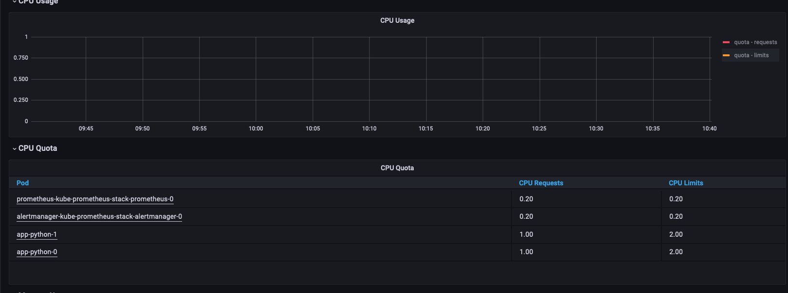
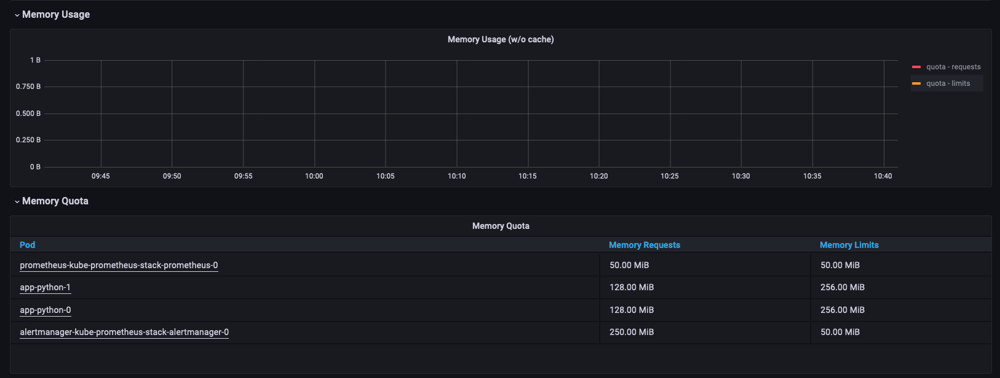

-  Which Pod is using CPU more than others and which is less in the default namespace.
No data, even if we fall down to individual pods. Only quotas - limits and requests, defined in manifests are present
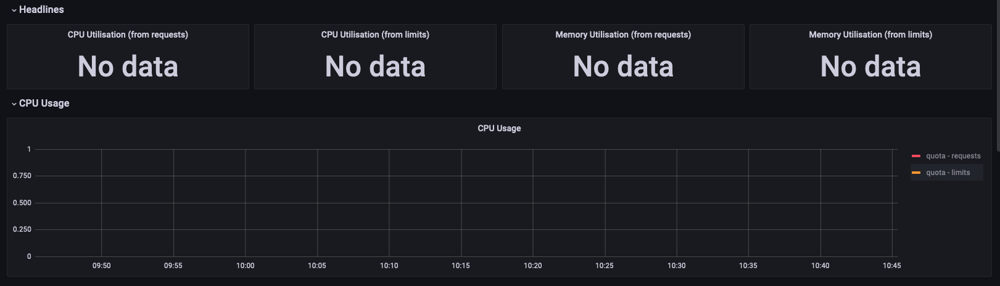
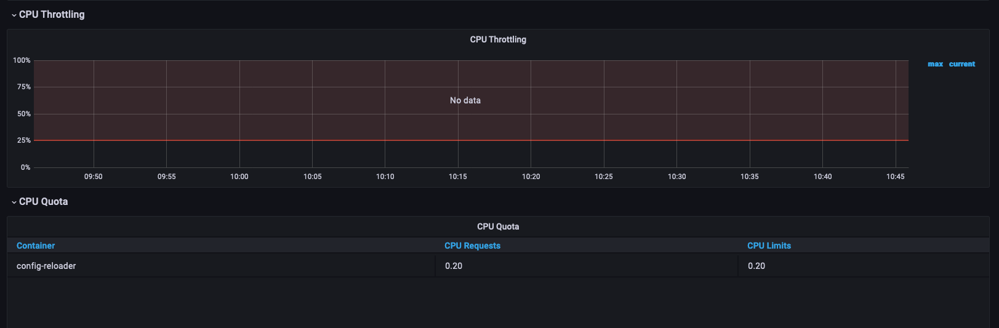

- How much memory is used on your node, in % and mb.
No data - quotas present
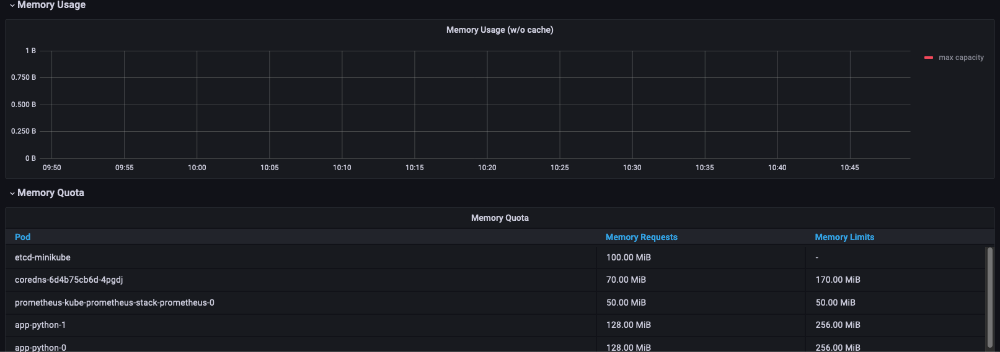

- How many pods and containers actually ran by the Kubelet service.
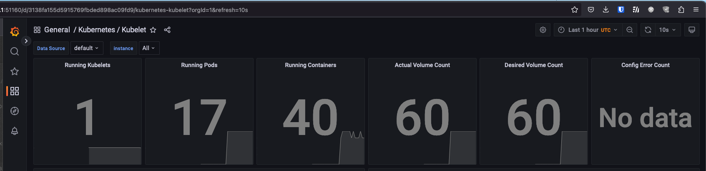

- Which Pod is using network more than others and which is less in the default namespace.
No data by the moment (as we're not making any traffic)
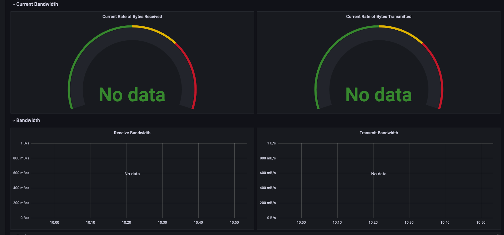

- How many alerts do you have
10 alerts by the moment
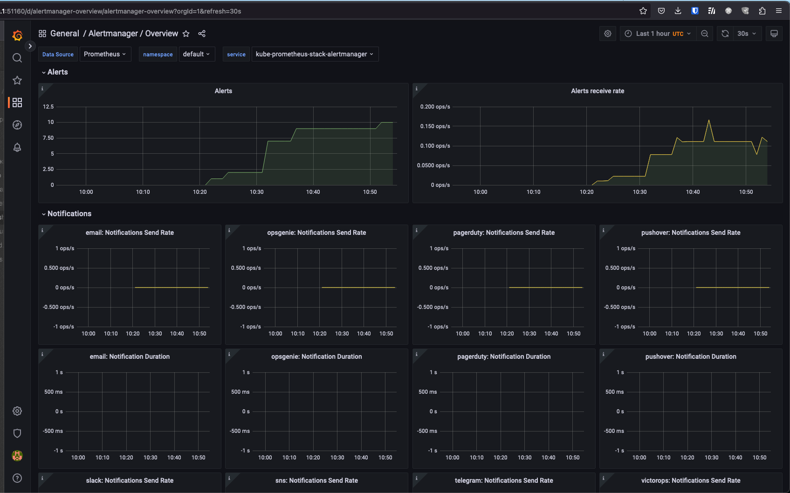

## Init containers
In Init Container I have downloaded page from <http://info.cern.ch> to */workdir/test.html*.
The result is the following:
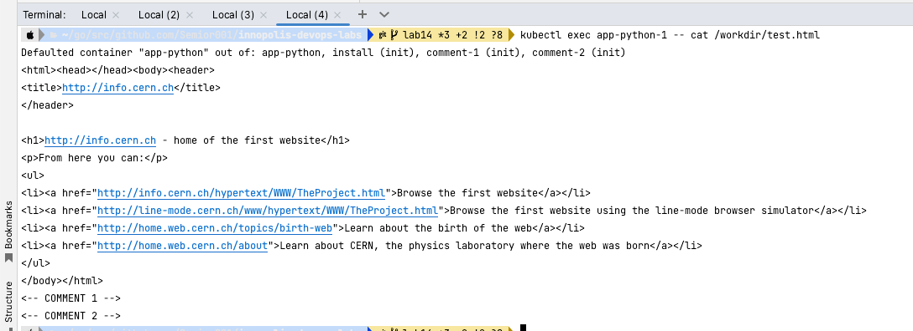

## Metrics from app
I have added additional service monitor to scrape metrics from the app.
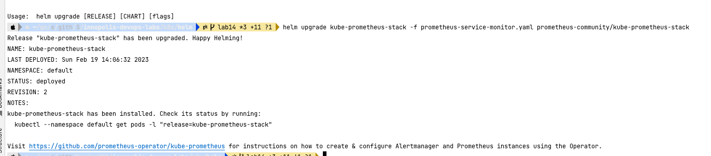
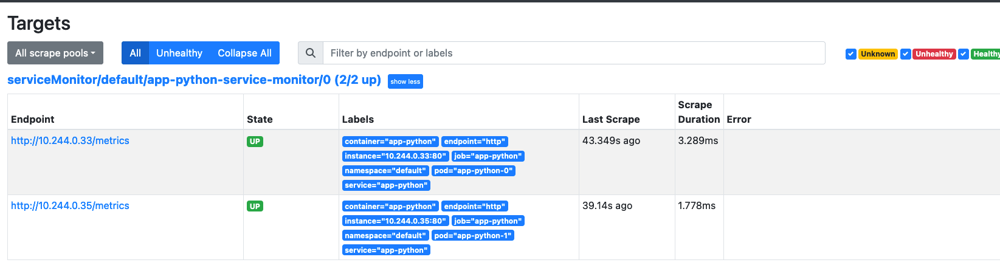

## Three Init Containers

I have added three init containers:

1. First container downloads page from <http://info.cern.ch>
2. Second container append to the resulting html file comment "COMMENT 1"
3. Third container append to the resulting html file comment "COMMENT 2"
