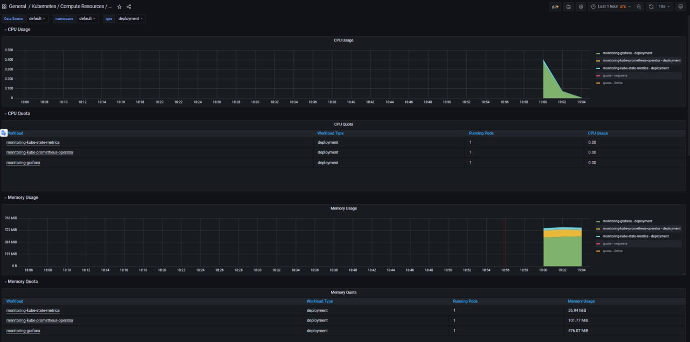
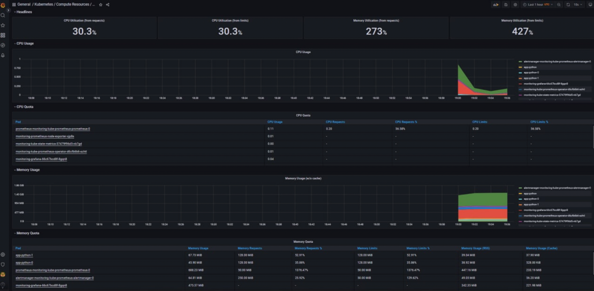
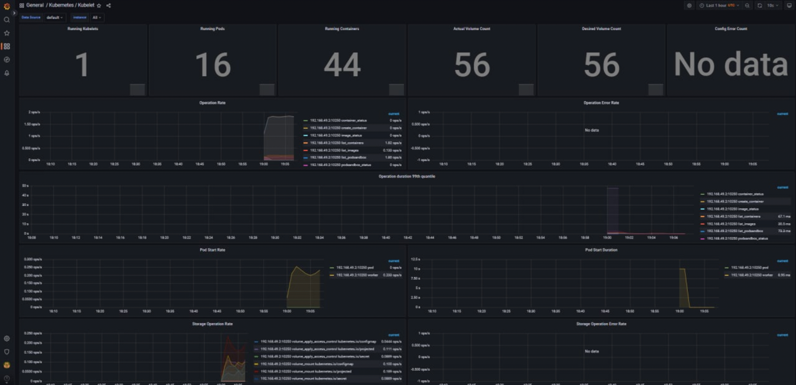
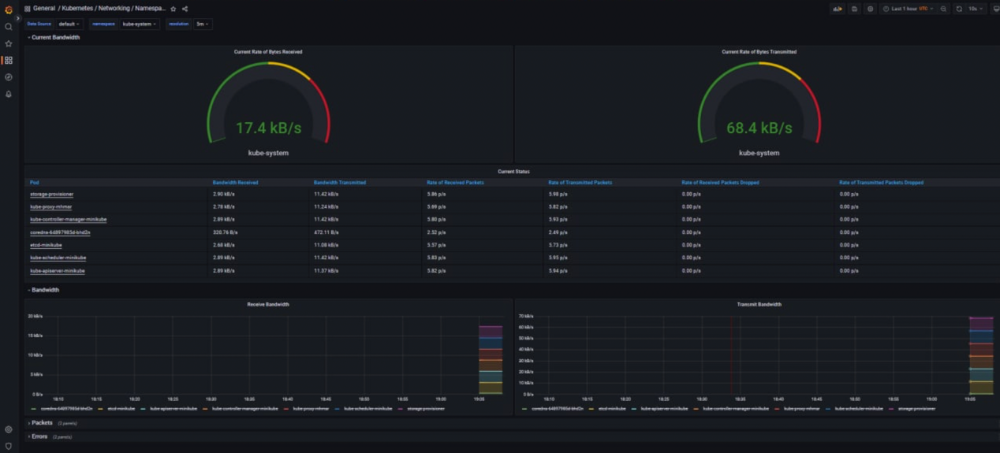
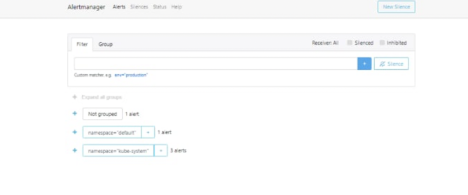

# 14
## Kubernetes Prometheus stack
- The Prometheus Operator - tool for prometheus management 
- Highly available Prometheus - system monitoring tool
- Highly available Alertmanager - catches, groups and manages application alerts
- Prometheus node-exporter - collects k8s nodes metrics
- Prometheus Adapter for Kubernetes Metrics APIs - provide api for gettin OS metrics in k8s (CPU usage, memory usage, etc.)
- kube-state-metrics - listens to the k8s server and create metrics about objects states
- Grafana - tool for data visualization and monitoring

## Report
0) Result of `kubectl get po,sts,svc,pvc,cm`
    ```bash
    $ kubectl get po,sts,svc,pvc,cm
    NAME                                                         READY   STATUS    RESTARTS       AGE
    pod/alertmanager-monitoring-kube-prometheus-alertmanager-0   2/2     Running   1 (30m ago)    30m
    pod/init-demo                                                1/1     Running   0              2m59s
    pod/monitoring-grafana-59864987bd-pdzf5                      3/3     Running   0              30m
    pod/monitoring-kube-prometheus-operator-d6cfb6b6-mpmgq       1/1     Running   0              30m
    pod/monitoring-kube-state-metrics-57479f96d5-5745n           1/1     Running   0              30m
    pod/monitoring-prometheus-node-exporter-72688                1/1     Running   0              30m
    pod/app-python-0                                             1/1     Running   0              30m
    pod/app-python-1                                             1/1     Running   0              29m
    pod/prometheus-monitoring-kube-prometheus-prometheus-0       2/2     Running   0              30m

    NAME                                                                    READY   AGE
    statefulset.apps/alertmanager-monitoring-kube-prometheus-alertmanager   1/1     30m
    statefulset.apps/app-python                                             2/2     30m
    statefulset.apps/prometheus-monitoring-kube-prometheus-prometheus       1/1     30m

    NAME                                              TYPE           CLUSTER-IP       EXTERNAL-IP   PORT(S)                      AGE
    service/alertmanager-operated                     ClusterIP      None             <none>        9093/TCP,9094/TCP,9094/UDP   30m
    service/kubernetes                                ClusterIP      10.96.0.1        <none>        443/TCP                      32m
    service/monitoring-grafana                        LoadBalancer   10.111.163.77    <pending>     80:30112/TCP                 30m
    service/monitoring-kube-prometheus-alertmanager   LoadBalancer   10.109.7.43      <pending>     9093:32127/TCP               30m
    service/monitoring-kube-prometheus-operator       ClusterIP      10.100.129.169   <none>        443/TCP                      30m
    service/monitoring-kube-prometheus-prometheus     ClusterIP      10.103.243.8     <none>        9090/TCP                     30m
    service/monitoring-kube-state-metrics             ClusterIP      10.96.225.184    <none>        8080/TCP                     30m
    service/monitoring-prometheus-node-exporter       ClusterIP      10.107.229.53    <none>        9100/TCP                     30m
    service/app-python                                ClusterIP      10.111.77.97     <none>        5000/TCP                     30m
    service/prometheus-operated                       ClusterIP      None             <none>        9090/TCP                     30m

    NAME                                                           STATUS   VOLUME                                     CAPACITY   ACCESS MODES   STORAGECLASS   AGE
    persistentvolumeclaim/app-python-state-volume-app-python-0     Bound    pvc-75d1ed0f-1273-4112-a418-55fe6061b0e8   512Mi      RWO            standard       30m
    persistentvolumeclaim/app-python-state-volume-app-python-1     Bound    pvc-5b567890-9bca-429e-908b-7dd65e0865fb   512Mi      RWO            standard       30m

    NAME                                                                     DATA   AGE
    configmap/kube-root-ca.crt                                               1      42m
    configmap/monitoring-grafana                                             1      30m
    configmap/monitoring-grafana-config-dashboards                           1      30m
    configmap/monitoring-kube-prometheus-alertmanager-overview               1      30m
    configmap/monitoring-kube-prometheus-apiserver                           1      30m
    configmap/monitoring-kube-prometheus-cluster-total                       1      30m
    configmap/monitoring-kube-prometheus-controller-manager                  1      30m
    configmap/monitoring-kube-prometheus-etcd                                1      30m
    configmap/monitoring-kube-prometheus-grafana-datasource                  1      30m
    configmap/monitoring-kube-prometheus-grafana-overview                    1      30m
    configmap/monitoring-kube-prometheus-k8s-coredns                         1      30m
    configmap/monitoring-kube-prometheus-k8s-resources-cluster               1      30m
    configmap/monitoring-kube-prometheus-k8s-resources-namespace             1      30m
    configmap/monitoring-kube-prometheus-k8s-resources-node                  1      30m
    configmap/monitoring-kube-prometheus-k8s-resources-pod                   1      30m
    configmap/monitoring-kube-prometheus-k8s-resources-workload              1      30m
    configmap/monitoring-kube-prometheus-k8s-resources-workloads-namespace   1      30m
    configmap/monitoring-kube-prometheus-kubelet                             1      30m
    configmap/monitoring-kube-prometheus-namespace-by-pod                    1      30m
    configmap/monitoring-kube-prometheus-namespace-by-workload               1      30m
    configmap/monitoring-kube-prometheus-node-cluster-rsrc-use               1      30m
    configmap/monitoring-kube-prometheus-node-rsrc-use                       1      30m
    configmap/monitoring-kube-prometheus-nodes                               1      30m
    configmap/monitoring-kube-prometheus-nodes-darwin                        1      30m
    configmap/monitoring-kube-prometheus-persistentvolumesusage              1      30m
    configmap/monitoring-kube-prometheus-pod-total                           1      30m
    configmap/monitoring-kube-prometheus-prometheus                          1      30m
    configmap/monitoring-kube-prometheus-proxy                               1      30m
    configmap/monitoring-kube-prometheus-scheduler                           1      30m
    configmap/monitoring-kube-prometheus-workload-total                      1      30m
    configmap/app-python-config                                              1      30m
    configmap/prometheus-monitoring-kube-prometheus-prometheus-rulefiles-0   29     30m

    ```
1) Statefulset Consumption

2) Pods CPU and Memory \


3) Node Memory \
both of nodes uses approximately 50% of memory and 128 mib each


4) Kubelet \
16 pods and 56 containers


5) Network \
The most consumpting pod is prometheus pod, the less consumpting - alertmanager

6) Alerts \
5 alerts



## Init container
- Created deployment.yaml
- Applyed changes
    ```
    $ kubectl apply -f init_containers.yaml
    pod/app-python created

    ```
- Result of container creation
    ```
    $ kubectl exec -it app-python -- cat ./usr/share/nginx/html/index.html
    Defaulted container "nginx" out of: nginx, install (init)
    Unable to use a TTY - input is not a terminal or the right kind of file
    <html><head></head><body><header>
    <title>http://info.cern.ch</title>
    </header>

    <h1>http://info.cern.ch - home of the first website</h1>
    <p>From here you can:</p>
    <ul>
    <li><a href="http://info.cern.ch/hypertext/WWW/TheProject.html">Browse the first website</a></li>
    <li><a href="http://line-mode.cern.ch/www/hypertext/WWW/TheProject.html">Browse the first website using the line-mode browser simulator</a></li>
    <li><a href="http://home.web.cern.ch/topics/birth-web">Learn about the birth of the web</a></li>
    <li><a href="http://home.web.cern.ch/about">Learn about CERN, the physics laboratory where the web was born</a></li>
    </ul>
    </body></html>
    ```