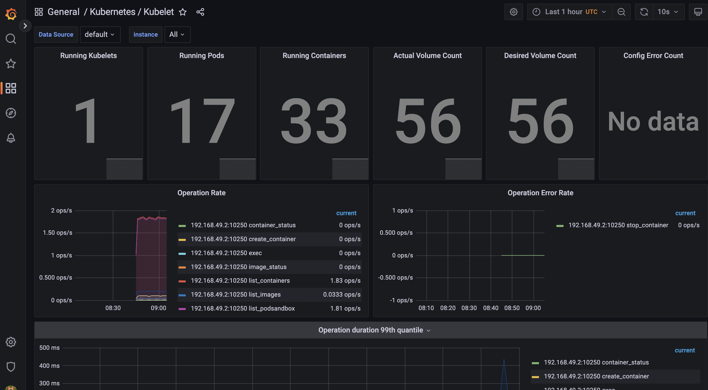

# Lab 14

- Follow the [guide](https://github.com/prometheus-community/helm-charts/tree/main/charts/kube-prometheus-stack#install-helm-chart)
- Use `minikube service promkube-grafana`
- To get password run `helm show values prometheus-community/kube-prometheus-stack | grep  adminPassword`

## Outputs

```
➜  k8s git:(lab13) ✗ kubectl get po,sts,svc,pvc,cm
NAME                                                         READY   STATUS    RESTARTS      AGE
pod/alertmanager-promkube-kube-prometheus-s-alertmanager-0   2/2     Running   1 (86s ago)   118s
pod/helm-app-0                                               1/1     Running   0             20m
pod/helm-app-1                                               1/1     Running   0             20m
pod/prometheus-promkube-kube-prometheus-s-prometheus-0       2/2     Running   0             118s
pod/promkube-grafana-94775c9d4-qdslx                         3/3     Running   0             3m9s
pod/promkube-kube-prometheus-s-operator-678bc8d66c-92mg4     1/1     Running   0             3m9s
pod/promkube-kube-state-metrics-cf7cd7cfc-jwg6n              1/1     Running   0             3m9s
pod/promkube-prometheus-node-exporter-phfjv                  1/1     Running   0             3m9s

NAME                                                                    READY   AGE
statefulset.apps/alertmanager-promkube-kube-prometheus-s-alertmanager   1/1     118s
statefulset.apps/helm-app                                               2/2     20m
statefulset.apps/prometheus-promkube-kube-prometheus-s-prometheus       1/1     118s

NAME                                              TYPE        CLUSTER-IP       EXTERNAL-IP   PORT(S)                      AGE
service/alertmanager-operated                     ClusterIP   None             <none>        9093/TCP,9094/TCP,9094/UDP   118s
service/helm-app                                  ClusterIP   10.102.157.142   <none>        80/TCP                       20m
service/kubernetes                                ClusterIP   10.96.0.1        <none>        443/TCP                      20h
service/prometheus-operated                       ClusterIP   None             <none>        9090/TCP                     118s
service/promkube-grafana                          ClusterIP   10.106.77.255    <none>        80/TCP                       3m10s
service/promkube-kube-prometheus-s-alertmanager   ClusterIP   10.110.90.189    <none>        9093/TCP                     3m10s
service/promkube-kube-prometheus-s-operator       ClusterIP   10.105.12.184    <none>        443/TCP                      3m10s
service/promkube-kube-prometheus-s-prometheus     ClusterIP   10.109.85.91     <none>        9090/TCP                     3m10s
service/promkube-kube-state-metrics               ClusterIP   10.109.232.22    <none>        8080/TCP                     3m10s
service/promkube-prometheus-node-exporter         ClusterIP   10.108.237.233   <none>        9100/TCP                     3m10s

NAME                                                               STATUS   VOLUME                                     CAPACITY   ACCESS MODES   STORAGECLASS   AGE
persistentvolumeclaim/persistent-volumemount-helm-app-0            Bound    pvc-0ddbf439-0066-4bfb-91fd-c84257184324   128Mi      RWO            standard       29m
persistentvolumeclaim/persistent-volumemount-helm-app-1            Bound    pvc-11ce3cd2-b771-4e0f-a89b-3db62fc2d480   128Mi      RWO            standard       29m
persistentvolumeclaim/persistent-volumemount-stateful-helm-app-0   Bound    pvc-33408926-c5b9-4b04-9828-326128115516   128Mi      RWO            standard       25m
persistentvolumeclaim/persistent-volumemount-stateful-helm-app-1   Bound    pvc-b234b197-ee60-438b-a244-09cb2e6e5b7c   128Mi      RWO            standard       25m

NAME                                                                     DATA   AGE
configmap/devops-map                                                     1      20m
configmap/kube-root-ca.crt                                               1      20h
configmap/prometheus-promkube-kube-prometheus-s-prometheus-rulefiles-0   29     118s
configmap/promkube-grafana                                               1      3m10s
configmap/promkube-grafana-config-dashboards                             1      3m10s
configmap/promkube-kube-prometheus-s-alertmanager-overview               1      3m10s
configmap/promkube-kube-prometheus-s-apiserver                           1      3m10s
configmap/promkube-kube-prometheus-s-cluster-total                       1      3m10s
configmap/promkube-kube-prometheus-s-controller-manager                  1      3m10s
configmap/promkube-kube-prometheus-s-etcd                                1      3m10s
configmap/promkube-kube-prometheus-s-grafana-datasource                  1      3m10s
configmap/promkube-kube-prometheus-s-grafana-overview                    1      3m10s
configmap/promkube-kube-prometheus-s-k8s-coredns                         1      3m10s
configmap/promkube-kube-prometheus-s-k8s-resources-cluster               1      3m10s
configmap/promkube-kube-prometheus-s-k8s-resources-namespace             1      3m10s
configmap/promkube-kube-prometheus-s-k8s-resources-node                  1      3m10s
configmap/promkube-kube-prometheus-s-k8s-resources-pod                   1      3m10s
configmap/promkube-kube-prometheus-s-k8s-resources-workload              1      3m10s
configmap/promkube-kube-prometheus-s-k8s-resources-workloads-namespace   1      3m10s
configmap/promkube-kube-prometheus-s-kubelet                             1      3m10s
configmap/promkube-kube-prometheus-s-namespace-by-pod                    1      3m10s
configmap/promkube-kube-prometheus-s-namespace-by-workload               1      3m10s
configmap/promkube-kube-prometheus-s-node-cluster-rsrc-use               1      3m10s
configmap/promkube-kube-prometheus-s-node-rsrc-use                       1      3m10s
configmap/promkube-kube-prometheus-s-nodes                               1      3m10s
configmap/promkube-kube-prometheus-s-nodes-darwin                        1      3m10s
configmap/promkube-kube-prometheus-s-persistentvolumesusage              1      3m10s
configmap/promkube-kube-prometheus-s-pod-total                           1      3m10s
configmap/promkube-kube-prometheus-s-prometheus                          1      3m10s
configmap/promkube-kube-prometheus-s-proxy                               1      3m10s
configmap/promkube-kube-prometheus-s-scheduler                           1      3m10s
configmap/promkube-kube-prometheus-s-workload-total                      1      3m10s
```

## Answers

1. Check how much CPU and Memory your StatefulSet is consuming.
   
2. Check which Pod is using CPU more than others and which is less in the default namespace.
   
3. Check how much memory is used on your node, in % and mb.
   
4. Check how many pods and containers actually ran by the Kubelet service.
   
5. Check which Pod is using network more than others and which is less in the default namespace.
   
6. Check how many alerts you have. Also you can see them in the Web UI by the minikube service monitoring-kube-prometheus-alertmanager command.
   

## Init containers

```
➜  k8s git:(lab14) ✗ kubectl apply -f container/container.yaml
pod/init-demo created
➜  k8s git:(lab14) ✗ kubectl get pod init-demo
NAME        READY   STATUS            RESTARTS   AGE
init-demo   0/1     PodInitializing   0          25s
➜  k8s git:(lab14) ✗ kubectl get pod init-demo
NAME        READY   STATUS    RESTARTS   AGE
init-demo   1/1     Running   0          33s
➜  k8s git:(lab14) ✗ kubectl exec -it init-demo -- /bin/bash
```


