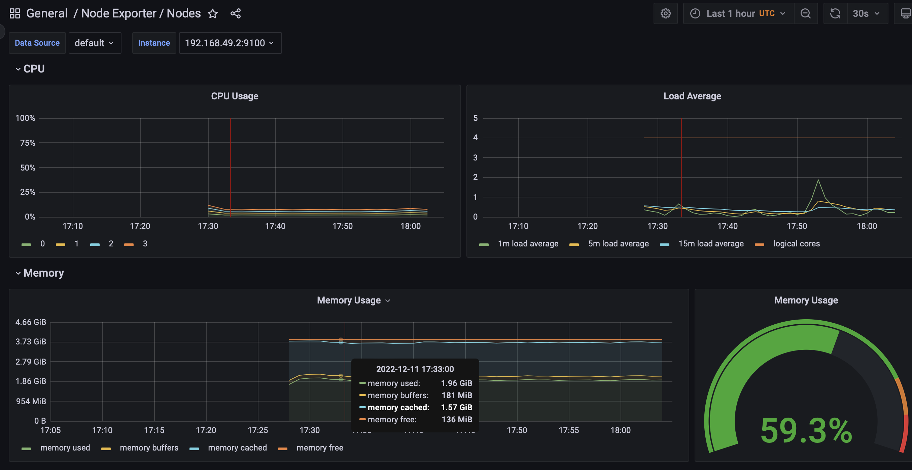

# 14 - K8s cluster monitoring with Prometheus

## Component stack

Here we briefly describe all components of the stack and their purpose

- **The Prometheus Operator** - responsible for the deployment and monitoring of visual data in the k8s cluster.

- **Highly available Prometheus** - responsible for the metrics collection (faster than usual Prometheus).

- **Highly available Alertmanager** - responsible for handling alerts sent by clients.

- **Prometheus node-exporter** - responsible for exporting of the hardware and OS metrics of the instance.

- **Prometheus Adapter for Kubernetes Metrics APIs** - responsible for converting k8s metrics to prometheus format; and for cluster autoscaling.

- **kube-state-metrics** - responsible for listening to the k8s API and providing metrics of deployments, nodes and pods inside the cluster.

- **Grafana** - responsible for the visualization (using pretty dashboards) of the collected metrics.

## Preparing the environment

We follow the tutorial from [prometheus-operator/kube-prometheus](https://github.com/prometheus-operator/kube-prometheus#minikube).

First, we reinstall the minikube with the command

```commandline
minikube delete && minikube start --kubernetes-version=v1.23.0 --memory=3g --bootstrapper=kubeadm --extra-config=kubelet.authentication-token-webhook=true --extra-config=kubelet.authorization-mode=Webhook --extra-config=scheduler.bind-address=0.0.0.0 --extra-config=controller-manager.bind-address=0.0.0.0
```

and disable the metrics addon with

```commandline
minikube addons disable metrics-server
```

Then we install *kube-prometheus-stack* using

```commandline
helm repo add prometheus-community https://prometheus-community.github.io/helm-charts
```

```commandline
helm repo update
```

Here we specify the configuration for the alertmanager. It should have an access to grafana.

```commandline
helm install monitoring prometheus-community/kube-prometheus-stack
```

After the deployment of all components and services, we can open the Minikube dashboard and see


## Output of `kubectl get ...`

The `kubectl get po,sts,svc,pvc,cm` command should list the resources

- `po` states for the pods

- `sts` states for the stateful sets

- `svc` states for the services

- `pvc` states for the persistent volume claims

- `cm` states for the config maps

In our case, after configuring and running the cluster, we will have the following output

```commandline
whutao@Romans-MacBook-Pro k8s % kubectl get po,sts,svc,pvc,cm
NAME                                                         READY   STATUS    RESTARTS      AGE
pod/alertmanager-monitoring-kube-prometheus-alertmanager-0   2/2     Running   1 (23m ago)   24m
pod/helm-0                                                   1/1     Running   0             22m
pod/helm-1                                                   1/1     Running   0             22m
pod/monitoring-grafana-f576895b-7q9kp                        3/3     Running   0             24m
pod/monitoring-kube-prometheus-operator-556bf86968-82zbc     1/1     Running   0             24m
pod/monitoring-kube-state-metrics-57479f96d5-qxqfq           1/1     Running   0             24m
pod/monitoring-prometheus-node-exporter-lqsxl                1/1     Running   0             24m
pod/prometheus-monitoring-kube-prometheus-prometheus-0       2/2     Running   0             24m

NAME                                                                    READY   AGE
statefulset.apps/alertmanager-monitoring-kube-prometheus-alertmanager   1/1     24m
statefulset.apps/helm                                                   2/2     22m
statefulset.apps/prometheus-monitoring-kube-prometheus-prometheus       1/1     24m

NAME                                              TYPE           CLUSTER-IP       EXTERNAL-IP   PORT(S)                      AGE
service/alertmanager-operated                     ClusterIP      None             <none>        9093/TCP,9094/TCP,9094/UDP   24m
service/helm                                      LoadBalancer   10.108.32.161    <pending>     80:30884/TCP                 22m
service/kubernetes                                ClusterIP      10.96.0.1        <none>        443/TCP                      26m
service/monitoring-grafana                        ClusterIP      10.102.144.189   <none>        80/TCP                       24m
service/monitoring-kube-prometheus-alertmanager   LoadBalancer   10.109.22.38     <pending>     9093:32223/TCP               24m
service/monitoring-kube-prometheus-operator       ClusterIP      10.96.64.45      <none>        443/TCP                      24m
service/monitoring-kube-prometheus-prometheus     ClusterIP      10.104.139.15    <none>        9090/TCP                     24m
service/monitoring-kube-state-metrics             ClusterIP      10.110.120.242   <none>        8080/TCP                     24m
service/monitoring-prometheus-node-exporter       ClusterIP      10.99.243.156    <none>        9100/TCP                     24m
service/prometheus-operated                       ClusterIP      None             <none>        9090/TCP                     24m

NAME                                             STATUS   VOLUME                                     CAPACITY   ACCESS MODES   STORAGECLASS   AGE
persistentvolumeclaim/persistent-volume-helm-0   Bound    pvc-dfbb0538-85da-4c4c-94fe-8f8ef8df747e   64Mi       RWO            standard       22m
persistentvolumeclaim/persistent-volume-helm-1   Bound    pvc-9212ca20-ca02-4c79-a690-8c01a53f42f6   64Mi       RWO            standard       22m

NAME                                                                     DATA   AGE
configmap/helm-configmap                                                 1      22m
configmap/kube-root-ca.crt                                               1      25m
configmap/monitoring-grafana                                             1      24m
configmap/monitoring-grafana-config-dashboards                           1      24m
configmap/monitoring-kube-prometheus-alertmanager-overview               1      24m
configmap/monitoring-kube-prometheus-apiserver                           1      24m
configmap/monitoring-kube-prometheus-cluster-total                       1      24m
configmap/monitoring-kube-prometheus-controller-manager                  1      24m
configmap/monitoring-kube-prometheus-etcd                                1      24m
configmap/monitoring-kube-prometheus-grafana-datasource                  1      24m
configmap/monitoring-kube-prometheus-grafana-overview                    1      24m
configmap/monitoring-kube-prometheus-k8s-coredns                         1      24m
configmap/monitoring-kube-prometheus-k8s-resources-cluster               1      24m
configmap/monitoring-kube-prometheus-k8s-resources-namespace             1      24m
configmap/monitoring-kube-prometheus-k8s-resources-node                  1      24m
configmap/monitoring-kube-prometheus-k8s-resources-pod                   1      24m
configmap/monitoring-kube-prometheus-k8s-resources-workload              1      24m
configmap/monitoring-kube-prometheus-k8s-resources-workloads-namespace   1      24m
configmap/monitoring-kube-prometheus-kubelet                             1      24m
configmap/monitoring-kube-prometheus-namespace-by-pod                    1      24m
configmap/monitoring-kube-prometheus-namespace-by-workload               1      24m
configmap/monitoring-kube-prometheus-node-cluster-rsrc-use               1      24m
configmap/monitoring-kube-prometheus-node-rsrc-use                       1      24m
configmap/monitoring-kube-prometheus-nodes                               1      24m
configmap/monitoring-kube-prometheus-nodes-darwin                        1      24m
configmap/monitoring-kube-prometheus-persistentvolumesusage              1      24m
configmap/monitoring-kube-prometheus-pod-total                           1      24m
configmap/monitoring-kube-prometheus-prometheus                          1      24m
configmap/monitoring-kube-prometheus-proxy                               1      24m
configmap/monitoring-kube-prometheus-scheduler                           1      24m
configmap/monitoring-kube-prometheus-workload-total                      1      24m
configmap/prometheus-monitoring-kube-prometheus-prometheus-rulefiles-0   29     24m
```

## Graphana inspection

To access the Graphana GUI, command `minikube service monitoring-grafana` will be used. We need to pass *login='admin', password='prom-operator'* credentials that can be extracted from `kubectl get secret --namespace default monitoring-grafana -o jsonpath="{.data}"` and then decoded to strings.

We can now open the dashboard list


### 1. Check how much CPU and Memory your StatefulSet is consuming

Select *Kubernetes/Compute Resources/Namespace(Workload)*.


### 2. Check which Pod is using CPU more than others and which is less in the default namespace

Select *Kubernetes/Compute Resources/Namespace(Pods)*


Pod *prometheus-monitoring-kube-prometheus-prometheus-0* is using CPU more than others, and *alertmanager-monitoring-kube-prometheus-alertmanager-0* less than others.


### 3. Check how much memory is used on your node, in % and mb

Select *Node exporter/Nodes*. We see that the node consumes about 59% of memory that is ~2 GB.



### 4. Check how many pods and containers actually ran by the Kubelet service

Select *Kubernetes/Kubelet*. We see that there are 17 pods and 25 containers.


### 5. Check which Pod is using network more than others and which is less in the default namespace

Select *Kubernetes/Compute Resources/Namespace(Pods)*. Pod *prometheus-monitoring-kube-prometheus-prometheus-0* is using more network than others, pod *monitoring-kube-prometheus-operator-556bf86968-82zbc* uses less network than others.


### 6. Check how many alerts you have. Also you can see them in the Web UI by the `minikube service monitoring-kube-prometheus-alertmanager` command

Select *Alertmanager/Overview*.


We can also check the Alertmanager dashboard


There are 5 alerts for the moment.

## Init containers

We follow the [tutorial](https://kubernetes.io/docs/tasks/configure-pod-container/configure-pod-initialization/#create-a-pod-that-has-an-init-container) and setup init container in *init/deployment.yaml*.

Then we deploy it and check that it is working as expected


