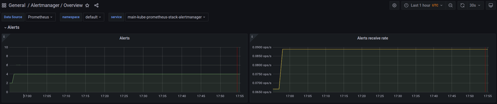

# Lab 14:  K8s cluster monitoring with Prometheus

## Part 1: Components description

- **Prometheus Operator** - responsible for deployment and management of Prometheus in K8s.

- **Prometheus** - time-series tool for collecting metrics from an application.

- **Alertmanager** - sends notifications about problems in the system.

- **Prometheus node-exporter** - monitors and collects metrics about k8s nodes.

- **Prometheus Adapter for Kubernetes Metrics APIs** - monitor and send metrics (cpu/memory usage) from K8S to Prometheus.

- **kube-state-metrics** - converts K8s metrics about health of the various assets and sends them to prometheus.

- **Grafana** - tool to view dashboards built using Prometheus metrics.

## Part 2: Install the helm chart to your k8s cluster

Command `kubectl get po,sts,svc,pvc,cm` explanation: this command is used to get the information about pods `po`, statefulsets `sts` ,services `svc`, persistent volume claims `pvc` and config maps `cm` in that respectful order.

`kubectl get po,sts,svc,pvc,cm`

```bash

NAME                                                         READY   STATUS    RESTARTS      AGE
pod/alertmanager-monitoring-kube-prometheus-alertmanager-0      2/2     Running   1 (18m ago)   12m
pod/my-app-0                                                    1/1     Running   0             11m
pod/my-app-1                                                    1/1     Running   0             11m
pod/monitoring-grafana-23d4c4bb66-7rhrg                         3/3     Running   0             11m
pod/monitoring-kube-prometheus-operator-l3f4fr86-j775v          1/1     Running   0             11m
pod/monitoring-kube-state-metrics-45e4f9efd4-7b4hw              1/1     Running   0             11m
pod/monitoring-prometheus-node-exporter-wg8t5                   1/1     Running   0             12m
pod/prometheus-monitoring-kube-prometheus-prometheus-0          2/2     Running   0             12m

NAME                                                                    READY   AGE
statefulset.apps/alertmanager-monitoring-kube-prometheus-alertmanager      1/1     19m
statefulset.apps/my-app                                                    5/5     18m
statefulset.apps/prometheus-monitoring-kube-prometheus-prometheus          1/1     19m

NAME                                              TYPE           CLUSTER-IP       EXTERNAL-IP   PORT(S)                      AGE
service/alertmanager-operated                     ClusterIP      None             <none>        9093/TCP,9094/TCP,9094/UDP   12m
service/my-app                                    ClusterIP      10.112.255.148   <none>        5000/TCP                     11m
service/kubernetes                                ClusterIP      10.96.0.1        <none>        443/TCP                      3m
service/monitoring-grafana                        LoadBalancer   10.109.48.215    <pending>     80:31707/TCP                 14m
service/monitoring-kube-prometheus-alertmanager   LoadBalancer   10.108.6.173     <pending>     9093:31284/TCP               12m
service/monitoring-kube-prometheus-operator       ClusterIP      10.102.229.129   <none>        443/TCP                      12m
service/monitoring-kube-prometheus-prometheus     ClusterIP      10.108.222.75    <none>        9090/TCP                     12m
service/monitoring-kube-state-metrics             ClusterIP      10.103.242.151   <none>        8080/TCP                     12m
service/monitoring-prometheus-node-exporter       ClusterIP      10.103.56.34     <none>        9100/TCP                     12m
service/prometheus-operated                       ClusterIP      None             <none>        9090/TCP                     12m

NAME                                                 STATUS   VOLUME                                     CAPACITY   ACCESS MODES   STORAGECLASS   AGE
persistentvolumeclaim/persistent-volume-my-app-0     Bound    pvc-e210a37c-651e-4487-a283-ce934fdca327   64Mi       RWO            standard       11m
persistentvolumeclaim/persistent-volume-my-app-1     Bound    pvc-9e3d7dc1-e5cb-4014-87c5-4b45f1074429   64Mi       RWO            standard       11m

NAME                                                                     DATA   AGE
configmap/kube-root-ca.crt                                               1      14m
configmap/monitoring-grafana                                             1      12m
configmap/monitoring-grafana-config-dashboards                           1      12m
configmap/monitoring-kube-prometheus-alertmanager-overview               1      12m
configmap/monitoring-kube-prometheus-apiserver                           1      12m
configmap/monitoring-kube-prometheus-cluster-total                       1      12m
configmap/monitoring-kube-prometheus-controller-manager                  1      12m
configmap/monitoring-kube-prometheus-etcd                                1      12m
configmap/monitoring-kube-prometheus-grafana-datasource                  1      12m
configmap/monitoring-kube-prometheus-grafana-overview                    1      12m
configmap/monitoring-kube-prometheus-k8s-coredns                         1      12m
configmap/monitoring-kube-prometheus-k8s-resources-cluster               1      12m
configmap/monitoring-kube-prometheus-k8s-resources-namespace             1      12m
configmap/monitoring-kube-prometheus-k8s-resources-node                  1      12m
configmap/monitoring-kube-prometheus-k8s-resources-pod                   1      12m
configmap/monitoring-kube-prometheus-k8s-resources-workload              1      12m
configmap/monitoring-kube-prometheus-k8s-resources-workloads-namespace   1      12m
configmap/monitoring-kube-prometheus-kubelet                             1      12m
configmap/monitoring-kube-prometheus-namespace-by-pod                    1      12m
configmap/monitoring-kube-prometheus-namespace-by-workload               1      12m
configmap/monitoring-kube-prometheus-node-cluster-rsrc-use               1      12m
configmap/monitoring-kube-prometheus-node-rsrc-use                       1      12m
configmap/monitoring-kube-prometheus-nodes                               1      12m
configmap/monitoring-kube-prometheus-nodes-darwin                        1      12m
configmap/monitoring-kube-prometheus-persistentvolumesusage              1      12m
configmap/monitoring-kube-prometheus-pod-total                           1      12m
configmap/monitoring-kube-prometheus-prometheus                          1      12m
configmap/monitoring-kube-prometheus-proxy                               1      12m
configmap/monitoring-kube-prometheus-scheduler                           1      12m
configmap/monitoring-kube-prometheus-workload-total                      1      12m
configmap/prometheus-monitoring-kube-prometheus-prometheus-rulefiles-0   22     12m
```

## Part 3: Dashboards

1. CPU and Memory your StatefulSet is consuming


2. Pod using CPU the most and another using it the least


3. Memory being used on node, in % and mb.


4. Number of pods and containers running by the Kubelet service


5. Pod using network the most and another using it the least:


6. Number of alerts: **5 alerts in total**



## Part 4: Init containers

Applied changes using `kubectl apply -f init_container.yaml`

`kubectl exec -it init-demo -- cat /usr/share/nginx/html/index.html`

```bash
Defaulted container "nginx" out of: nginx, install (init)
<html><head></head><body><header>
<title>http://info.cern.ch</title>
</header>
<h1>http://info.cern.ch - home of the first website</h1>
<p>From here you can:</p>
<ul>
<li><a href="http://info.cern.ch/hypertext/WWW/TheProject.html">Browse the first website</a></li>
<li><a href="http://line-mode.cern.ch/www/hypertext/WWW/TheProject.html">Browse the first website using the line-mode browser simulator</a></li>
<li><a href="http://home.web.cern.ch/topics/birth-web">Learn about the birth of the web</a></li>
<li><a href="http://home.web.cern.ch/about">Learn about CERN, the physics laboratory where the web was born</a></li>
</ul>
</body></html>
```